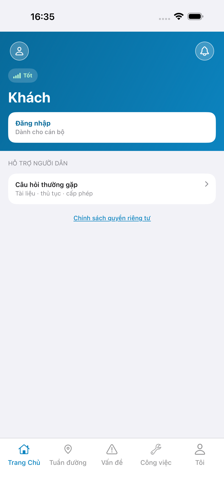
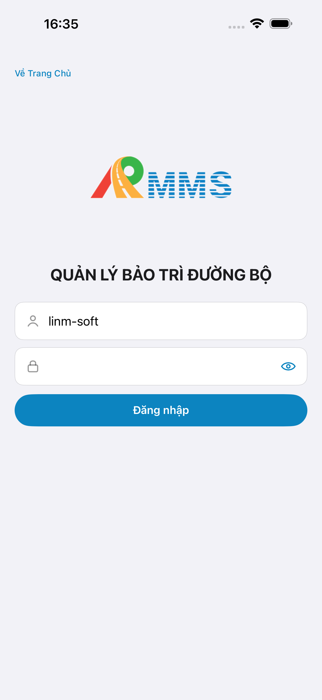
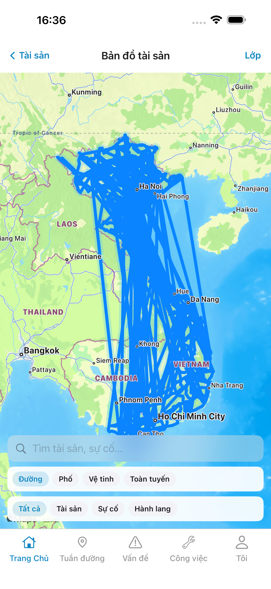
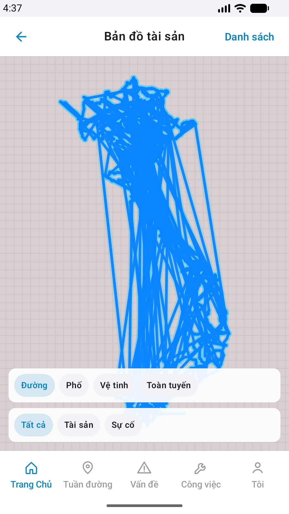
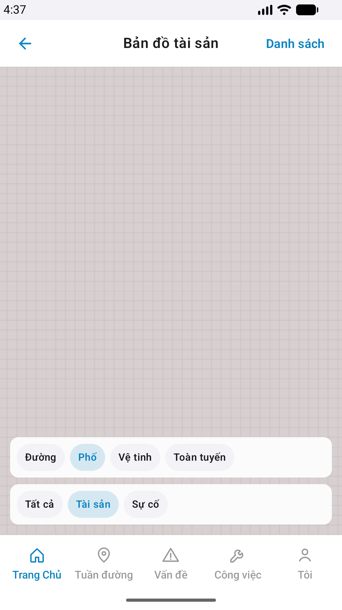

# QA — Scenarios — mobile-bff-map (mobile · Mobile.Bff MapService)

| Field | Value |
|-------|-------|
| feature | `mobile-bff-map` |
| this role | `qa` · `/agent-qa-mobile` |
| status | **confirmed** |
| packKind | **`map`** |
| taskId | `task_00f2df80` |
| e2eQa | **ON** · `yarn e2e-qa-mobile` · `ios_test_phase=phase1_iphone` (autoApprove) · **A4-IPAD DEFER** |
| store_qa | **run_store** (autoApprove=ON · e2eQa=ON) |
| e2e result | **ok:true** · dest **iPhone 17 Pro Max** 1320×2868 RGB · AVD **Pixel 2** 1080×1920 · visual **Aligned** (chrome) |
| method | e2e runtime · yarn e2e-qa-mobile · Maestro · **cấm** GenerateImage · **cấm** yarn e2e-qa / start:std / mfeStdUrl |
| align | `/review-align-ux-ios-android` · Read A3-CORE + P6-CORE(+2) vs peer `#sc-gis-map` · proto `#zone-tileurl-note` (config note · **none** `#sc-*` mới) · **Must 0** |
| post-dev | TileUrl → Mobile.Bff MVT · peer map reuse · Wave 4 MVT paint debt |
| API / BFF | API docker host **:5101** · Mobile.Bff **:5202** · `--skip-start` (đã listen) · MapService **:5021** **DOWN** (tile curl 404 · debt) |
| updatedAt | `2026-09-12T09:39:54.000Z` |

**Scope:** slug `mobile-bff-map` · TileUrl BFF + peer `#sc-gis-map` · **cấm** invent ERP.* / màn map mới.

## Verdict

pass

## VERIFY GATE

| Gate | Result |
|------|--------|
| iOS xcodegen + xcodebuild (e2e install) | **PASS** (prior build · `--skip-build` re-run) |
| Android assembleDebug (e2e install) | **PASS** (prior build · `--skip-build` re-run) |
| Mobile.Bff `dotnet build` | **PASS** |
| Mobile.Bff `:5202` healthy | **PASS** (A10-BFF) |
| API docker `:5101` | **PASS** (`--skip-start`) |
| Maestro iOS → peer `#sc-gis-map` | **PASS** |
| Maestro Android → peer `#sc-gis-map` | **PASS** |
| `yarn e2e-qa-mobile` CLI | **PASS** · `ok: true` |
| Visual Aligned (Read CORE) | **PASS** · Must 0 · dual chrome platform-OK |
| curl live tile MapService | **DEBT** · `:5021` down · BFF tile HTTP 404 |

## Device AC (slug `mobile-bff-map`)

| ID | Expect | Result | Evidence |
|----|--------|--------|----------|
| QA-01 | Launch → guest home | **PASS** |  |
| QA-02 | Login Auth seed | **PASS** |  |
| QA-03 | Hub `#tile-asset` → `#tile-map` → peer `#sc-gis-map` | **PASS** | Maestro dual |
| QA-04 | Title **Bản đồ tài sản** · basemap · legend · dual chrome | **PASS** | A3 / P6 |
| QA-05 | TileUrl SSOT BFF path (config) · MVT paint Wave 4 | **PASS** chrome · **DEBT** live clip tile | implement + MapService down |
| QA-06 | Tab shell 5 giữ · **cấm** invent tab trên map | **PASS** | A3 / P6 |
| QA-07 | Back hub · iOS **Tài sản** · Android chevron / **Danh sách** | **PASS** | dual chrome |

## Store Must × feature

| Case | Store | Result | Evidence |
|------|-------|--------|----------|
| A10-BFF | A10 · P11 | **PASS** | — |
| A11-LAUNCH | A11 | **PASS** |  |
| A9-LOGIN | A9 · P10 | **PASS** |  |
| A3-CORE | A3 · A11 | **PASS** CLI · **visual Aligned** |  |
| P6-CORE | P6 · P11 | **PASS** CLI · chrome Aligned |  |
| P6-CORE-2 | P6 | **PASS** CLI · Esri/isolate tap |  |
| A4-IPAD | A4 | **DEFER** Phase 1 | — |

## E2E screenshots

Viewer: `/api/qldb/artifact?id=&rel=qa/scenarios.md` rewrite `screens/{caseId}.png`.

CLI **PASS** = Maestro + PNG + store px only — **not** visual vs demo. QA **Read** A3-CORE + P6-CORE vs prototype (`/review-align-ux-ios-android`).

| Case | Store | Result | Evidence |
|------|-------|--------|----------|
| A10-BFF | A10 · P11 | **PASS** | — |
| A11-LAUNCH | A11 | **PASS** |  |
| A9-LOGIN | A9 · P10 | **PASS** |  |
| A3-CORE | A3 · A11 | **PASS** |  |
| P6-CORE | P6 · P11 | **PASS** |  |
| P6-CORE-2 | P6 | **PASS** |  |

## Align UX (Read CORE)

| Check | Result |
|-------|--------|
| Proto `#zone-tileurl-note` = config note · **none** new `#sc-*` | **OK** · E2E peer `#sc-gis-map` |
| iOS A3 title / chips Đường·Phố·Vệ tinh·Toàn tuyến / legend | **Aligned** |
| Android P6 title / `mb-*` + `lg-*` / back·Danh sách | **Aligned** |
| Platform chrome dual OK | **OK** |
| Must (store visual) | **0** |
| Debt | MapService `:5021` · MVT paint Wave 4 · overlay scribble = peer GIS data (không Must fail slug này) |

## Notes

- Android Maestro: IME `Enter` chuyển `f-user`→`f-pass` (tap `f-pass` + `inputText` bị concat vào username trên Pixel ScrollView+IME).
- `e2e/ios.yaml` · `e2e/android.yaml` hand-written · peer gis-map path.
- **Cấm** kill worker / taskkill rộng (`GAP-QA-E2E-KILL-01`).
