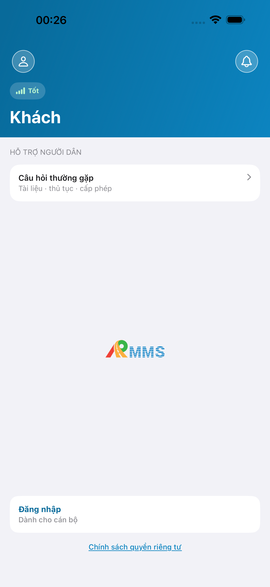
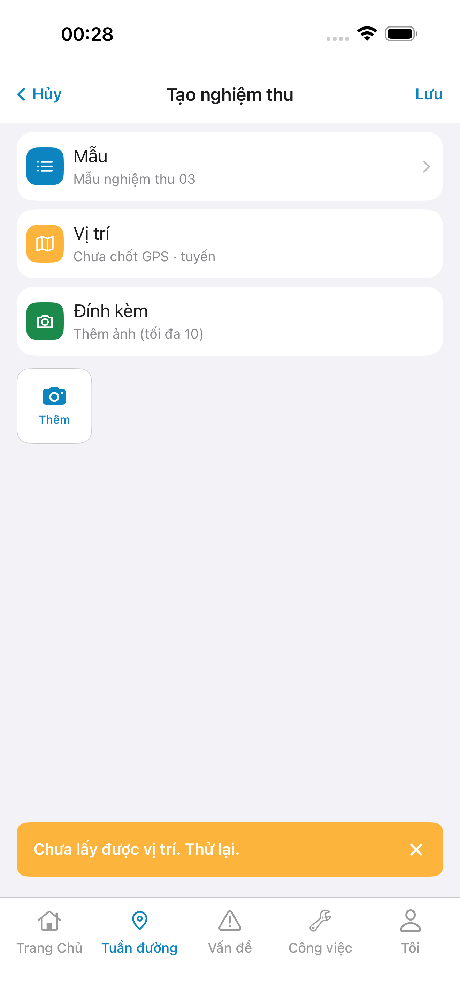

# QA — Scenarios — nghiem-thu-create

| | |
|--|--|
| Feature | `nghiem-thu-create` |
| Title | [Mobile] [Công tác nghiệm thu] → Tạo nghiệm thu |
| Role | `qa` |
| e2eQa | ON · `yarn e2e-qa-mobile` · Maestro · ok:**true** |
| Device | iPhone 17 Pro Max · Pixel 2 (1080×1920) · A4-IPAD DEFER |
| method | e2e runtime · yarn e2e-qa-mobile |
| taskId | `task_8fff9688` |
| writtenAt | 2026-09-19T17:35:00.000Z |

## Device AC

| # | Scenario | Expect | Actual | Result |
|---|----------|--------|--------|--------|
| 1 | Login seed Auth | Vào Trang chủ sau `linm-soft` | A9-LOGIN form VN → home | **PASS** |
| 2 | List → Tạo | `#sc-nghiem-thu` **Tạo** → `#sc-nghiem-thu-create` | Push Create · title **Tạo nghiệm thu** | **PASS** |
| 3 | TopBar + 3 rows | Hủy/Lưu · Mẫu · Vị trí · Đính kèm | A3/P6 khớp demo zones | **PASS** |
| 4 | Init mẫu | Label init `Mẫu nghiệm thu NN` · default mau-03 | Live **Mẫu nghiệm thu 03** | **PASS** |
| 5 | Sheet mẫu | `#sheet-mau` Chọn mẫu | P6-CORE-2 sheet mau-01… · check 03 | **PASS** |
| 6 | GPS sim | Location fail toast / deny modal OK trên sim | Toast «Chưa lấy được vị trí. Thử lại.» (sim) | **PASS** (env) |
| 7 | Real BFF | init-data + proxy live · **cấm** demoItems | A10-BFF :5202 PASS · init Label live | **PASS** |
| 8 | Leave-dirty | Must khi dirty | Dev wire · E2E không force dirty iOS (tránh camera hit) | note |
| 9 | Watermark | **cấm** placeholder | Không thấy watermark trên CORE | **PASS** |

## E2E screenshots

Viewer: `/api/qldb/artifact?id=&rel=qa/scenarios.md` rewrite `screens/{caseId}.png`.

CLI **PASS** = Maestro + PNG không đen + store px + ảnh không trùng. **Không** = khớp design. QA **Read** CORE vs prototype.

| Case | Scenario | Expect | Actual | Result | Evidence |
|------|----------|--------|--------|--------|----------|
| A10-BFF | App gọi BFF khi mở Create | BFF listen · data thật | :5202 health PASS · init-data Label live | **PASS** | — |
| A11-LAUNCH | Cán bộ mở app iPhone | Guest/home · không đen | Home guest 1320×2868 | **PASS** |  |
| A9-LOGIN | Cán bộ đăng nhập | Form VN · vào home | Seed fill · login OK | **PASS** |  |
| A3-CORE | Cán bộ vào Create trên iPhone | Title + 3 rows khớp prototype | **Tạo nghiệm thu** · Mẫu 03 · Vị trí · Đính kèm · Thêm · toast GPS sim | **PASS** · visual **Aligned** |  |
| P6-CORE | Cán bộ vào Create trên Android | Title + việc chính khớp | Dual OS cùng zones · GPS toast sim | **PASS** · visual **Aligned** |  |
| P6-CORE-2 | Fold / sheet mẫu Android | Sheet Chọn mẫu · không đen · ≠ P6-CORE | `#sheet-mau` mau-01…06 · selected 03 | **PASS** |  |

## Visual align (`/review-align-ux-ios-android`)

| Check | Result |
|-------|--------|
| Title live = demo | **Aligned** · `Tạo nghiệm thu` |
| Zones `#sc-nghiem-thu-create` · row-template/location/attach | **Aligned** |
| Init Label COPY-01 | **Aligned** · `Mẫu nghiệm thu 03` |
| Dual iOS↔Android | **Aligned** · cùng việc · chrome kit (Hủy text vs back icon) |
| End-user job | **Aligned** · cán bộ vào Create từ list Tạo |
| PNG đen / DUP | none · MD5 khác nhau |
| Must open | **0** · GPS toast = sim env (Should note) |

## Notes

- Bundle/package: `com.drvn.rmms.store` (`--bundle-id` / `--package-name`)
- iOS E2E: **cấm** tap `row-template`/`Mẫu` trong Maestro — hit-test mở `FieldReflectCameraPicker` (a11y) · sheet verify trên Android P6-CORE-2
- **cấm** mfeStdUrl / start:std / kill worker
- next: `/agent-review-mobile` (roleOnly stop)
