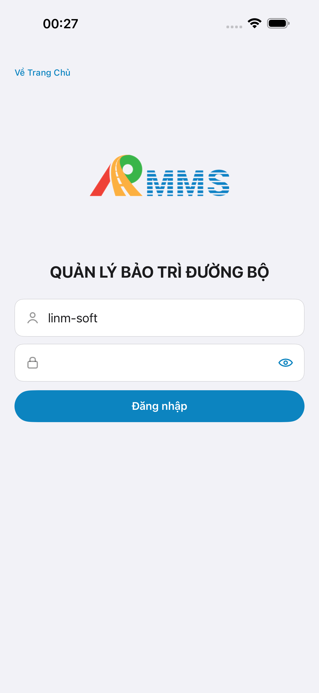
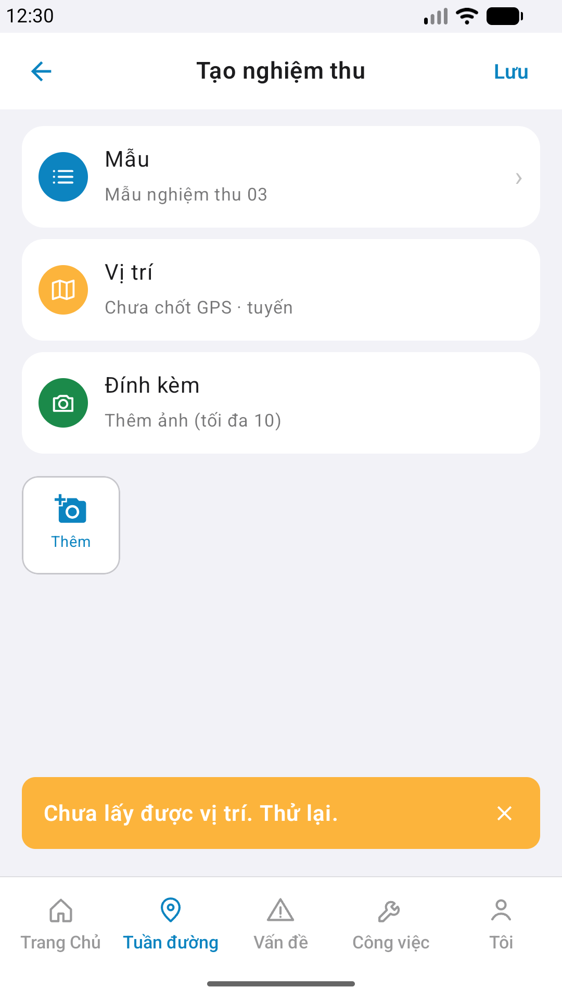
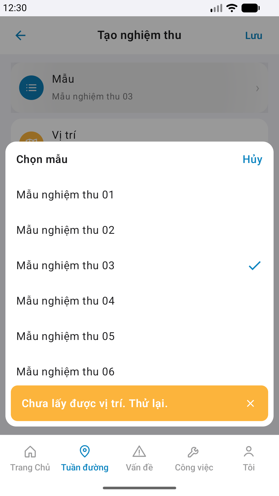

# Capture — nghiem-thu-create

| Case | Scenario | Expect | Actual | Result | Evidence |
|------|----------|--------|--------|--------|----------|
| A10-BFF | App gọi BFF khi mở Create | BFF listen · data thật | :5202 PASS · init Label live | **PASS** | — |
| A11-LAUNCH | Cán bộ mở app iPhone | Guest/home · không đen | 1320×2868 home guest | **PASS** |  |
| A9-LOGIN | Cán bộ đăng nhập | Form VN · vào home | Seed `linm-soft` OK | **PASS** |  |
| A3-CORE | Cán bộ vào Create iPhone | Title + 3 rows khớp demo | **Tạo nghiệm thu** · Mẫu 03 · Vị trí · Đính kèm · Aligned | **PASS** |  |
| P6-CORE | Cán bộ vào Create Android | Title + việc chính khớp | Dual zones · 1080×1920 · Aligned | **PASS** |  |
| P6-CORE-2 | Sheet mẫu Android | Chọn mẫu · ≠ P6-CORE | `#sheet-mau` mau-01…06 selected 03 | **PASS** |  |

iOS device: iPhone 17 Pro Max  
iPad device: DEFER Phase 1  
method: e2e runtime · yarn e2e-qa-mobile · Maestro ON · bundle `com.drvn.rmms.store`

CLI PASS = Maestro + PNG không đen + px + không trùng. Visual = `/review-align-ux-ios-android` Read CORE vs demo → **Aligned** · Must 0.

Listing official → `/store-image-capture` confirm file live (cấm AI vẽ).
