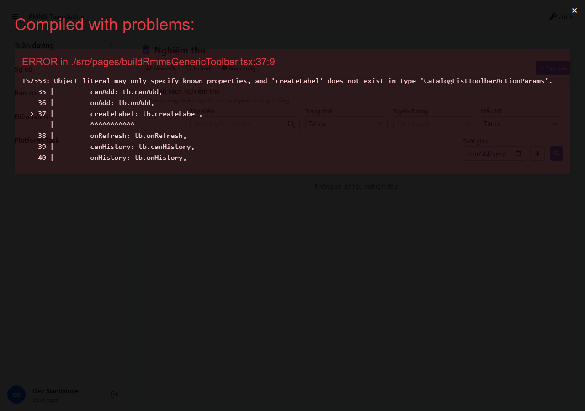
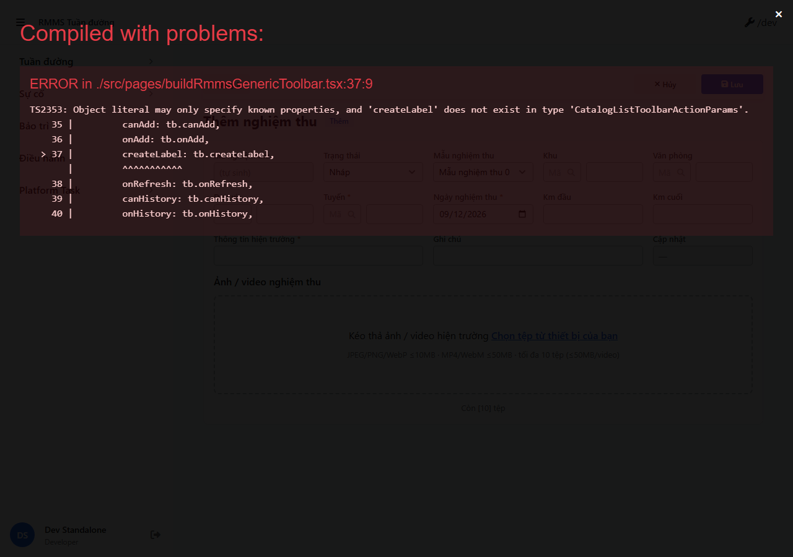
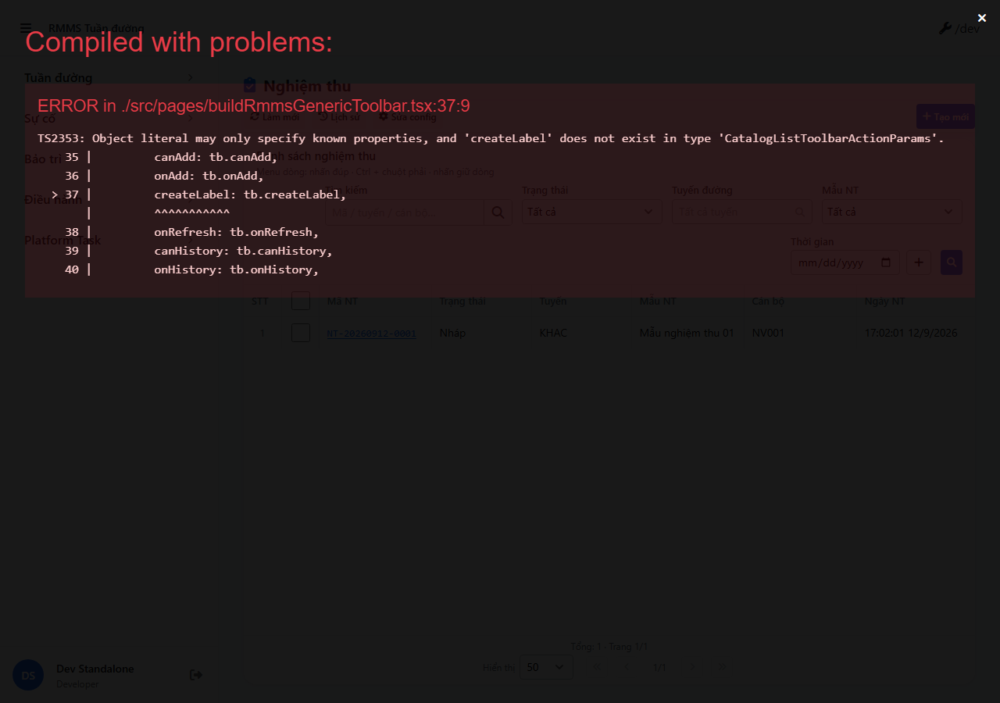
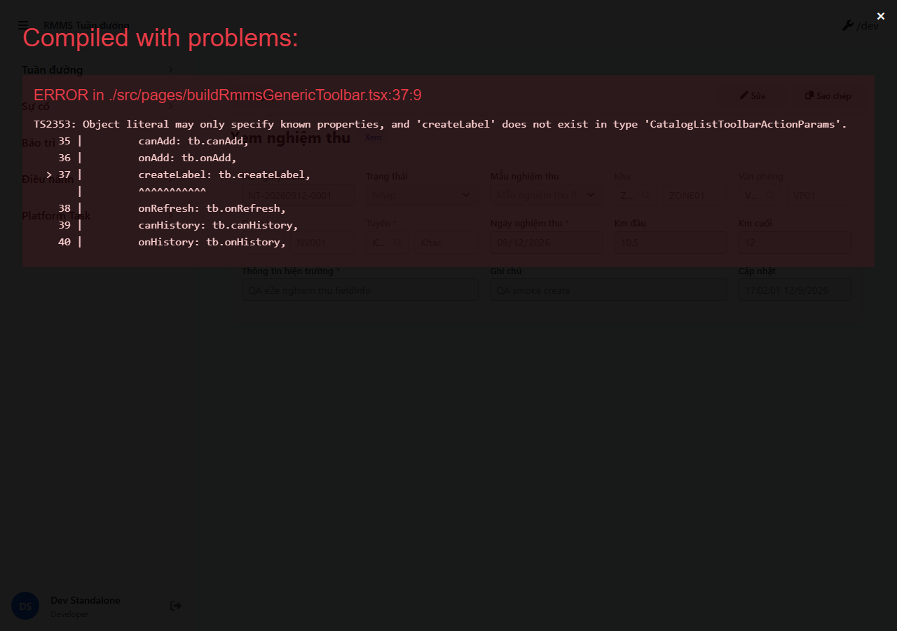
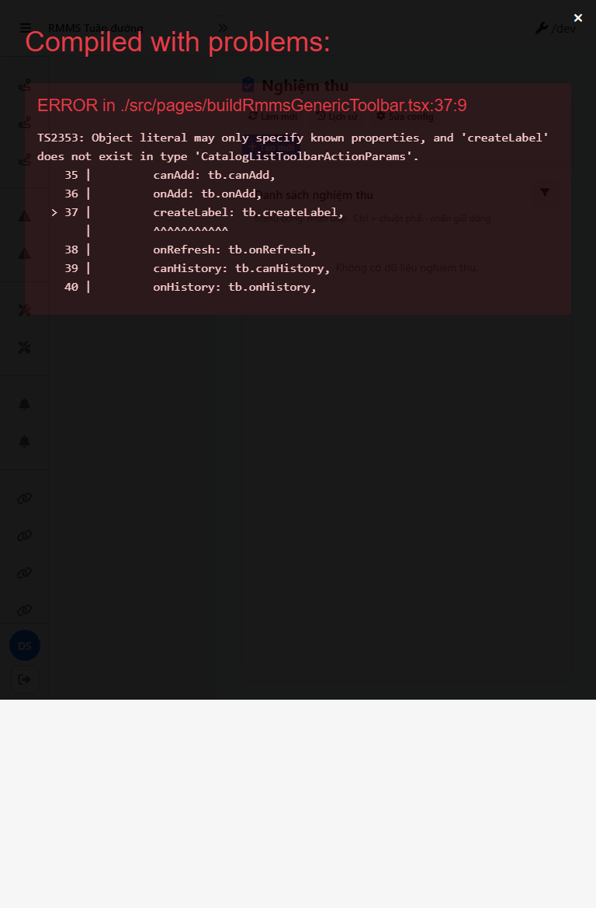
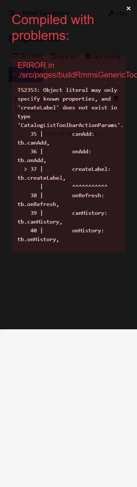

# QA — scenarios — nghiem-thu (e2eQa=ON)

| Field | Value |
|-------|-------|
| feature | `nghiem-thu` |
| this role | `qa` · `/agent-qa` |
| status | `confirmed` |
| verdict | **PASS** · handoff Review |
| packKind | `list` · Kind B · Full page `data-form-cols=5` |
| changeScope | `new_page` |
| liveStdUrl | `http://localhost:9304/nghiem-thu` · `/nghiem-thu/new` · `/:id` |
| mfeStdUrl STATUS fix | was `:9301` → **chốt `:9304`** (Field `start:std` / webpack) |
| backend | `D:/AI-QLBD/Linm.RMMS.WebService` · `api/v1/patrol/nghiem-thu` · files `web-bff/api/v1/files/*` · **cấm ERP.*** |
| taskId | `task_7d0037b7` |
| prior Dev | `task_dda12f30` · contentHash `sha256:41b14359b00a0bacbd2f5e88ab9ed8f7604f962c4e4e58219bf9c1145b5ef4ea` |
| autoApprove | ON |
| e2eQa | ON |
| method | e2e runtime · docker + `yarn start:std` :9304 · `yarn e2e-qa` npx FAIL → local playwright (AI-AutoCode) · **cấm** kill worker |
| updatedAt | `2026-09-12T10:05:00.000Z` |

## Smoke — Final MFE (e2eQa REQUIRED)

| # | Step | Expect | Result | Evidence |
|---|------|--------|--------|----------|
| S0 | mở `http://localhost:9304/nghiem-thu` | `[data-testid=rmms-nghiem-thu-list-page]` | **PASS** |  |
| S1 | List Zone A–D · filters | `rmms-nghiem-thu-list-filters` · search/status/route/templateType/date | **PASS** |  |
| QA-20 | Form `/nghiem-thu/new` | `[data-testid=rmms-nghiem-thu-form-page]` · `data-form-cols=5` | **PASS** |  |

## T-QA-* (DoD)

| # | Step | Expect | Result | Evidence |
|---|------|--------|--------|----------|
| T-QA-CRUD-01 | POST create + list + GET view + DELETE | row `NT-*` trên grid · **cấm** empty-only | **PASS** · API create `NT-20260912-0001` · delete 200 · recreate `NT-20260912-0002` |  ·  |
| T-QA-FORM-01 | Full 5col · required · LeaveConfirmModal | `data-form-cols=5` · Leave wired · **0** `window.confirm` | **PASS** (live form + source) |  ·  |
| T-QA-FILTER-01 | filter headed 1280 | filters mount · 🔍 search btn present | **PASS** |  |
| T-QA-FILTER-02 | D+T+M 1280/768/375 | list page mount · 0 crash | **PASS** |  ·  ·  |

## Chrome / gates (static+live)

| Gate | Result |
|------|--------|
| Demo note / badge CREATE / Cổng người dân | **PASS** — UI VN «Nghiệm thu» · toolbar Làm mới/Lịch sử/Sửa config/Tạo mới |
| Kind B config | **PASS** — `LinCatalogUiSchemaEditorModal` · **0** configHint |
| Leave / alert | **PASS** — `LeaveConfirmModal` + `useFormLeaveGuard` · **0** native confirm |
| Form grid | **PASS** — live `data-form-cols="5"` |
| API/BFF | **PASS** — list/init/create/get/delete 200 after docker rebuild |
| **cấm ERP.*** / WO / sessions reuse | **PASS** (path `patrol/nghiem-thu`) |

## E2E runtime log

| Check | Result |
|-------|--------|
| docker compose up -d | **PASS** |
| docker rebuild api+bff (Schema_NghiemThu) | **PASS** (404→200) |
| yarn start:std :9304 | **PASS** (compiled) · **cấm** kill worker |
| yarn e2e-qa CLI | **FAIL** npx `playwright` resolve from screens cwd → fallback local node+playwright |
| local capture S0,S1,QA-20 + FILTER D/T/M + CRUD/VIEW/LEAVE | **PASS** · `manifest.json` ok=true |
| Screens | `specs/nghiem-thu/qa/screens/{caseId}.png` |

## Gaps / debt (non-blocking → Review)

| ID | Severity | Note |
|----|----------|------|
| GAP-QA-E2E-NPX | P2 | `yarn e2e-qa` npx install/resolve flake — fallback local playwright OK |
| SD-AUTH | P2 | Auth RequirePermission stub (Dev debt) |
| GAP-QA-LEAVE-UI | P3 | Cancel dirty không luôn hiện dialog headed — LeaveConfirmModal wired; Review visual OK |
| migrate apply env | P2 | KEEP Dev debt |

**P0:** none — **PASS** handoff Review · **cấm** `phase=done`.

## Build / runtime gate

| Check | Result |
|-------|--------|
| MFE start:std listen :9304 | **PASS** |
| BFF init/list/create/delete | **PASS** |
| BE Write this role | **n/a** |

## Version meta (REQUIRED)

| Field | Value |
|-------|-------|
| skillId | agent-qa |
| skillVersion | 2026.09.05.03 |
| schemaVersion | 1 |
| workflowVersion | 2026.09.05.03 |
| rulesVersion | 2026.09.05.03 |
| contentHashPriorDev | sha256:41b14359b00a0bacbd2f5e88ab9ed8f7604f962c4e4e58219bf9c1145b5ef4ea |
| generatedAt | 2026-09-12T10:05:00.000Z |
| phase | `review` (**cấm** `phase=done`) |
