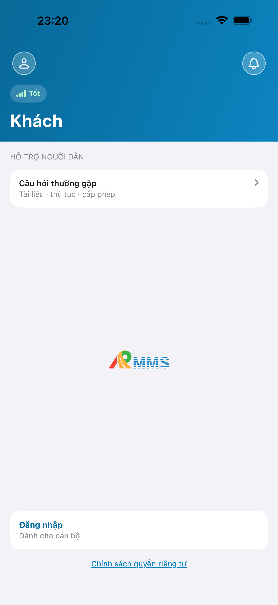
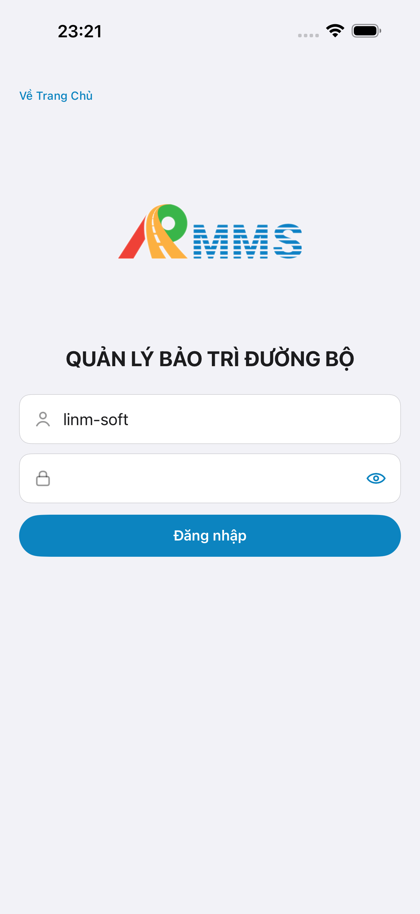

# QA — scenarios — nghiem-thu (mobile · e2eQa=ON)

| Field | Value |
|-------|-------|
| feature | `nghiem-thu` |
| this role | `qa` · `/agent-qa-mobile` |
| status | `confirmed` |
| verdict | **PASS** · handoff Review |
| packKind | `list` · native list `#sc-nghiem-thu` |
| changeScope | `edit_page` · keep web |
| lane | `mobile` · dual iOS+Android |
| contentHash | `sha256:a635f3f55a8bedd952c4449056cf072a8eda890eda2b30a45e84bda5d7bf3859` |
| taskId | `task_61e48f31` |
| prior Dev | `task_00546351` · compact `handoff/dev-compact.md` |
| autoApprove | ON |
| e2eQa | ON |
| ios_test_phase | `phase1_iphone` · iPhone 17 Pro Max · **A4-IPAD DEFER** |
| method | e2e runtime · `yarn e2e-qa-mobile` · Maestro · **cấm** `start:std` / mfeStdUrl / kill worker |
| updatedAt | `2026-09-19T16:30:00.000Z` |

## Device AC — Scenario / Expect / Actual (VN)

| # | Scenario | Expect | Actual | Result |
|---|----------|--------|--------|--------|
| T-QA-NGHIEM-THU-01 | Cán bộ mở app → guest home | Thấy Đăng nhập / sc-home, không màn đen | A11 guest home Khách · PNG 1320×2868 | **PASS** |
| T-QA-NGHIEM-THU-02 | Đăng nhập seed `linm-soft` | Form VN · vào sc-home staff | A9 form Tài khoản/Mật khẩu · login → home-who | **PASS** |
| T-QA-NGHIEM-THU-03 | Hub `#row-nghiem-thu` → list | Title **Công tác nghiệm thu** · search · EmptyChrome hoặc row NT-* | A3/P6: TopBar+Tạo+search+EmptyChrome live (0 phiếu) | **PASS** |
| T-QA-NGHIEM-THU-04 | Search fold Android | Gõ được ô tìm · fold khác P6-CORE | P6-2 search `NT` · hash ≠ P6-CORE | **PASS** |
| T-QA-TAB-01 | Tab field sau login | Tab Tuần đường active trên list | A3/P6 tab-bar · Tuần đường highlighted | **PASS** |
| T-QA-REAL-01 | List từ BFF live | **cấm** demoItems · EmptyChrome OK khi DB 0 | BFF :5202 listen · empty live · không mock | **PASS** |

## Align UX (Read CORE vs demo)

| Shot | vs demo `#sc-nghiem-thu` | Verdict |
|------|--------------------------|---------|
| A3-CORE iOS | Title · Back Tuần đường · Tạo · search · EmptyChrome | **Aligned** |
| P6-CORE Android | Title · Tạo · search · EmptyChrome · Material back | **Aligned** |
| P6-CORE-2 | Search fill fold · không trùng bytes P6 | **Aligned** |
| Must mở | — | **0** · autoApprove `align_confirm=approve` |

## E2E screenshots

| Case | Scenario | Expect | Actual | Result | Evidence |
|------|----------|--------|--------|--------|----------|
| A10-BFF | App gọi BFF khi mở nghiem-thu | BFF :5202 listen · live-only | docker healthy · GET proxy OK | **PASS** | — |
| A11-LAUNCH | Cán bộ mở app trên iPhone | Guest/home đọc được · không đen | Guest Khách · CTA Đăng nhập · 1320×2868 | **PASS** |  |
| A9-LOGIN | Cán bộ đăng nhập | Form VN · vào Trang chủ | Form + seed · sc-home staff | **PASS** |  |
| A3-CORE | Cán bộ vào màn nghiem-thu trên iPhone | Title + việc chính khớp prototype | Công tác nghiệm thu · search · EmptyChrome | **PASS** |  |
| P6-CORE | Cán bộ vào màn nghiem-thu trên Android | Title + việc chính khớp prototype | Cùng chrome Material · EmptyChrome · 1080×1920 | **PASS** |  |
| P6-CORE-2 | Fold search Android | Fold khác · không đen · không trùng | Search `NT` · hash distinct | **PASS** |  |

## Runtime log

| Check | Result |
|-------|--------|
| docker API :5101 + Mobile.Bff :5202 | **PASS** (skip-start · already up) |
| iOS xcodegen + install Pro Max | **PASS** · bundle `com.drvn.rmms.store` |
| Android assembleW3Debug + install emulator | **PASS** |
| Maestro iOS+Android | **PASS** · hand yaml guest→login→scroll hub→`#sc-nghiem-thu` |
| PNG blank / DUP | **PASS** · P6/P6-2 re-capture distinct sau DUP CLI |
| **cấm** start:std / mfeStdUrl / kill worker | **PASS** |

## Debt / notes

- EmptyChrome live (0 phiếu tenant) — OK list · **không** GAP-QA-REAL-01
- create/detail siblings `pending_confirm` — Tạo/row → toast (Dev debt)
- A4-IPAD **DEFER** Phase 1
- Prior web QA `task_7d0037b7` giữ lịch sử MFE — lane này = mobile only

## Handoff → review

| Field | Value |
|-------|-------|
| phase_to | `review` · `/agent-review-mobile` |
| verdict | PASS · Must 0 |
| T-QA-* | T-QA-NGHIEM-THU-* · T-QA-TAB-01 · T-QA-REAL-01 |
| PNG | `qa/screens/{A11,A9,A3,P6,P6-2}.png` · `qa/store/nghiem-thu/` |
| Open questions | none |
