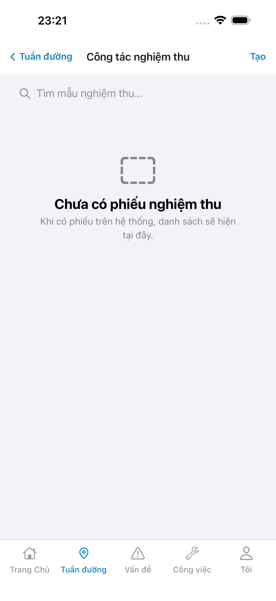
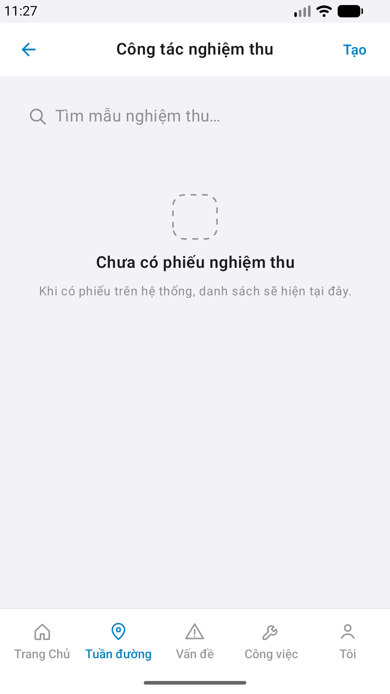
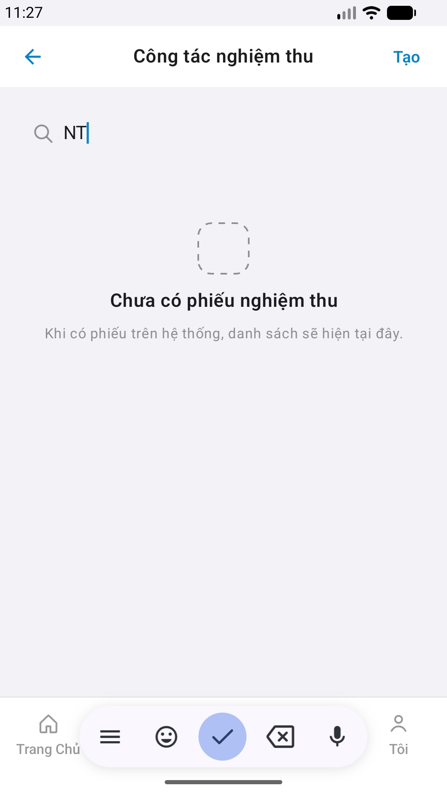

# Capture — nghiem-thu

| Case | Scenario | Expect | Actual | Result | Evidence |
|------|----------|--------|--------|--------|----------|
| A10-BFF | App gọi BFF khi mở nghiem-thu | BFF listen; dữ liệu thật — không mock in-app | :5202 healthy · live EmptyChrome (0 row) | **PASS** | — |
| A11-LAUNCH | Cán bộ mở app trên iPhone | Thấy màn khách/home, title đọc được, không màn đen | Guest Khách · CTA Đăng nhập · 1320×2868 | **PASS** |  |
| A9-LOGIN | Cán bộ đăng nhập | Form tiếng Việt, vào được Trang chủ | Form VN + seed · sc-home staff | **PASS** |  |
| A3-CORE | Cán bộ vào màn nghiem-thu trên iPhone | Title và việc chính khớp prototype | Công tác nghiệm thu · search · EmptyChrome · Aligned | **PASS** |  |
| P6-CORE | Cán bộ vào màn nghiem-thu trên Android | Title và việc chính khớp prototype | Material chrome · EmptyChrome · 1080×1920 · Aligned | **PASS** |  |
| P6-CORE-2 | Cán bộ xem phần còn lại của màn nghiem-thu trên Android | Fold tiếp theo cùng việc, không màn đen | Search `NT` · hash ≠ P6-CORE | **PASS** |  |

iOS device: iPhone 17 Pro Max  
iPad device: DEFER Phase 1  
Android: Pixel_2 · 1080×1920  
method: e2e runtime · yarn e2e-qa-mobile · Maestro ON  

CLI PASS = Maestro + PNG không đen + px + không trùng ảnh. Visual = `/review-align-ux-ios-android` Read CORE vs demo → **Aligned** Must 0.

Listing official → `/store-image-capture` confirm file live (cấm AI vẽ).
