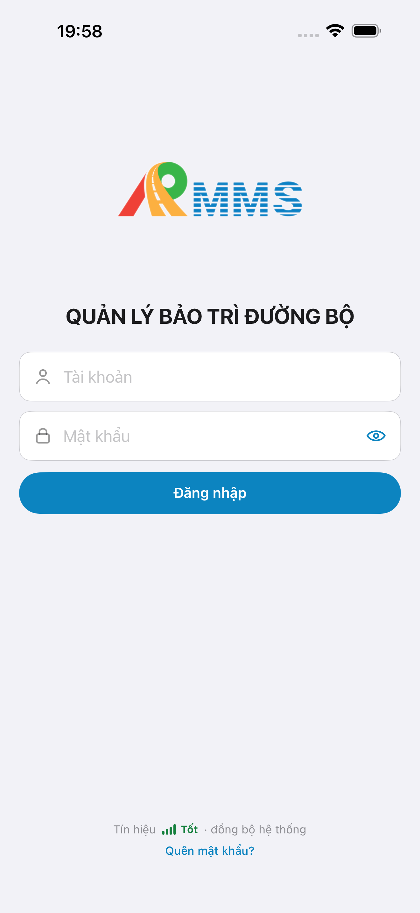
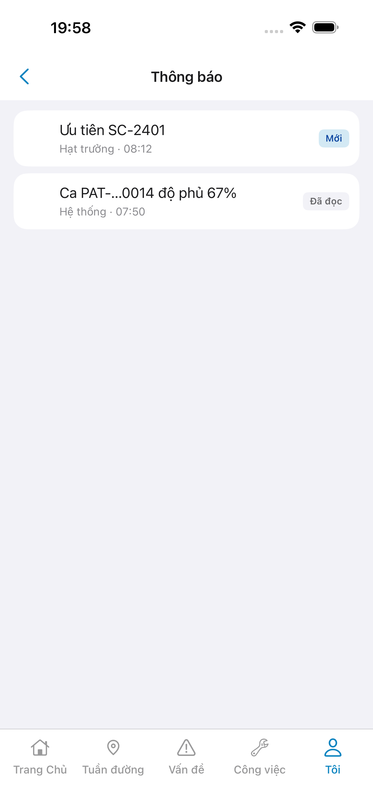
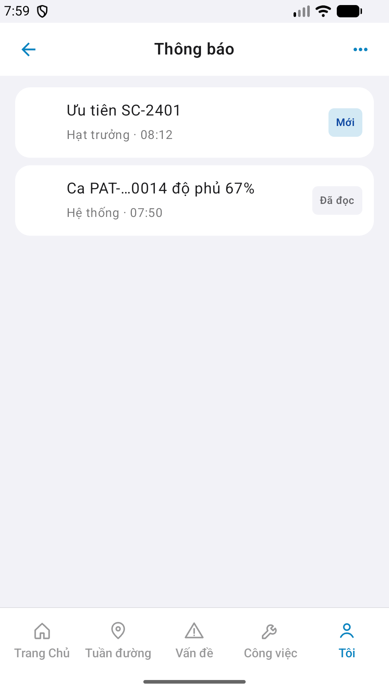

# QA — Scenarios — ops (mobile list · Thông báo)

| Field | Value |
|-------|-------|
| feature | `ops` |
| this role | `qa` · `/agent-qa-mobile` |
| status | **confirmed** |
| packKind | **`list`** |
| taskId | `task_6be285ee` |
| e2eQa | **ON** · `yarn e2e-qa-mobile` · `ios_test_phase=phase1_iphone` · **A4-IPAD DEFER** |
| store_qa | **run_store** |
| e2e result | **ok:true** · `2026-08-19T12:59:36.360Z` · dest **iPhone 17 Pro Max** · AVD **Pixel_2** 1080×1920 |
| method | e2e runtime · yarn e2e-qa-mobile · Maestro + simctl/adb · **cấm** GenerateImage · **cấm** yarn start:std / mfeStdUrl |
| align | `ui/review/align-ux.md` · **Aligned** · Must 0 |
| updatedAt | `2026-08-19T13:05:00.000Z` |

**Scope:** slug `ops` list `#sc-ops` only. **Cấm** AC sibling / form create / Kind B web.

## VERIFY GATE

| Gate | Result |
|------|--------|
| iOS `xcodegen` | **PASS** |
| iOS `xcodebuild` dest **iPhone 17 Pro** | **PASS** |
| Android `./gradlew :app:assembleDebug` | **PASS** |
| Mobile.Bff `dotnet build` | **PASS** (0 warning · 0 error) |
| Maestro iOS + Android | **PASS** · Me `row-ops` → `#sc-ops` |
| API :5101 + BFF :5202 | **PASS** (docker) |

## Device AC

| ID | Expect | Result |
|----|--------|--------|
| AC-D-01 | Offline · list mở · demo 2 rows | **PASS** (code + live demo fallback rows) |
| AC-D-02 | GPS deny | **N/A** |
| AC-D-03 | Leave dirty | **N/A** |
| AC-D-04 | Cấm native alert · toast only | **PASS** (Maestro mark-read toast) |
| AC-D-05 | Keyboard | **N/A** |
| AC-D-06 | Safe area TopBar + list | **PASS** (shots A3/P6) |
| AC-D-07 | Biometric | **N/A** |
| AC-D-08 | Signal on ops | **N/A** |
| AC-D-09 | Bearer BFF prefix | **PASS** (BFF :5202) |
| AC-D-10 | tabs none trên ops | **PASS** (shell tab only) |
| AC-D-11 | Camera / push | **N/A** |
| AC-D-12 | Type 13 / ≥16 | **PASS** (visual + demo-parity) |
| AC-D-13 | Dual copy VN | **PASS** |
| AC-D-14 | Cấm watermark / device label | **PASS** |
| AC-F-01 | GET inbox · fail → demo | **PASS** (demo rows live) |
| AC-F-02 | Me `row-ops` → `#sc-ops` | **PASS** (Maestro iOS+Android) |
| AC-F-03 | Home `btn-notify` → `#sc-ops` | **PASS** (code · route_a · ids shipped) |
| AC-F-04 | Mark-read toast | **PASS** (Maestro «Đã đọc chỉ đạo») |
| AC-F-05 | POST fail toast | **PASS** (code) |
| AC-F-06 | A11y Maestro ids | **PASS** · yaml fix: assert `sc-ops`+row copy · **cấm** assert title text iOS |
| AC-F-07 | Cấm watermark Gói | **PASS** |

## Store Must

| Case | Store | Evidence | Result |
|------|-------|----------|--------|
| A11-LAUNCH | A11 |  | **PASS** |
| A10-BFF | A10 · P11 | — | **PASS** |
| A9-LOGIN | A9 · P10 |  | **PASS** |
| A3-CORE | A3 · A11 |  | **PASS** |
| P6-CORE | P6 · P11 |  | **PASS** |
| P6-CORE-2 | P6 |  | **PASS** |
| A4-IPAD | A4 | **DEFER** Phase 1 · family `1` | DEFER |

## Maestro

| Flow | Path | Result |
|------|------|--------|
| iOS | `qa/e2e/ios.yaml` | **PASS** · Me `tab-me` → `row-ops` → `#sc-ops` |
| Android | `qa/e2e/android.yaml` | **PASS** |

## Gaps

| ID | Note | Block complete? |
|----|------|-----------------|
| GAP-QA-OPS-IOS-01 | **CLOSED** — yaml assert `sc-ops`+row · không assert «Thông báo» (TopBar title không expose a11y iOS) | **No** |
| GAP-MOB-UX-COMP-OPS-01 | Android TopBar trailing default · Should DEFER | **No** |

## E2E screenshots

Viewer: `/api/qldb/artifact?id=&rel=qa/scenarios.md` rewrite `screens/{caseId}.png`.

| Case | Store | Result | Evidence |
|------|-------|--------|----------|
| A10-BFF | A10 · P11 | **PASS** | — |
| A11-LAUNCH | A11 | **PASS** |  |
| A9-LOGIN | A9 · P10 | **PASS** |  |
| A3-CORE | A3 · A11 | **PASS** |  |
| P6-CORE | P6 · P11 | **PASS** |  |
| P6-CORE-2 | P6 | **PASS** |  |

## Version meta

skillId=agent-qa-mobile · skillVersion=2026.08.19.28 · workflowVersion=2026.08.19.27 · generatedAt=2026-08-19T13:05:00.000Z · taskId=task_6be285ee
