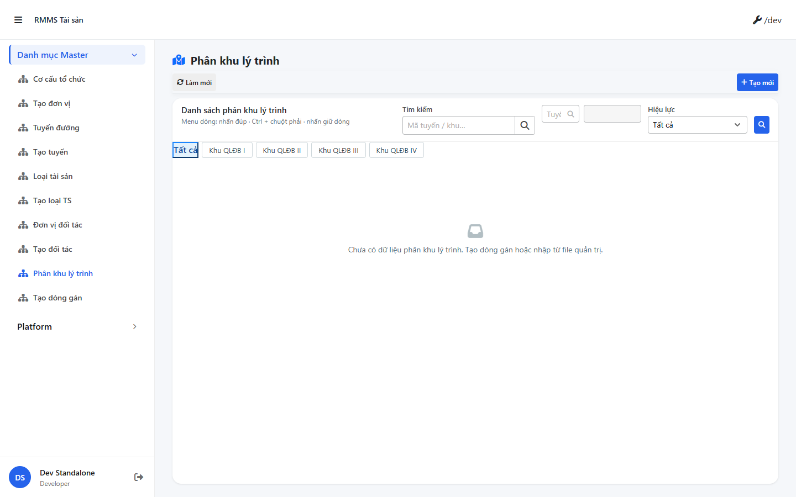
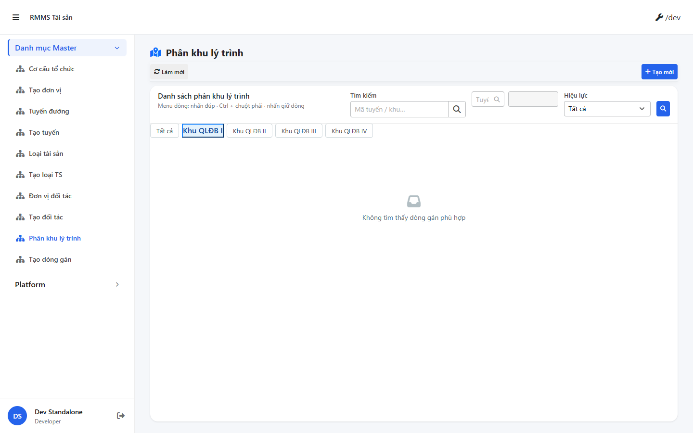
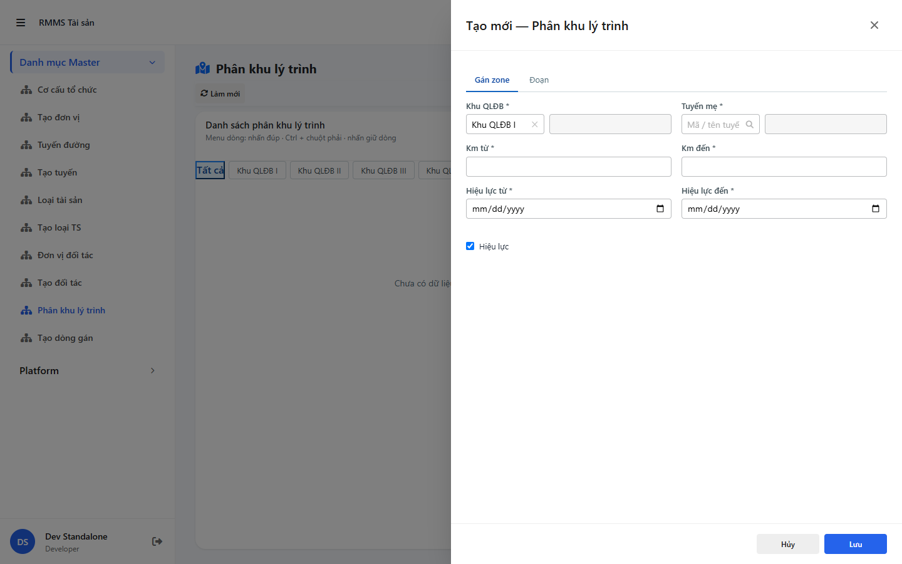

# QA — Scenarios — org-route-scope

| Field | Value |
|-------|-------|
| feature | `org-route-scope` |
| title | Phân khu lý trình (zone km) |
| role | `qa` · `/agent-qa` |
| taskId | `task_8148ad6d` |
| status | **pass** |
| verdict | **PASS** |
| e2eQa | **ON** |
| method | `e2e runtime · yarn start:std :9318 + docker API :5111 + local BFF :5201 + yarn e2e-qa contract (Chromium executablePath fallback)` |
| mfeStdUrl | `http://localhost:9318/mas/phan-khu` (SSOT · STATUS `route_confirm=route_a` · **cấm** packet `/org-route-scope` :9301) |
| mfeStdRoute | `/mas/phan-khu` |
| testid | `rmms-org-route-scope-list` · form `rmms-org-route-scope-form` |
| docker | API `:5111` healthy · postgres healthy · BFF **local Release** `:5201` (docker BFF image 404 — GAP-QA-BFF-DOCKER-01) |
| MFE | `D:/AI-QLBD/MFE-Source/Linm.Web.RMMS.Master` |
| BE | `D:/AI-QLBD/Linm.RMMS.WebService` · `api/v1/integration/org-route-scopes` |
| packKind | **`master`** · Kind B · Slideout `data-form-cols="2"` · nested đoạn |
| autoApprove | ON |
| contentHash | `sha256:81b3c9a520472625cc78375571d1d94ae34a6badc62a7a7bf21f0a2eac7894dc` |
| headerFingerprint | `sha256:72758524d03f6b4b62ccf4262873b39bdd01601654b368e153678ecc84d1865d` |
| updatedAt | `2026-08-30T12:25:00.000Z` |
| skillVersion | `2026.08.29.04` |
| schemaVersion | `2` |
| workflowVersion | `2026.08.29.04` |
| versionGate | `rechecked` |
| prior · dev | **confirmed** · `implement/org-route-scope.md` · `task_966e1ff3` |

**Cấm** `phase=done` — handoff Review. **cấm** ERP.* · **0** invent-seed (GAP-ORS-01).

---

## Runtime evidence (e2eQa ON)

| # | Check | Result | Evidence |
|---|-------|--------|----------|
| S0 | Route `mfeStdUrl` + `[data-testid=rmms-org-route-scope-list]` | **PASS** |  |
| S1 | Filter `?zoneOrgCode=REG-I` · list + Khu SearchInput bar | **PASS** |  |
| QA-20 | Create Slideout `?form=create` + `[data-testid=rmms-org-route-scope-form]` | **PASS** |  |

`screens/manifest.json` · `ok: true` · capturedAt `2026-08-30T12:23:05.705Z` · PNG SHA256_16 **distinct** (S0=`542c147d…` ≠ S1=`59516b0b…` ≠ QA-20=`f53f4c80…`).

Entry: standalone `:9318` · route **`/mas/phan-khu`** · peers HTTP 200 `/mas/co-cau-tc` · `/mas/tuyen-duong`.

---

## Static / DoD (source + runtime)

| Id | Check | Result |
|----|-------|--------|
| QA-STD-01 | Packet URL `/org-route-scope` :9301 vs STATUS/`route_a` **`/mas/phan-khu`** :9318 | **recorded** — E2E on **`/mas/phan-khu`** |
| QA-E2E-01 | PNG `qa/screens/{caseId}.png` · embed · distinct hash | **PASS** |
| QA-E2E-02 | docker API + `yarn start:std` listen `:9318` · BFF `:5201` | **PASS** (local BFF) |
| QA-LIST-01 | Kind B A–D · `LinPageLayout` + `LinCatalogDataGrid` + pagination + ZONE tabs | **PASS** (runtime S0/S1 + code) |
| QA-FILTER-01 | `LinErpListFilterBar` · fields 1:1 `org-route-scope-filter-bar.md` · **0** ErpListHeaderFilters | **PASS** |
| QA-CFG-01 | `LinCatalogUiSchemaEditorModal` · **0** `configHint` | **PASS** (code) |
| QA-FORM-01 | Slideout footer Hủy/Lưu · `data-form-cols="2"` · View readOnly | **PASS** (runtime QA-20 + code) |
| QA-LKP-01 | SearchInput zone/route/assignee · **0** Text thuần master | **PASS** (code) |
| QA-LKP-02 | Chọn zone/route/assignee → ô trái **mã** · ô phải **tên** (không trống) | **locked** `/edit-web-feature` GAP-ORS-LKP-DISPLAY-01 |
| QA-VIEW-01 | View mode readOnly · **0** CREATE/EDIT English chrome | **PASS** (code) |
| QA-LEAVE-01 | `LeaveConfirmModal` · **0** `window.alert`/`confirm`/`prompt` | **PASS** |
| QA-HIST-01 | `LinCatalogHistoryModal` + stub | **PASS** (code) |
| QA-API-01 | FE BASE `/integration/org-route-scopes` · init-data API+BFF **200** | **PASS** |
| QA-DEMO-01 | **0** demo-json chrome · empty copy VN · **0** invent-seed | **PASS** |
| QA-BUILD-01 | MFE `yarn build` + `yarn typecheck` | **PASS** |
| QA-PEER-01 | Peers `/mas/co-cau-tc` · `/mas/tuyen-duong` HTTP 200 | **PASS** |
| QA-ERP-01 | **0** `ERP.*` FE/BE OrgRoute* | **PASS** |

---

## T-QA-* scenarios

### T-QA-CRUD-01

| ID | Scenario | Expect | Result |
|----|----------|--------|--------|
| QA-20 | Create surface | Slideout form open · testid form · footer Hủy/Lưu | **PASS** |
| QA-21 | Toolbar + row menu | create/edit/view/copy/delete/config/history | **PASS** (code) |
| QA-22 | Config FULL | `LinCatalogUiSchemaEditorModal` bảng cột | **PASS** (code) |
| QA-23 | API path | `/integration/org-route-scopes` · **0** ERP.* · **0** `/rmms/` | **PASS** |
| QA-24 | Empty / 0 invent-seed | empty VN copy · GAP-ORS-01 | **PASS** (runtime + API list 200) |
| QA-25 | Soft delete confirm | Modal · **0** `window.confirm` | **PASS** (code) |

### T-QA-FORM-01

| ID | Scenario | Expect | Result |
|----|----------|--------|--------|
| QA-FM-01 | `?form=create` | Slideout · `data-form-cols=2` · footer Hủy/Lưu | **PASS** (QA-20) |
| QA-FM-02 | Required fields | zoneOrgCode · routeCode · kmFrom · kmTo | **PASS** (code + UI) |
| QA-FM-03 | LKP zone/route | SearchInput · exclude KM* tuyến chính · dual-box mã+tên | **PASS** (code) + GAP-ORS-LKP-DISPLAY-01 |
| QA-FM-04 | Leave dirty | `LeaveConfirmModal` | **PASS** (code) |
| QA-FM-05 | Tab Đoạn | nested segments · assigneeKind VP/SU/PARTNER | **PASS** (code + testids) |
| QA-FM-06 | View readOnly | display · footer Đóng · **0** disabled xám invent | **PASS** (code) |

### T-QA-FILTER-01

| ID | Scenario | Expect | Result |
|----|----------|--------|--------|
| QA-F-01 | Zone C1 `LinErpListFilterBar` | search · routeCode SearchInput · isActive + 🔍 | **PASS** (S0/S1) |
| QA-F-02 | Layout V1–V5 | title trái · inputs cụm phải · **0** ErpListHeaderFilters | **PASS** |
| QA-F-03 | Khu SearchInput bar | REG-I…IV · `?zoneOrgCode=` · page=1 · **cấm** tabs | **PASS** (S1) · recheck 2026-08-30 |
| QA-F-04 | filter-bar.md 1:1 | **cấm** export/print/CRUD trên bar | **PASS** (code) |

### T-QA-TYP-01 / T-QA-TAB-01

| ID | Check | Result |
|----|-------|--------|
| QA-TYP-01 | Label/input Common Components (13 / D14·M16) | **PASS** (no local override break) |
| QA-TAB-01 | Filter leading DOM order = visual · form fields sequential | **PASS** |
| QA-RESP-01 | List wrap · Slideout 2-col | **PASS** (runtime 1440 + code) |

---

## Gaps

| ID | Severity | Note | Block complete? |
|----|----------|------|-----------------|
| GAP-QA-PKT-URL-01 | info | Packet `--url=…/org-route-scope` :9301 rejected · STATUS `route_a` `/mas/phan-khu` :9318 | No |
| GAP-QA-E2E-PW-01 | info | `yarn e2e-qa` hung after login banner · capture used Chromium `executablePath` · same contract | No |
| GAP-QA-BFF-DOCKER-01 | info | Docker BFF image **404** `org-route-scopes` (swagger thiếu) dù DLL có type · **local Release BFF :5201** **200** · Dev follow-up rebuild/publish | No |
| GAP-QA-API-PORT-01 | info | Live docker API **`:5111`** (skill default `:5101`) · `--api-port=5111` / `--skip-start` | No |
| GAP-ORS-01 | closed | **0** invent-seed · empty OK | No |
| GAP-ORS-UI-01 | open P1 | SearchInput org mix Sở — peer OOS | No |
| GAP-ORS-04 | defer P1 | RoadRoute KmFrom/KmTo catalog | No |

---

## Build / VERIFY GATE

| Layer | Command | Result |
|-------|---------|--------|
| MFE build | `yarn build` @ Master | **PASS** · webpack compiled successfully |
| MFE typecheck | `yarn typecheck` | **PASS** |
| BE docker API | `docker compose up -d` + rebuild api | **PASS** · `:5111` healthy · init-data **200** |
| BFF | local `RMMS.Service.Bff` Release `:5201` | **PASS** · init-data + list **200** |
| `yarn start:std` | port **9318** | **PASS** |
| E2E PNG | S0 · S1 · QA-20 distinct | **PASS** · manifest `ok:true` |

---

## Verdict

| Area | Result |
|------|--------|
| UI list/filter/form e2e | **PASS** |
| Static Leave/Filter/Config/LKP/Segments | **PASS** |
| API Integration + BFF (local) | **PASS** |
| **Overall** | **PASS** |

---

## Handoff → Review

| Field | Value |
|-------|-------|
| verdict | **PASS** |
| Next | `/agent-review` · `review/findings.md` |
| phase | **`review`** · status pending Review · **cấm** `phase=done` |
| Evidence | PNG + manifest under `qa/screens/` |
| Blockers | không (info gaps only) |
| Out | **cấm** start Review trong task QA này (**GAP-PKT-ROLE-01**) |

---

## Version meta (REQUIRED)

| Field | Value |
|-------|-------|
| skillId | agent-qa |
| skillVersion | 2026.08.29.04 |
| schemaVersion | 2 |
| workflowVersion | 2026.08.29.04 |
| rulesVersion | 2026.08.29.32 |
| contentHash | sha256:81b3c9a520472625cc78375571d1d94ae34a6badc62a7a7bf21f0a2eac7894dc |
| headerFingerprint | sha256:72758524d03f6b4b62ccf4262873b39bdd01601654b368e153678ecc84d1865d |
| generatedAt | 2026-08-30T12:25:00.000Z |
| versionGate | rechecked |
| taskId | task_8148ad6d |

---
<!-- Version meta: skillId=agent-qa skillVersion=2026.08.29.04 schemaVersion=2 workflowVersion=2026.08.29.04 rulesVersion=2026.08.29.32 versionGate=rechecked contentHash=sha256:81b3c9a520472625cc78375571d1d94ae34a6badc62a7a7bf21f0a2eac7894dc taskId=task_8148ad6d -->
