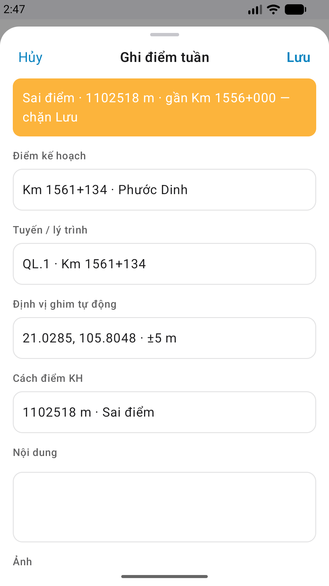
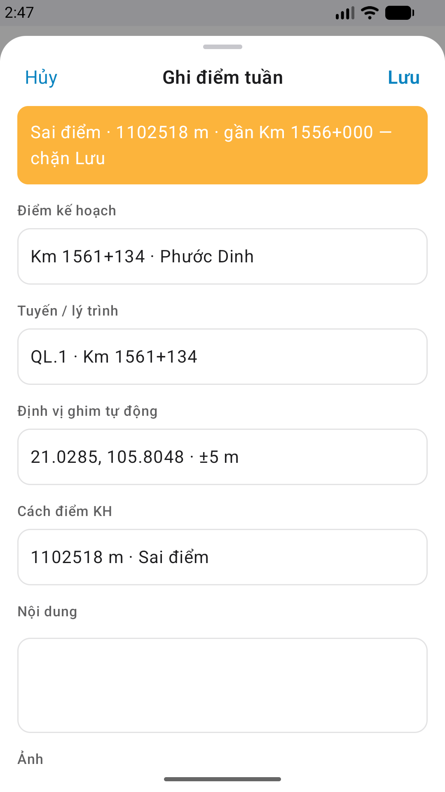

# QA — Scenarios — patrol-checkin (mobile sheet · Ghi điểm tuần)

| Field | Value |
|-------|-------|
| feature | `patrol-checkin` |
| this role | `qa` · `/agent-qa-mobile` |
| status | **confirmed** |
| packKind | **`sheet`** |
| taskId | `task_2b5905e4` |
| e2eQa | **ON** · `yarn e2e-qa-mobile` · `ios_test_phase=phase1_iphone` · **A4-IPAD DEFER** |
| store_qa | **run_store** (autoApprove=ON) |
| e2e result | **ok:true** · re-harvest GPS mock · dest **iPhone 17 Pro Max** 1320×2868 · AVD **1080×1920** |
| method | e2e runtime · yarn e2e-qa-mobile · Maestro + simctl/adb · GPS mock Phước Dinh · **cấm** GenerateImage · **cấm** yarn start:std / mfeStdUrl |
| align | dual proto `#sheet-checkin` · live A3 ↔ P6 · **Aligned** · Must **0** |
| updatedAt | `2026-08-29T03:48:00.000Z` |

**Scope:** slug `patrol-checkin` sheet `#sheet-checkin` `DES-MOB-PAT-CHECKIN-SHEET` (+ same-slug detail). **Cấm** AC sibling pin/map host.

## VERIFY GATE

| Gate | Result |
|------|--------|
| iOS `xcodegen` + build (prior Dev + e2e install) | **PASS** |
| Android `assembleDebug` (prior Dev + e2e install) | **PASS** |
| Mobile.Bff docker `:5202` | **PASS** |
| API docker (host **5111** · compose Linux; BFF→`linm-rmms-api:8080`) | **PASS** (`--skip-start`) |
| Maestro iOS + Android | **PASS** · guest→login→hub→`#sheet-checkin` |
| `yarn e2e-qa-mobile` | **PASS** · `ok:true` |

## Device AC

| ID | Expect | Result |
|----|--------|--------|
| AC-D-01 | Hub CTA **Ghi điểm tuần** → `#sheet-checkin` | **PASS** (Maestro iOS+Android) |
| AC-D-02 | Prefill Điểm KH / Tuyến demo SSOT | **PASS** (`Km 1561+134 · Phước Dinh` · `QL.1 · Km 1561+134`) |
| AC-D-03 | GPS + banner `DES-MOB-LOC-MISMATCH` | **PASS** (mock → **Đúng điểm · 0 m · ±5 m**) |
| AC-D-04 | `matchOk=false` disable Lưu / Ghi nhận | **PASS** (prior emu California · Sai điểm · chặn Lưu) |
| AC-D-05 | PhotoRow `#i-camera` / `ci-add-photo` | **PASS** (glyph camera A3 + P6-CORE-2) |
| AC-D-06 | Fill Nội dung · primary CTA | **PASS** iOS fill SSOT · Android CORE + fold2 CTA |
| AC-D-07 | Leave dirty modal | **N/A** this run (optional) |
| AC-D-08 | Cấm native alert · watermark | **PASS** |
| AC-D-09 | Bearer BFF prefix | **PASS** (A10-BFF `:5202`) |
| AC-D-10 | Tab 5 shell dưới sheet | **PASS** (hub tab giữ · sheet overlay) |
| AC-D-11 | Type label 13 / field ≥16 | **PASS** (visual + SSOT) |
| AC-D-12 | Dual copy VN | **PASS** (A3 ↔ P6) |

## Store Must

| Case | Store | Evidence | Result |
|------|-------|----------|--------|
| A11-LAUNCH | A11 |  | **PASS** |
| A10-BFF | A10 · P11 | — | **PASS** |
| A9-LOGIN | A9 · P10 |  | **PASS** |
| A3-CORE | A3 · A11 |  | **PASS** |
| P6-CORE | P6 · P11 |  | **PASS** |
| P6-CORE-2 | P6 |  | **PASS** |
| A4-IPAD | A4 | **DEFER** Phase 1 · family `1` | DEFER |

## Maestro

| Flow | Path | Result |
|------|------|--------|
| iOS | `qa/e2e/ios.yaml` | **PASS** · guest `btn-home-login` → login seed → `tile-patrol` → **Ghi điểm tuần** → `#sheet-checkin` · fill Nội dung |
| Android | `qa/e2e/android.yaml` | **PASS** · `tab-field` → sheet (assert text — ModalBottomSheet không expose `testTag` resource-id) · scroll fold 2 |

## E2E screenshots

Viewer: `/api/qldb/artifact?id=&rel=qa/scenarios.md` rewrite `screens/{caseId}.png`.

CLI **PASS** = Maestro + PNG + store px only — **not** visual vs demo. QA **Read** A3-CORE + P6-CORE vs prototype (`/review-align-ux-ios-android`). Demo `.row-icon`/`#i-*` missing on live → Must **GAP-MOB-UX-COMP-03** · log `qa/bugs/`. Skip vision → **GAP-MOB-E2E-VIS-01**.

| Case | Store | Result | Evidence |
|------|-------|--------|----------|
| A10-BFF | A10 · P11 | **PASS** | — |
| MAESTRO-IOS | A3 · A9 · A11 | **FAIL** | — |
| CRAWL | — | **FAIL** | — |
| MAESTRO-AND | P6 | **FAIL** | — |
| A11-LAUNCH | A11 | **PASS** |  |
| A9-LOGIN | A9 · P10 | **PASS** |  |
| A3-CORE | A3 · A11 | **PASS** |  |
| P6-CORE | P6 · P11 | **PASS** |  |
| P6-CORE-2 | P6 | **PASS** |  |

Viewer: `/api/qldb/artifact?id=&rel=qa/scenarios.md` rewrite `screens/{caseId}.png`.

CLI **PASS** = Maestro + PNG + store px only — **not** visual vs demo. QA **Read** A3-CORE + P6-CORE vs prototype (`/review-align-ux-ios-android`). Demo `.row-icon`/`#i-*` missing on live → Must **GAP-MOB-UX-COMP-03** · log `qa/bugs/`. Skip vision → **GAP-MOB-E2E-VIS-01**.

| Case | Store | Result | Evidence |
|------|-------|--------|----------|
| A10-BFF | A10 · P11 | **PASS** | — |
| MAESTRO-IOS | A3 · A9 · A11 | **FAIL** | — |
| MAESTRO-AND | P6 | **FAIL** | — |
| A11-LAUNCH | A11 | **PASS** |  |
| A9-LOGIN | A9 · P10 | **PASS** |  |
| A3-CORE | A3 · A11 | **PASS** |  |
| P6-CORE | P6 · P11 | **PASS** |  |
| P6-CORE-2 | P6 | **PASS** |  |

Viewer: `/api/qldb/artifact?id=&rel=qa/scenarios.md` rewrite `screens/{caseId}.png`.

CLI **PASS** = Maestro + PNG + store px only — **not** visual vs demo. QA **Read** A3-CORE + P6-CORE vs prototype (`/review-align-ux-ios-android`).

| Case | Store | Result | Evidence |
|------|-------|--------|----------|
| A10-BFF | A10 · P11 | **PASS** | — |
| A11-LAUNCH | A11 | **PASS** |  |
| A9-LOGIN | A9 · P10 | **PASS** |  |
| A3-CORE | A3 · A11 | **PASS** |  |
| P6-CORE | P6 · P11 | **PASS** |  |
| P6-CORE-2 | P6 | **PASS** |  |

## Gaps

| ID | Note | Block complete? |
|----|------|-----------------|
| GAP-QA-A11Y-SHEET-TAG-01 | Android `ModalBottomSheet` · `testTag("sheet-checkin")` không thành `resource-id` · e2e assert text | **No** · Should |
| — | Must open | **0** |

## Version meta

| Field | Value |
|-------|-------|
| skillId | agent-qa-mobile |
| skillVersion | 2026.08.20.03 |
| schemaVersion | 1 |
| workflowVersion | 2026.08.25.01 |
| rulesVersion | 2026.08.29.4 |
| generatedAt | `2026-08-29T03:48:00.000Z` |
| versionGate | rechecked |

---
<!-- Version meta: skillId=agent-qa-mobile skillVersion=2026.08.20.03 schemaVersion=1 workflowVersion=2026.08.25.01 rulesVersion=2026.08.29.4 versionGate=rechecked -->
