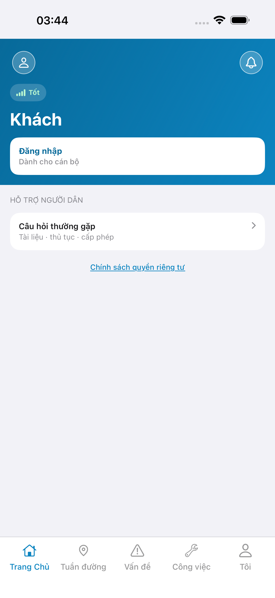
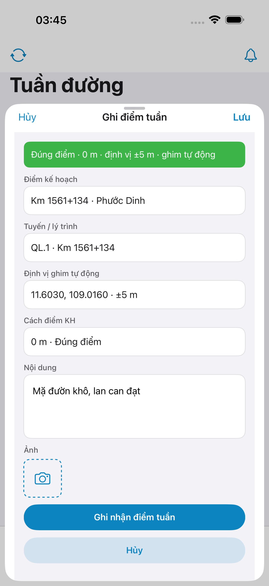
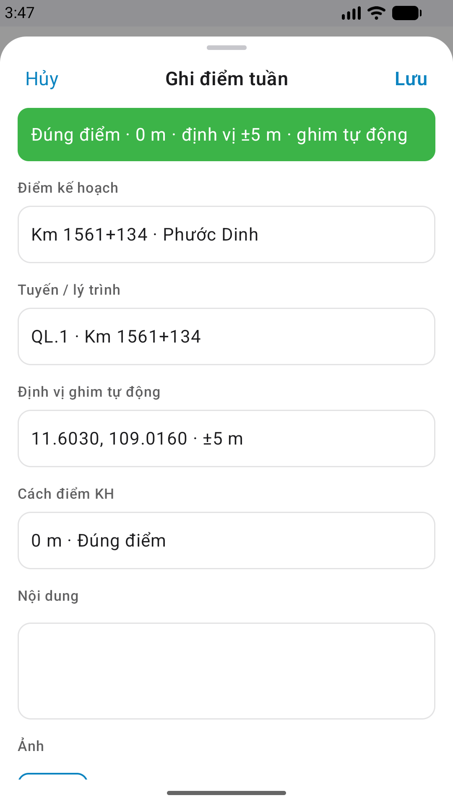

# Capture — patrol-checkin

| Field | Value |
|-------|-------|
| feature | `patrol-checkin` |
| method | e2e runtime · yarn e2e-qa-mobile · Maestro ON |
| iosDevice | iPhone 17 Pro Max (6.9") · **1320×2868** RGB |
| androidDevice | emulator wm **1080×1920** |
| iPad | **DEFER** Phase 1 |
| capturedAt | `2026-08-28T20:47:00.000Z` |
| gps | mock `11.6030,109.0160` (Phước Dinh SSOT) |

| Case | Store | Result | Evidence |
|------|-------|--------|----------|
| A10-BFF | A10 · P11 | **PASS** | — |
| A11-LAUNCH | A11 | **PASS** |  |
| A9-LOGIN | A9 · P10 | **PASS** |  |
| A3-CORE | A3 · A11 | **PASS** |  |
| P6-CORE | P6 · P11 | **PASS** |  |
| P6-CORE-2 | P6 | **PASS** |  |

CLI PASS = capture+px only. Visual = `/review-align-ux-ios-android` Read CORE vs demo HTML.

Listing official → `/store-image-capture` confirm file live (**cấm** AI vẽ).
