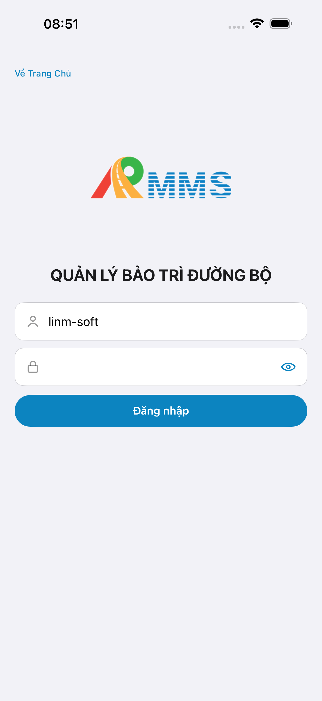
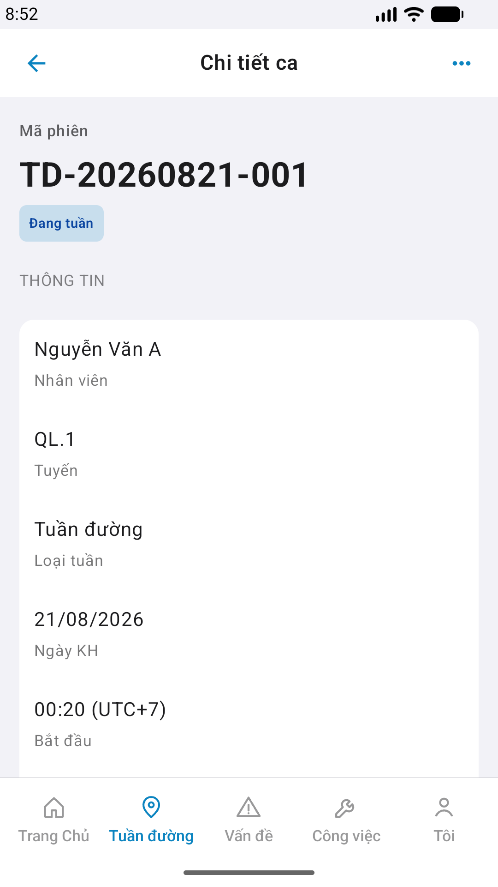

# QA — Scenarios — patrol-history-detail

> Status: **PASS** · task `task_cf2aadc0` · e2eQa ON · method `yarn e2e-qa-mobile`  
> Devices: iPhone 17 Pro Max (6.9") · Android Pixel 2 (1080×1920) · A4-IPAD **DEFER** Phase 1  
> Prior: re-QA after `/edit-mobile-feature` NAV wire + strip OfflineDemo (`task_158bf625`)

| | |
|--|--|
| Feature | `patrol-history-detail` |
| Title | [Mobile] [Lịch sử phiên] -> Chi tiết ca |
| Role | `qa` |
| Seed | BFF `a11e0001-0001-4a01-8a01-000000000001` · `TD-20260821-001` |
| API | GET `mobile-bff/api/v1/patrol/sessions/{id}` · real row (cấm mock-only PASS) |
| API host | Linux compose `:5111` · Mobile.Bff `:5202` · e2e `--skip-start` (GAP-QA-STORE-02 default :5101 Win) |

## Device AC

| id | AC | Result | notes |
|----|----|--------|-------|
| T-QA-LAUNCH | A11 guest home | **PASS** | `#sc-home` |
| T-QA-BFF | A10 BFF :5202 | **PASS** | health |
| T-QA-LOGIN | A9 Auth seed | **PASS** | `linm-soft` / `Linm@2026` |
| T-QA-CORE-IOS | A3 `#sc-patrol-detail` | **PASS** | push from history · info+timeline+CTA · real Code via P6 |
| T-QA-CORE-AND | P6 ×2 folds | **PASS** | top hero TD-* · scroll timeline+CTA |
| T-QA-NAV | list → detail push | **PASS** | GAP-MOB-PAT-HIST-DET-NAV-01 closed |
| T-QA-REAL | GET BFF ≠ demo-only | **PASS** | live seed TD-20260821-001 |
| T-QA-ALIGN | Read CORE vs demo | **PASS** | `ui/review/align-ux.md` · Must 0 |

## E2E screenshots

Viewer: `/api/qldb/artifact?id=&rel=qa/scenarios.md` rewrite `screens/{caseId}.png`.

CLI **PASS** = Maestro + PNG + store px only — **not** visual vs demo. QA **Read** A3-CORE + P6-CORE vs prototype (`/review-align-ux-ios-android`).

| Case | Store | Result | Evidence |
|------|-------|--------|----------|
| A10-BFF | A10 · P11 | **PASS** | — |
| A11-LAUNCH | A11 | **PASS** |  |
| A9-LOGIN | A9 · P10 | **PASS** |  |
| A3-CORE | A3 · A11 | **PASS** |  |
| P6-CORE | P6 · P11 | **PASS** |  |
| P6-CORE-2 | P6 | **PASS** |  |

method: `e2e runtime · yarn e2e-qa-mobile` · **cấm** start:std / mfeStdUrl
