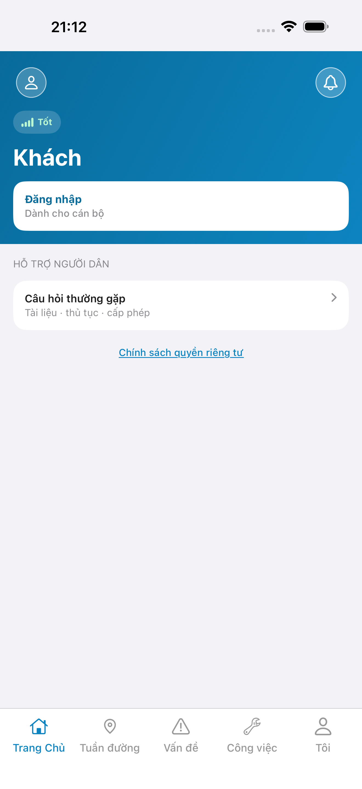
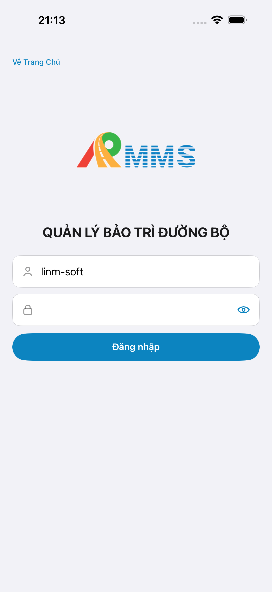
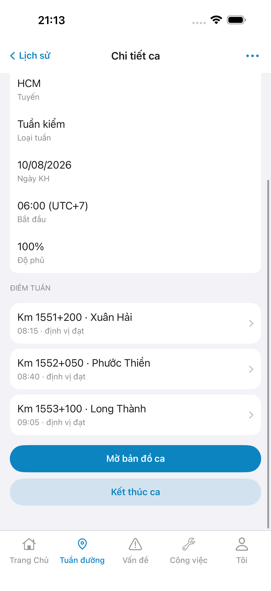
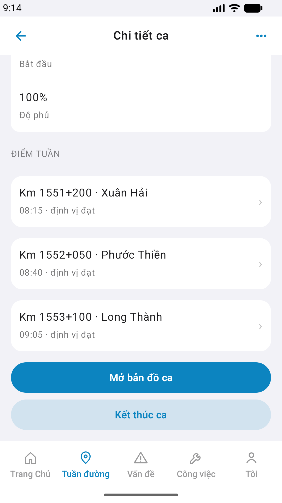

# Capture — patrol-history-detail

> task `task_01ffb168` · capturedAt `2026-09-12T14:14:47.240Z` · edit_page timeline Live · `ok:true`

| Case | Store | Result | Evidence |
|------|-------|--------|----------|
| A10-BFF | A10 · P11 | **PASS** | — |
| A11-LAUNCH | A11 | **PASS** |  |
| A9-LOGIN | A9 · P10 | **PASS** |  |
| A3-CORE | A3 · A11 | **PASS** |  |
| P6-CORE | P6 · P11 | **PASS** |  |
| P6-CORE-2 | P6 | **PASS** |  |

iOS device: iPhone 17 Pro Max
iPad device: DEFER Phase 1
method: e2e runtime · yarn e2e-qa-mobile · Maestro ON · `--skip-start` · `--skip-build` (API :5111 · BFF :5202 healthy)

Seed: `b33e0001-0001-4c01-8c01-000000000002` · `PAT-20260810-0009` · check-ins Live

CLI PASS = capture+px only. Visual = `/review-align-ux-ios-android` Read CORE vs demo HTML · Must 0.

Listing official → `/store-image-capture` confirm file live (cấm AI vẽ).
