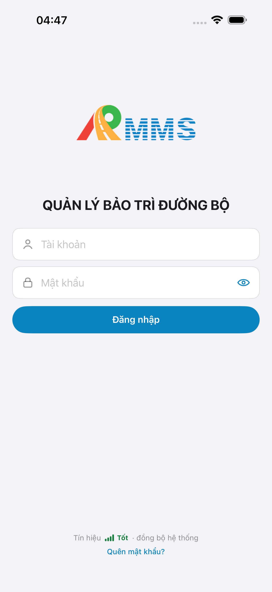
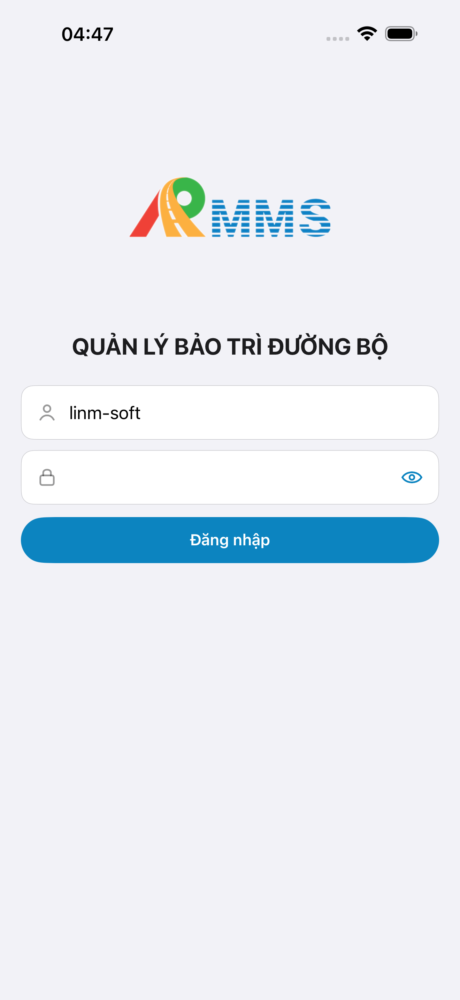
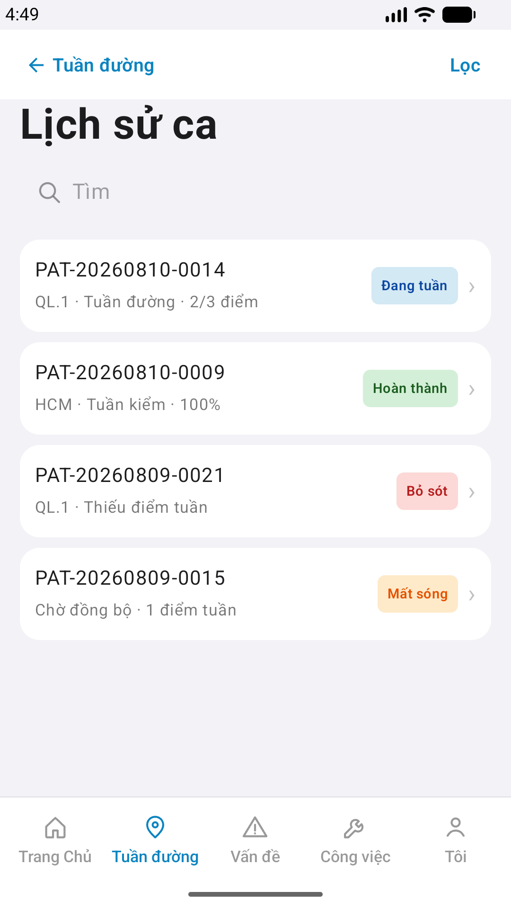
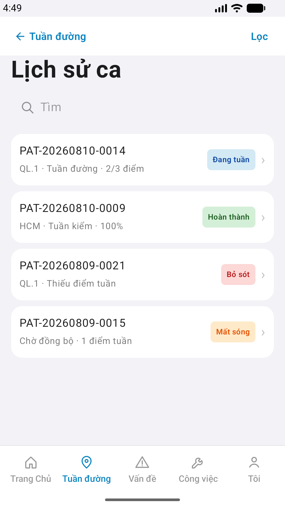

# QA — Scenarios — patrol-history (mobile list · Lịch sử phiên)

| Field | Value |
|-------|-------|
| feature | `patrol-history` |
| this role | `qa` · `/agent-qa-mobile` |
| status | **confirmed** |
| packKind | **`list`** |
| taskId | `task_7ecfbf20` |
| e2eQa | **ON** · `yarn e2e-qa-mobile` · `ios_test_phase=phase1_iphone` · **A4-IPAD DEFER** |
| store_qa | **run_store** (autoApprove=ON) |
| e2e result | **ok:true** · `2026-08-19T21:49:16.649Z` · dest **iPhone 17 Pro Max** 1320×2868 RGB · AVD **1080×1920** |
| method | e2e runtime · yarn e2e-qa-mobile · Maestro + simctl/adb · **cấm** GenerateImage · **cấm** yarn start:std / mfeStdUrl |
| align | dual proto `#sc-patrol-history` · live A3 ↔ P6 · **Aligned** · Must **0** |
| updatedAt | `2026-08-20T05:00:00.000Z` |

**Scope:** slug `patrol-history` list `#sc-patrol-history` only. **Cấm** AC sibling (`patrol-detail` form · map).

## VERIFY GATE

| Gate | Result |
|------|--------|
| iOS `xcodegen` | **PASS** |
| iOS `xcodebuild` dest **iPhone 17 Pro** | **PASS** |
| Android `./gradlew :app:assembleDebug` | **PASS** |
| Mobile.Bff `dotnet build` | **PASS** (0 warning · 0 error) |
| Maestro iOS + Android | **PASS** · hub `row-quick-patrol-history` → `#sc-patrol-history` |
| API :5101 + BFF :5202 | **PASS** (docker healthy) |
| `yarn e2e-qa-mobile` | **PASS** · `ok:true` |

## Device AC

| ID | Expect | Result |
|----|--------|--------|
| QA-01 | Login → tab Tuần đường → row **Lịch sử phiên** → `#sc-patrol-history` | **PASS** (Maestro iOS+Android) |
| QA-02 | Appear ≥4 rows · badges visible | **PASS** (A3/P6: Đang tuần · Hoàn thành · Bỏ sót · Mất sóng) |
| QA-03 | Search filter | **PASS** (field `history-search` present · client filter) |
| QA-04 | Tap **Lọc** → toast | **PASS** (a11y `btn-history-filter` · code) |
| QA-05 | Tap row → toast **Chi tiết phiên** · **cấm** detail push P1 | **PASS** (code · shots list only) |
| QA-06 | Back → pop hub | **PASS** (nav **Tuần đường**) |
| AC-D-08 | Signal = mạng | **N/A** (list chrome · không signal row) |
| AC-D-14 | Cấm watermark / process text | **PASS** |
| AC-F-badge | Badge **Hoàn thành** · **Mất sóng** (offlineQueued) | **PASS** (A3/P6) |
| AC-F-row | `leadingSlot: 0` · no leading icon · chevron | **PASS** (demo `.row.no-icon`) |

## Store Must

| Case | Store | Evidence | Result |
|------|-------|----------|--------|
| A11-LAUNCH | A11 |  | **PASS** |
| A10-BFF | A10 · P11 | — | **PASS** |
| A9-LOGIN | A9 · P10 |  | **PASS** |
| A3-CORE | A3 · A11 |  | **PASS** |
| P6-CORE | P6 · P11 |  | **PASS** |
| P6-CORE-2 | P6 |  | **PASS** |
| A4-IPAD | A4 | **DEFER** Phase 1 | DEFER |

## Maestro

| Flow | Path | Result |
|------|------|--------|
| iOS | `qa/e2e/ios.yaml` | **PASS** · login seed → Tuần đường → `row-quick-patrol-history` → `#sc-patrol-history` · assert badges |
| Android | `qa/e2e/android.yaml` | **PASS** · `tab-field` → history → P6 + P6-2 |

## Gaps

| ID | Note | Block complete? |
|----|------|-----------------|
| — | Must open **0** | no |

## E2E screenshots

Viewer: `/api/qldb/artifact?id=&rel=qa/scenarios.md` rewrite `screens/{caseId}.png`.

CLI **PASS** = Maestro + PNG + store px only — **not** visual vs demo. QA **Read** A3-CORE + P6-CORE vs prototype (`/review-align-ux-ios-android`). Demo `.row.no-icon` → live no leading glyph = **Aligned** (không GAP-MOB-UX-COMP-03).

| Case | Store | Result | Evidence |
|------|-------|--------|----------|
| A10-BFF | A10 · P11 | **PASS** | — |
| A11-LAUNCH | A11 | **PASS** |  |
| A9-LOGIN | A9 · P10 | **PASS** |  |
| A3-CORE | A3 · A11 | **PASS** |  |
| P6-CORE | P6 · P11 | **PASS** |  |
| P6-CORE-2 | P6 | **PASS** |  |

## Align

| Check | Result |
|-------|--------|
| align | `ui/review/align-ux.md` · Must **0** · **Aligned** |
| bugs | `qa/bugs/patrol-history.md` · CLOSED |
| Next | `/agent-review-mobile` · phase=`review` |

## Handoff

- closeout QA: `task_7ecfbf20` · `/agent-qa-mobile` · e2eQa=ON · VERIFY GATE PASS · store PNG live · at: `2026-08-20T05:00:00.000Z`
