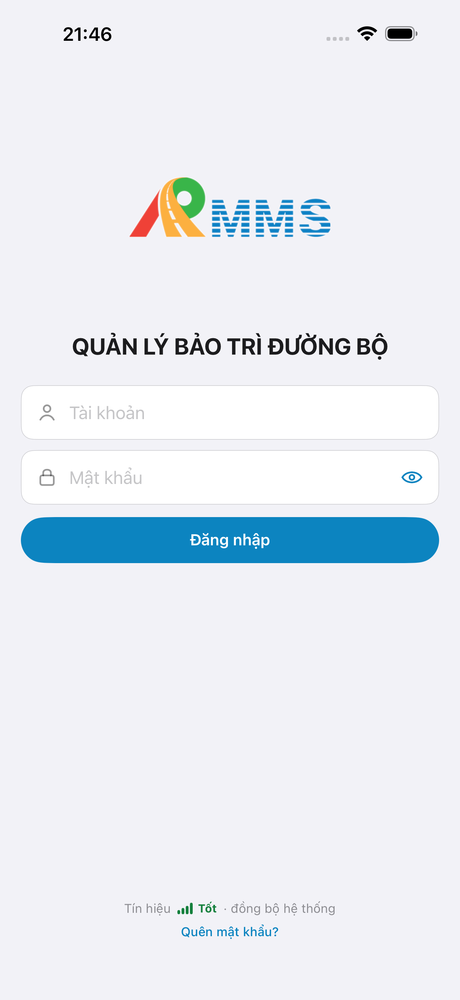
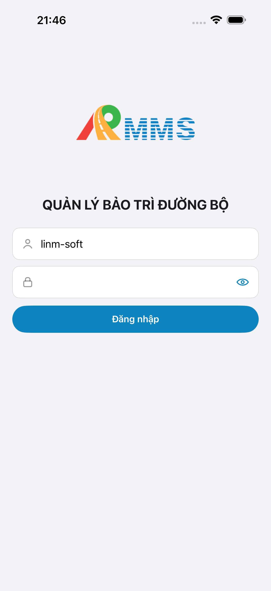
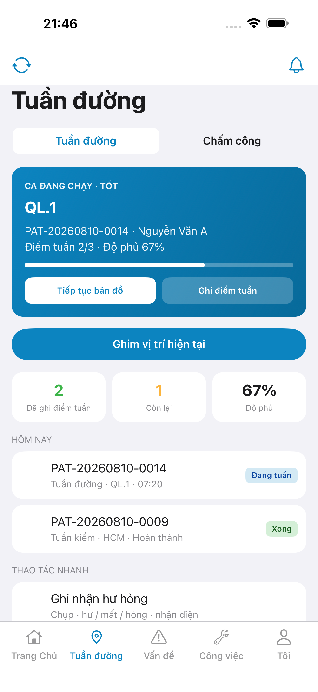

# QA — Scenarios — patrol-home (mobile hub · Tuần đường)

| Field | Value |
|-------|-------|
| feature | `patrol-home` |
| this role | `qa` · `/agent-qa-mobile` |
| status | **confirmed** |
| packKind | **`hub`** |
| taskId | `task_c882b8bd` |
| e2eQa | **ON** · `yarn e2e-qa-mobile` · `ios_test_phase=phase1_iphone` · **A4-IPAD DEFER** |
| store_qa | **run_store** (autoApprove=ON) |
| e2e result | **ok:true** · `2026-08-19T14:47:21.050Z` · dest **iPhone 17 Pro Max** 1320×2868 RGB · AVD **1080×1920** |
| method | e2e runtime · yarn e2e-qa-mobile · Maestro + simctl/adb · **cấm** GenerateImage · **cấm** yarn start:std / mfeStdUrl |
| align | dual proto `#sc-patrol-home` · live A3 ↔ P6 · **Aligned** · Must **0** |
| updatedAt | `2026-08-19T14:50:00.000Z` |

**Scope:** slug `patrol-home` hub `#sc-patrol-home` only. **Cấm** AC sibling screens (`attendance` · `patrol-map` · check-in form · `ops`).

## VERIFY GATE

| Gate | Result |
|------|--------|
| iOS `xcodegen` | **PASS** |
| iOS `xcodebuild` dest **iPhone 17 Pro** | **PASS** |
| Android `./gradlew :app:assembleDebug` | **PASS** |
| Mobile.Bff `dotnet build` | **PASS** (0 warning · 0 error) |
| Maestro iOS + Android | **PASS** · Home `tile-patrol` / `tab-field` → `#sc-patrol-home` |
| API :5101 + BFF :5202 | **PASS** (docker) |
| `yarn e2e-qa-mobile` | **PASS** · `ok:true` |

## Device AC

| ID | Expect | Result |
|----|--------|--------|
| AC-D-01 | Tab / tile Tuần đường → `#sc-patrol-home` visible | **PASS** (Maestro iOS+Android) |
| AC-D-02 | GPS deny | **N/A** (GPS live P2) |
| AC-D-03 | Leave dirty | **N/A** (no form) |
| AC-D-04 | Cấm native alert · toast only | **PASS** (code · shots không sheet) |
| AC-D-05 | Keyboard | **N/A** (no text field on hub) |
| AC-D-06 | Safe area TopBar + scroll hub | **PASS** (A3 6.9" · P6 + P6-2 fold) |
| AC-D-07 | Biometric | **N/A** |
| AC-D-08 | Signal on hub = mạng · **cấm** «Có mạng» | **PASS** (eyebrow **Tốt** · A3/P6) |
| AC-D-09 | Bearer BFF prefix GET `patrol/sessions` | **PASS** (BFF :5202 · A10-BFF) |
| AC-D-10 | Tab 5 · field selected | **PASS** (A3/P6 tab **Tuần đường** active) |
| AC-D-11 | Camera / push | **N/A** |
| AC-D-12 | Type 13 / ≥16 | **PASS** (visual + SSOT parity) |
| AC-D-13 | Dual copy VN | **PASS** (A3 ↔ P6) |
| AC-D-14 | Cấm watermark / device label | **PASS** |
| AC-F-01 | Hero + KPI + pin `LinmPrimaryButton` | **PASS** (`btn-pin-here` · 2 / 1 / 67%) |
| AC-F-02 | Home tile `tile-patrol` / tab field → `#sc-patrol-home` | **PASS** (Maestro) |
| AC-F-03 | Nav sync / Lưu trữ ids · **cấm** AC sibling screen | **PASS** (`btn-sync` · `row-quick-patrol-offline`) |
| AC-F-04 | Bell toast Thông báo · badge 0 ẩn | **PASS** (shots không badge 3) |
| AC-F-05 | Segment idx 0 Tuần đường | **PASS** (A3/P6) |
| AC-F-06 | A11y `sc-patrol-home` · `btn-pin-here` · `patrol-hero` | **PASS** (Maestro) |
| AC-F-07 | Cấm watermark Gói | **PASS** |
| AC-F-08 | Sibling toast · **cấm** sheet check-in | **PASS** (shots hub only) |

## Store Must

| Case | Store | Evidence | Result |
|------|-------|----------|--------|
| A11-LAUNCH | A11 |  | **PASS** |
| A10-BFF | A10 · P11 | — | **PASS** |
| A9-LOGIN | A9 · P10 |  | **PASS** |
| A3-CORE | A3 · A11 |  | **PASS** |
| P6-CORE | P6 · P11 |  | **PASS** |
| P6-CORE-2 | P6 |  | **PASS** |
| A4-IPAD | A4 | **DEFER** Phase 1 · family `1` | DEFER |

## Maestro

| Flow | Path | Result |
|------|------|--------|
| iOS | `qa/e2e/ios.yaml` | **PASS** · login seed → `tile-patrol` / text Tuần đường → `#sc-patrol-home` |
| Android | `qa/e2e/android.yaml` | **PASS** · `tab-field` → `#sc-patrol-home` · scroll `row-quick-patrol-offline` |

## Gaps

| ID | Note | Block complete? |
|----|------|-----------------|
| GAP-QA-A11Y-TAB-FIELD-01 | iOS `LinmTabBar` children inherit `resource-id` `tab-bar` (không expose `tab-field`) · Maestro dùng `tile-patrol` + text **Tuần đường** · Android `tab-field` OK | **No** |

## E2E screenshots

Viewer: `/api/qldb/artifact?id=&rel=qa/scenarios.md` rewrite `screens/{caseId}.png`.

| Case | Store | Result | Evidence |
|------|-------|--------|----------|
| A10-BFF | A10 · P11 | **PASS** | — |
| A11-LAUNCH | A11 | **PASS** |  |
| A9-LOGIN | A9 · P10 | **PASS** |  |
| A3-CORE | A3 · A11 | **PASS** |  |
| P6-CORE | P6 · P11 | **PASS** |  |
| P6-CORE-2 | P6 | **PASS** |  |

## Notes

- Maestro iOS: **cấm** rely `id: tab-field` (kit a11y) — same class work-around as ops `text: Tôi`.
- px: iOS A3 **1320×2868** RGB · Play P6 **1080×1920** RGB.
- **Cấm** READY_TO_SUBMIT ở QA — next `/agent-review-mobile`.
- Sibling AC / form slug khác: **out of scope**. Form submit **N/A** (hub không CTA Lưu/Gửi).

## Handoff → Review

| Field | Value |
|-------|-------|
| phase_to | `review` |
| Next slash | `/agent-review-mobile` |
| store | `qa/store/patrol-home/` · CAPTURE.md |
| align | `ui/review/align-ux.md` · Must **0** |
| Chain this turn | **không** (roleOnly=`qa`) |

## Version meta

skillId=agent-qa-mobile · skillVersion=2026.08.19.28 · workflowVersion=2026.08.19.29 · generatedAt=2026-08-19T14:50:00.000Z · taskId=task_c882b8bd
