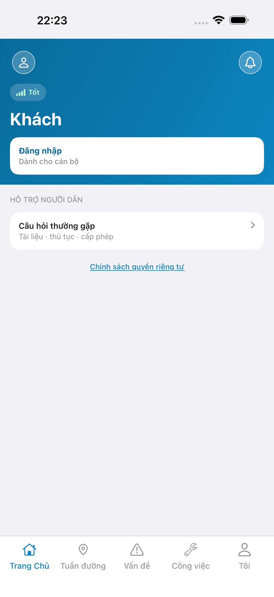
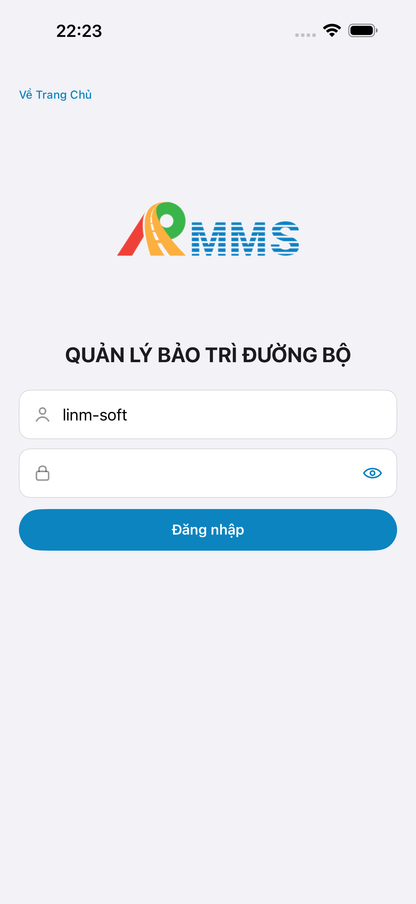
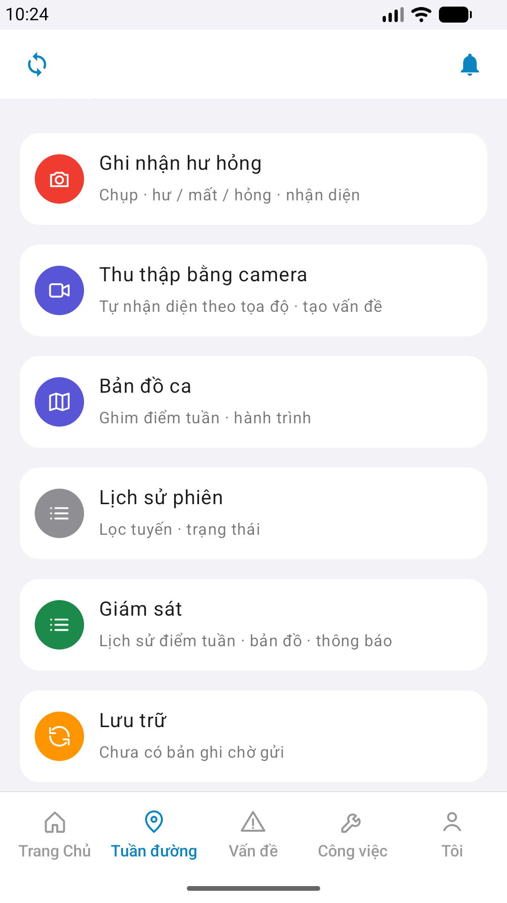

# Capture — patrol-home

| Case | Store | Result | Evidence |
|------|-------|--------|----------|
| A10-BFF | A10 · P11 | **PASS** | — |
| A11-LAUNCH | A11 | **PASS** |  |
| A9-LOGIN | A9 · P10 | **PASS** |  |
| A3-CORE | A3 · A11 | **PASS** |  |
| P6-CORE | P6 · P11 | **PASS** |  |
| P6-CORE-2 | P6 | **PASS** |  |

iOS device: iPhone 17 Pro Max  
iPad device: DEFER Phase 1  
method: e2e runtime · yarn e2e-qa-mobile · Maestro ON  
taskId: task_56abf022 · capturedAt: 2026-09-12T15:25:02.199Z  
px: A3 1320×2868 · P6 1080×1920  

CLI PASS = capture+px only. Visual = `/review-align-ux-ios-android` Read CORE vs demo HTML · **Aligned** Must 0.

Listing official → `/store-image-capture` confirm file live (cấm AI vẽ).
