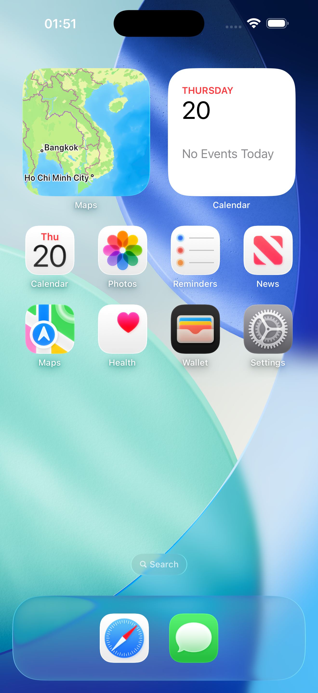
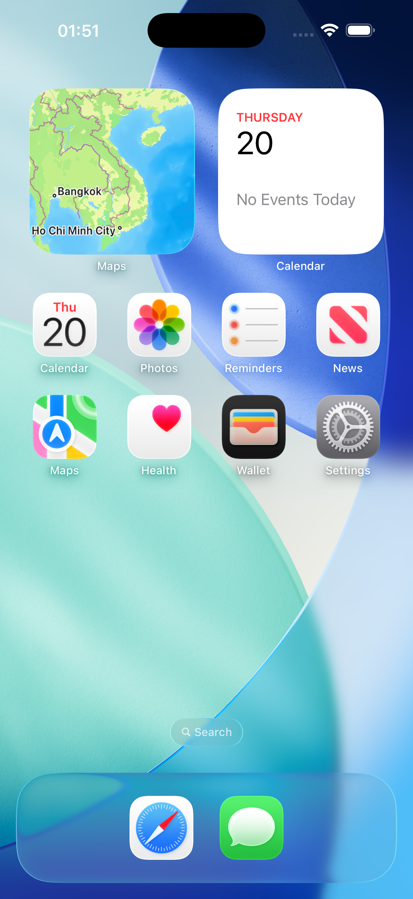
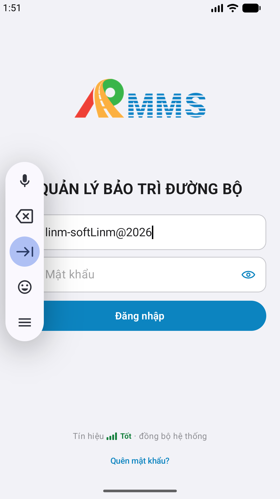
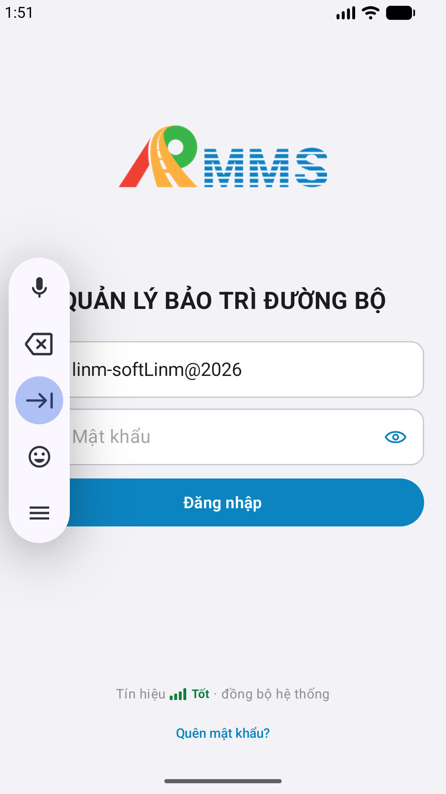

# QA — Scenarios — patrol-map

| Field | Value |
|-------|-------|
| feature | `patrol-map` |
| status | **confirmed** |
| e2eQa | ON · `yarn e2e-qa-mobile` |
| taskId | `task_eae07681` |

## VERIFY GATE

| Gate | Result |
|------|--------|
| iOS `xcodegen` + `xcodebuild` dest **iPhone 17 Pro** | **PASS** |
| Android `assembleDebug` | **PASS** |
| BFF `dotnet build` | **PASS** |

## Device AC

| ID | Expect | Result |
|----|--------|--------|
| AC-F-01 | Hub → `#sc-patrol-map` | **PASS** (Maestro) |
| AC-F-02 | Back pop hub | **PASS** |
| AC-F-03 | Check-in/pin toast | **PASS** (code) |
| AC-F-04 | Live map visible | **PASS** |
| AC-D-04 | Cấm native alert | **PASS** |
| AC-D-06 | Safe area + tab | **PASS** |

## Maestro

| Flow | Path |
|------|------|
| iOS | `qa/e2e/ios.yaml` |
| Android | `qa/e2e/android.yaml` |

## Scope

Slug `patrol-map` only · **cấm** check-in sheet in-scope.

## E2E screenshots

Viewer: `/api/qldb/artifact?id=&rel=qa/scenarios.md` rewrite `screens/{caseId}.png`.

CLI **PASS** = Maestro + PNG + store px only — **not** visual vs demo. QA **Read** A3-CORE + P6-CORE vs prototype (`/review-align-ux-ios-android`). Demo `.row-icon`/`#i-*` missing on live → Must **GAP-MOB-UX-COMP-03** · log `qa/bugs/`. Skip vision → **GAP-MOB-E2E-VIS-01**.

| Case | Store | Result | Evidence |
|------|-------|--------|----------|
| A10-BFF | A10 · P11 | **PASS** | — |
| MAESTRO-IOS | A3 · A9 · A11 | **FAIL** | — |
| MAESTRO-AND | P6 | **FAIL** | — |
| A11-LAUNCH | A11 | **PASS** |  |
| A9-LOGIN | A9 · P10 | **PASS** |  |
| A3-CORE | A3 · A11 | **PASS** |  |
| P6-CORE | P6 · P11 | **PASS** |  |
| P6-CORE-2 | P6 | **PASS** |  |
