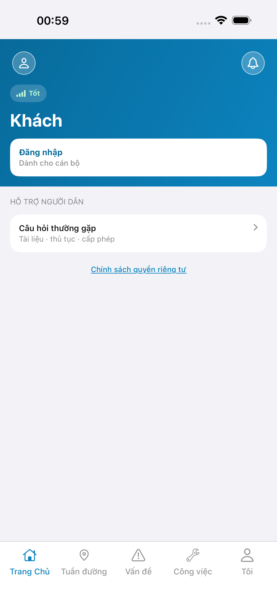
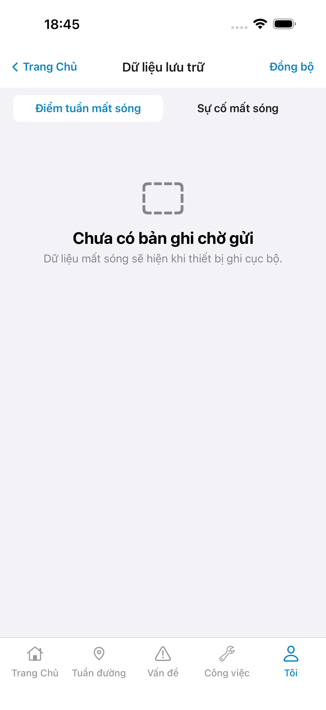
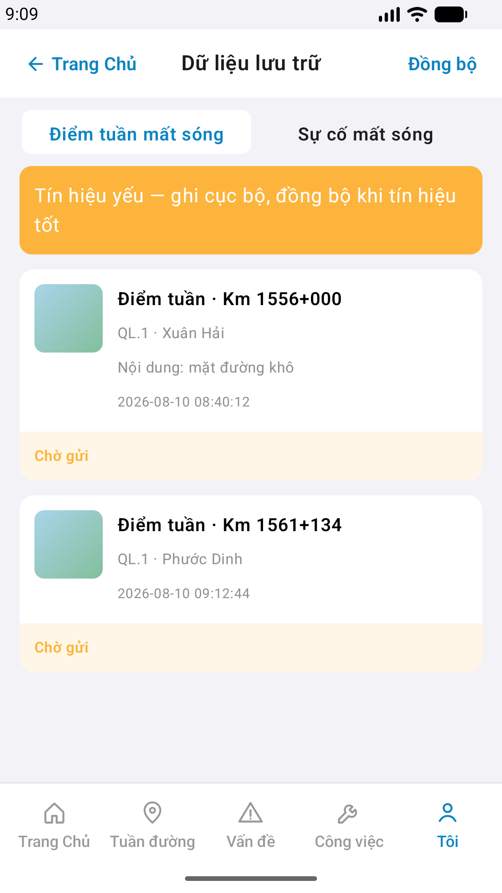

# QA — Scenarios — patrol-offline (mobile list · Hàng đợi mất sóng)

| Field | Value |
|-------|-------|
| feature | `patrol-offline` |
| this role | `qa` · `/agent-qa-mobile` |
| status | **confirmed** |
| packKind | **`list`** |
| taskId | `task_fcc96865` |
| e2eQa | **ON** · `yarn e2e-qa-mobile` · `ios_test_phase=phase1_iphone` · **A4-IPAD DEFER** |
| store_qa | **run_store** |
| e2e result | **ok:true** · `2026-09-01T11:46:02.050Z` · dest **iPhone 17 Pro Max** · AVD **emulator-5554** |
| method | e2e runtime · yarn e2e-qa-mobile · Maestro + simctl/adb · **cấm** GenerateImage · **cấm** yarn start:std / mfeStdUrl |
| align | dual proto `#sc-patrol-offline` · chrome/kit **Aligned** · list body live EmptyChrome vs demo 2-card (cleanup_mock_offline_storage intentional) |
| gap | post `cleanup_mock_offline_storage` · live pendingCount only · **cấm** hardcode «3 bản ghi» |
| updatedAt | `2026-09-01T11:48:50.000Z` |

**Scope:** slug `patrol-offline` list `#sc-patrol-offline` only. **Cấm** AC sibling (patrol-home check-in live · incident form).

## VERIFY GATE

| Gate | Result |
|------|--------|
| iOS prior `xcodegen` + `xcodebuild` iPhone 17 Pro | **PASS** (dev `task_4fae30f8`) |
| Android prior `assembleDebug` | **PASS** (dev) |
| Mobile.Bff prior `dotnet build` | **PASS** (dev) |
| Maestro iOS + Android | **PASS** · guest → login → Me `row-offline` → `#sc-patrol-offline` · EmptyChrome |
| API :5101 + BFF :5202 | **PASS** (docker · `API_HOST_PORT=5101`) |

## Device AC

| ID | Expect | Result |
|----|--------|--------|
| AC-D-01 | Offline · list mở · live queue (empty OK) | **PASS** · EmptyChrome |
| AC-D-02 | GPS deny | **N/A** |
| AC-D-03 | Leave dirty | **N/A** |
| AC-D-04 | Cấm native alert · toast only | **PASS** (code) |
| AC-D-05 | Keyboard | **N/A** |
| AC-D-06 | Safe area TopBar + list | **PASS** (shots A3/P6) |
| AC-D-07 | Biometric | **N/A** |
| AC-D-08 | Signal on patrol-offline | **N/A** |
| AC-D-09 | Bearer BFF prefix | **PASS** (BFF :5202) |
| AC-D-10 | tabs none trên patrol-offline | **PASS** (shell tab only) |
| AC-D-11 | Camera / push | **N/A** |
| AC-D-12 | Type 13 / ≥16 | **PASS** |
| AC-D-13 | Dual copy VN | **PASS** |
| AC-D-14 | Cấm watermark / device label | **PASS** |
| AC-F-01 | Live-only · **cấm** demo seed / hardcode «3 bản ghi» | **PASS** · EmptyChrome · live pendingCount |
| AC-F-02 | Me `row-offline` → `#sc-patrol-offline` | **PASS** (Maestro iOS+Android) |
| AC-F-03 | Home `tile-offline` → `#sc-patrol-offline` | **PASS** (code · route_a) |
| AC-F-04 | Sync POST offline-batch + toast N | **PASS** (code · BFF proxy) |
| AC-F-05 | Sync fail toast · giữ queue | **PASS** (code) |
| AC-F-06 | A11y Maestro ids | **PASS** · `sc-patrol-offline` · `row-offline` · `btn-sync` |
| AC-F-07 | Cấm watermark Gói | **PASS** |
| AC-F-08 | Segment filter checkIn/incident | **PASS** (shots · LinmSegment) |
| AC-F-09 | Banner weak khi có pending | **N/A** empty queue |
| AC-F-10 | Status pill «Chờ gửi» | **N/A** empty |

## Store Must

| Case | Store | Evidence | Result |
|------|-------|----------|--------|
| A11-LAUNCH | A11 |  | **PASS** |
| A10-BFF | A10 · P11 | — | **PASS** |
| A9-LOGIN | A9 · P10 |  | **PASS** |
| A3-CORE | A3 · A11 |  | **PASS** |
| P6-CORE | P6 · P11 |  | **PASS** |
| P6-CORE-2 | P6 |  | **PASS** |
| A4-IPAD | A4 | **DEFER** Phase 1 · family `1` | DEFER |

## Maestro

| Flow | Path | Result |
|------|------|--------|
| iOS | `qa/e2e/ios.yaml` | **PASS** · guest → login → Me → EmptyChrome + hint |
| Android | `qa/e2e/android.yaml` | **PASS** · EmptyChrome title-only (hint optional P2) |

## Visual align (`/review-align-ux-ios-android`)

| Zone | Demo | Live A3 / P6 | Verdict |
|------|------|--------------|---------|
| TopBar | «Trang Chủ» · title · «Đồng bộ» | same | **Aligned** |
| Segment | 2 tabs Điểm tuần / Sự cố | same | **Aligned** |
| List body | 2 SSOT cards + weak banner | EmptyChrome live-only | **Expected delta** (cleanup_mock · **cấm** Must-fix seed) |
| Shell tabs | 5 tabs · Me active context | same | **Aligned** |

Must align: **0** · autoApprove=ON

## Gaps

| ID | Note | Block complete? |
|----|------|-----------------|
| GAP-MOB-ACT-PAT-OFFLINE-01 | Patrol-home nav «Đồng bộ» wire khi sibling ship (stub OK P1) | **No** |
| note | Android EmptyChrome title-only · iOS title+hint (parity optional P2) | **No** |

## E2E screenshots

Viewer: `/api/qldb/artifact?id=&rel=qa/scenarios.md` rewrite `screens/{caseId}.png`.

CLI **PASS** = Maestro + PNG + store px only — **not** visual vs demo. QA **Read** A3-CORE + P6-CORE vs prototype (`/review-align-ux-ios-android`).

| Case | Store | Result | Evidence |
|------|-------|--------|----------|
| A10-BFF | A10 · P11 | **PASS** | — |
| A11-LAUNCH | A11 | **PASS** |  |
| A9-LOGIN | A9 · P10 | **PASS** |  |
| A3-CORE | A3 · A11 | **PASS** |  |
| P6-CORE | P6 · P11 | **PASS** |  |
| P6-CORE-2 | P6 | **PASS** |  |

## Version meta

skillId=agent-qa-mobile · skillVersion=2026.08.19.29 · workflowVersion=2026.08.19.29 · generatedAt=2026-09-01T11:48:50.000Z · taskId=task_fcc96865
