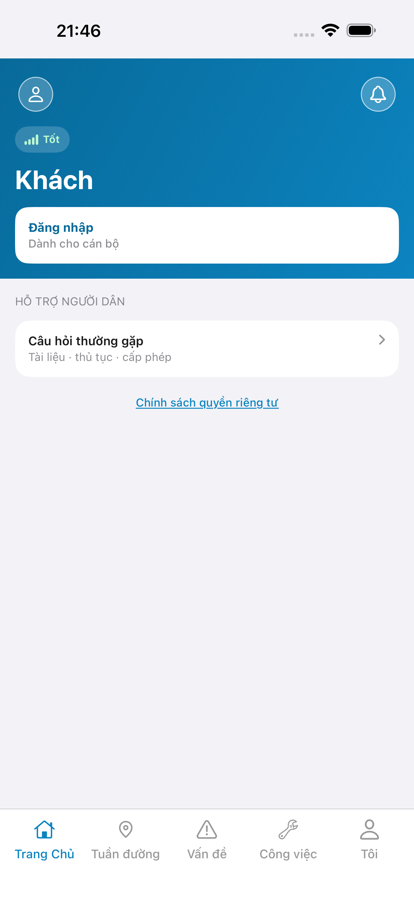
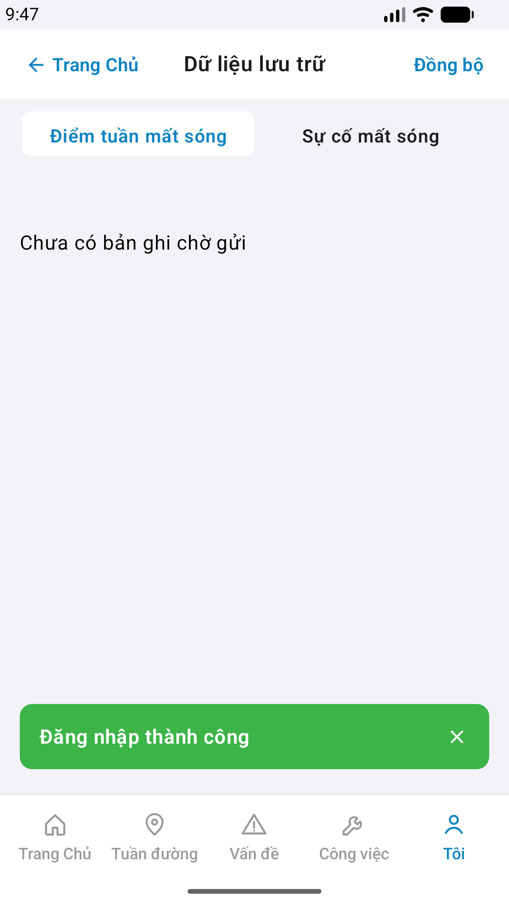

# Capture — patrol-offline

| Case | Store | Result | Evidence |
|------|-------|--------|----------|
| A10-BFF | A10 · P11 | **PASS** | — |
| A11-LAUNCH | A11 | **PASS** |  |
| A9-LOGIN | A9 · P10 | **PASS** |  |
| A3-CORE | A3 · A11 | **PASS** |  |
| P6-CORE | P6 · P11 | **PASS** |  |
| P6-CORE-2 | P6 | **PASS** |  |

iOS device: iPhone 17 Pro Max
iPad device: DEFER Phase 1
Android: emulator-5554
method: e2e runtime · yarn e2e-qa-mobile · Maestro ON
capturedAt: 2026-09-12T14:47:59.841Z
taskId: task_53265cb6
gap: offline_sync_apply_checkins
note: live EmptyChrome · Sync=replay check-ins · cấm hardcode «3 bản ghi» · cấm demo cards · Android login Back+scroll btn-login

CLI PASS = capture+px only. Visual = `/review-align-ux-ios-android` Read CORE vs demo HTML · chrome **Aligned** · list delta expected.

Listing official → `/store-image-capture` confirm file live (cấm AI vẽ).
