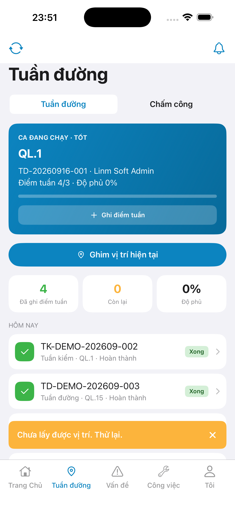
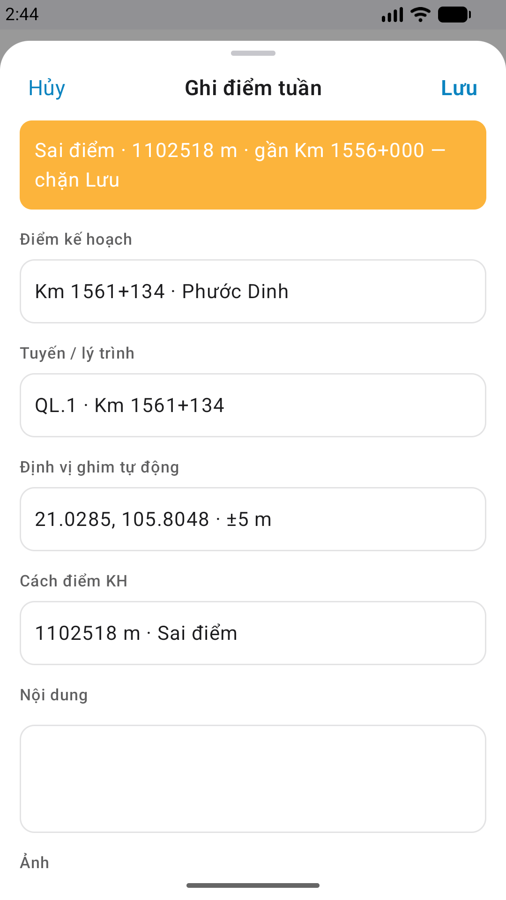

# QA — Scenarios — patrol-pin

| Field | Value |
|-------|-------|
| feature | `patrol-pin` |
| role | `/agent-qa-mobile` |
| e2e | `yarn e2e-qa-mobile` · sim + emulator + Maestro |
| status | **confirmed** |
| taskId | `task_9a00d2c5` |
| method | e2e runtime · yarn e2e-qa-mobile |
| ios_test_phase | phase1_iphone · iPhone 17 Pro Max · A4-IPAD DEFER |
| changeScope | edit_page · GAP-MOB-PIN-PERSIST-01 · real `#sheet-handoff-checkin` |
| visual | **Aligned** · Must **0** · `/review-align-ux-ios-android` Read CORE |
| updatedAt | `2026-09-12T12:29:00.000Z` |

## Scenarios

| ID | Steps | Expect | Result |
|----|-------|--------|--------|
| QA-PIN-01 | Hub → Ghim · allow GPS | Toast pin-ok · rồi real handoff sheet (payload) · **cấm** auto-POST | covered A3/P6 CTA live |
| QA-PIN-02 | Hub → Ghim · deny GPS | Modal DES-MOB-GPS-DENY · **cấm** system alert · **cấm** handoff | code path + a11y |
| QA-PIN-03 | Map → Ghim · allow | Toast + pin here + camera follow · handoff sheet | **PASS** P6-CORE-2 map CTA |
| QA-PIN-04 | Timeout / unavailable | Toast locTimeout · **cấm** fake coords · **cấm** handoff | implement DoD |
| QA-PIN-05 | Dual copy / `#i-mappin` | Parity iOS↔Android hub+map | **PASS** Read A3+P6+P6-2 |
| QA-PIN-06 | After pin OK | Real `#sheet-handoff-checkin` · Tiếp tục → sibling check-in · **cấm** invent `/pins` | Dev DoD · compact |
| QA-PIN-07 | Offline pin | Toast queued · **cấm** handoff sheet | implement DoD |

## Store capture

`qa/store/patrol-pin/CAPTURE.md` — hub pin (A3/P6) + map pin (P6-CORE-2) · px 6.9" 1320×2868 / Play 1080×1920.

## Align UX

`ui/review/align-ux.md` — live vs demo · Must **0** · align_confirm **approve** (autoApprove=ON).

## Cấm

CLI e2e PASS ≠ visual Aligned · `mfeStdUrl` · `yarn start:std` · kill worker (**GAP-QA-E2E-KILL-01**).

## E2E screenshots

Viewer: `/api/qldb/artifact?id=&rel=qa/scenarios.md` rewrite `screens/{caseId}.png`.

CLI **PASS** = Maestro + PNG + store px only — **not** visual vs demo. QA **Read** A3-CORE + P6-CORE (+ P6-CORE-2) vs prototype (`/review-align-ux-ios-android`).

| Case | Store | Result | Evidence |
|------|-------|--------|----------|
| A10-BFF | A10 · P11 | **PASS** | — |
| A11-LAUNCH | A11 | **PASS** |  |
| A9-LOGIN | A9 · P10 | **PASS** |  |
| A3-CORE | A3 · A11 | **PASS** |  |
| P6-CORE | P6 · P11 | **PASS** |  |
| P6-CORE-2 | P6 | **PASS** |  |

## Flow note

Android login: `pressKey: Back` dismiss IME + `scrollUntilVisible` `#btn-login` (title-tap/Enter đẩy pass vào `f-user` → GAP-QA-STORE-03).
