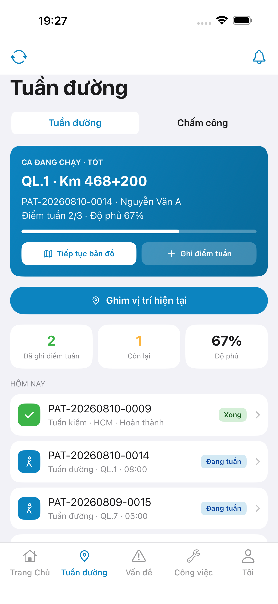
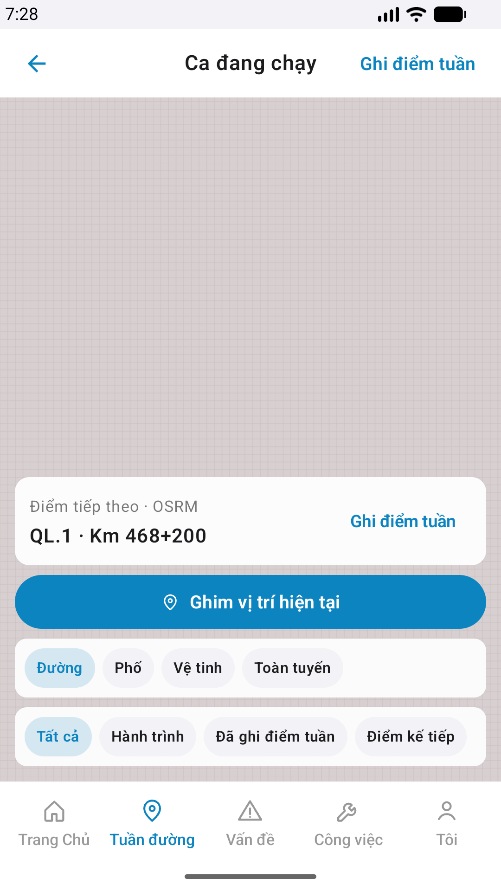

# CAPTURE — patrol-pin (store)

| Field | Value |
|-------|-------|
| feature | `patrol-pin` |
| method | e2e runtime · yarn e2e-qa-mobile |
| taskId | `task_9a00d2c5` |
| ios | iPhone 17 Pro Max · 1320×2868 · phase1_iphone |
| android | Pixel 2 · 1080×1920 |
| capturedAt | `2026-09-12T12:28:22.116Z` |
| ok | true |

## Shots

| Case | Store | Device | px | Notes |
|------|-------|--------|-----|-------|
| A11-LAUNCH | A11 | iPhone 17 Pro Max | 1320×2868 | guest home |
| A9-LOGIN | A9 · P10 | iPhone 17 Pro Max | 1320×2868 | login form |
| A3-CORE | A3 · A11 | iPhone 17 Pro Max | 1320×2868 | hub · `#btn-pin-here` · Ghim vị trí hiện tại |
| P6-CORE | P6 · P11 | Pixel 2 | 1080×1920 | hub pin CTA |
| P6-CORE-2 | P6 | Pixel 2 | 1080×1920 | map · `#sc-patrol-map` · pin CTA |

## Embeds

## Notes

- Live Maestro capture only · **cấm** GenerateImage / HTML mock.
- CORE = pin CTA hub+map · handoff sheet post-pin = sibling flow (không store CORE).
- A4-IPAD **DEFER** phase2.
