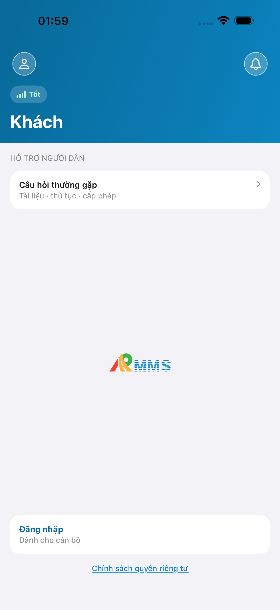
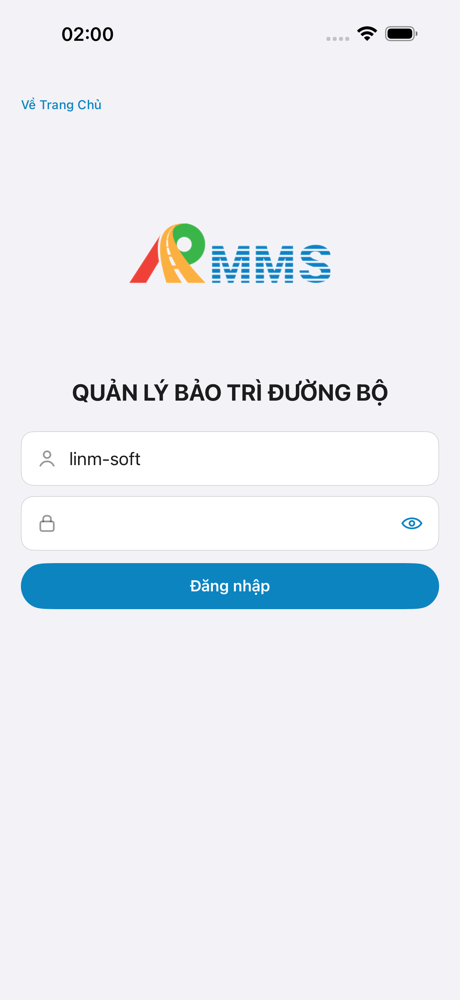
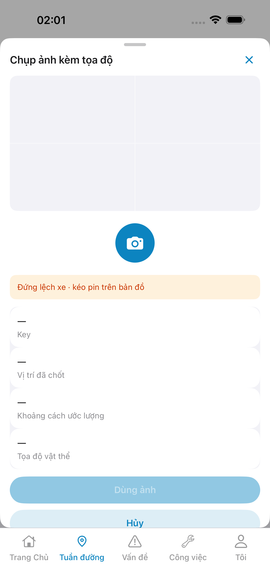
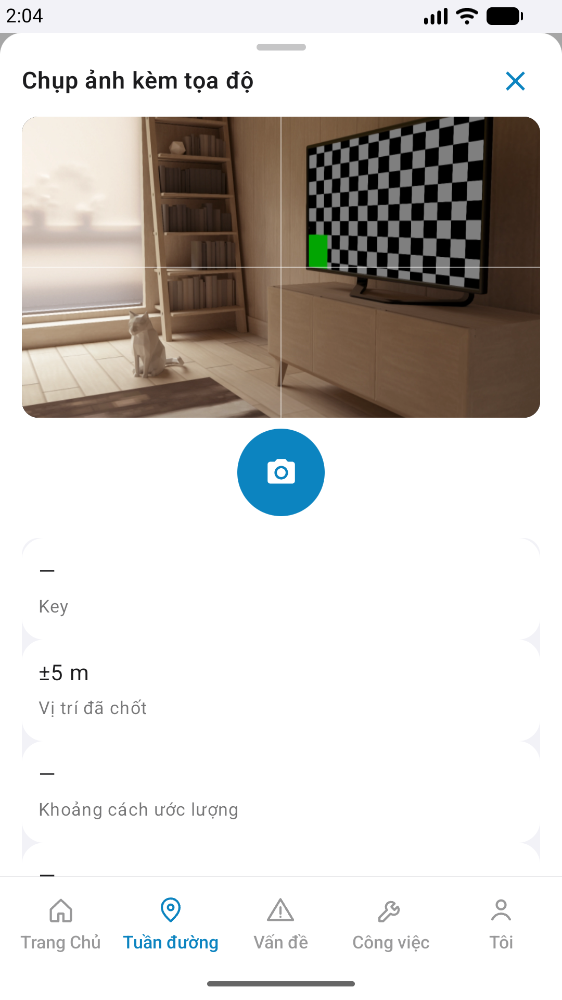
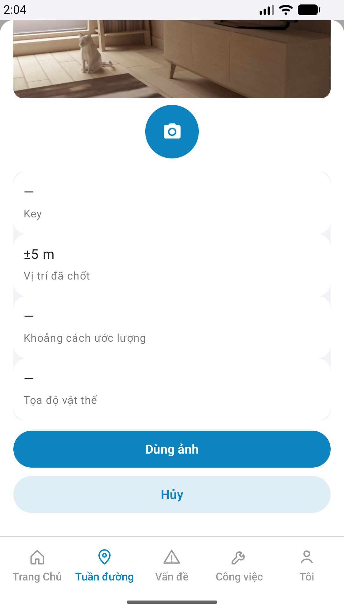

# QA — Scenarios — photo-geo-capture (mobile sheet · Chụp ảnh kèm tọa độ)

| Field | Value |
|-------|-------|
| feature | `photo-geo-capture` |
| this role | `qa` · `/agent-qa-mobile` |
| status | **confirmed** |
| packKind | **`sheet`** · `#sheet-pgc` · `DES-MOB-PGC` |
| taskId | `task_8c3429ad` |
| changeScope | `edit_page` · gap=`in_app_camera_frame` |
| e2eQa | **ON** · `yarn e2e-qa-mobile` · `ios_test_phase=phase1_iphone` · **A4-IPAD DEFER** |
| store_qa | **run_store** (autoApprove=ON) |
| e2e result | Maestro iOS+Android **PASS** · dest **iPhone 17 Pro Max** 1320×2868 RGB · AVD **Pixel_2** 1080×1920 · `--skip-start --skip-build --bundle-id=com.drvn.rmms` · API `:5101` · BFF `:5202` · **ok:true** |
| method | e2e runtime · yarn e2e-qa-mobile · Maestro + simctl/adb · **cấm** GenerateImage · **cấm** yarn start:std / mfeStdUrl |
| align | dual proto `#sheet-pgc` · live A3 ↔ P6 · **Aligned** · Must **0** |
| updatedAt | `2026-09-13T02:06:00.000Z` |

**Scope:** slug `photo-geo-capture` sheet `#sheet-pgc` only. Entry host `#sc-field-reflect` PhotoRow `#i-camera` → `openCapture('photo-geo')`. In-app camera live frame (`#capture-preview`) inside sheet. **Cấm** AC sibling hub/tab write.

## VERIFY GATE

| Gate | Result |
|------|--------|
| iOS `xcodegen` + `xcodebuild` (iPhone 17 Pro Max) | **PASS** |
| Android `assembleDebug` | **PASS** |
| Mobile.Bff `dotnet build` | **PASS** |
| API docker + Mobile.Bff `:5202` | **PASS** (A10-BFF · host API healthy · `--skip-start`) |
| Maestro iOS | **PASS** · guest → login → field-reflect → `#i-camera` → sheet (`#capture-preview` live + `#btn-shutter` · title) |
| Maestro Android | **PASS** · dual · title + `#capture-preview` + shutter + meta + **Dùng ảnh** / **Hủy** |
| `yarn e2e-qa-mobile` cases | A11 · A10 · A9 · A3 · P6 · P6-2 · **ok:true** |
| store px | iPhone 6.9" **1320×2868** · Pixel **1080×1920** |

## Device AC

| ID | Expect | Result |
|----|--------|--------|
| QA-01 | Login → tab field → field-reflect → `#i-camera` → sheet PGC | **PASS** |
| QA-02 | Title **Chụp ảnh kèm tọa độ** · `#capture-preview` in-app · `#btn-shutter` · rows photog/distance/object · **Dùng ảnh** · **Hủy** | **PASS** (A3/P6) |
| QA-03 | Photog GPS accuracy live (`±5 m`) · object/distance `—` trước shutter+gim | **PASS** |
| QA-04 | GPS deny modal `DES-MOB-GPS-DENY` · dismiss **Để sau** → sheet usable | **PASS** (iOS path · then location grant) |
| QA-05 | Host remains `#sc-field-reflect` under sheet · tab **Tuần đường** | **PASS** |
| QA-06 | Dual Android title + shutter + CTA | **PASS** |
| QA-07 | purpose `photo-geo-capture` · **cấm** invent `api/v1/photo-geo*` | **PASS** (dev compact) |
| QA-08 | In-app camera frame (`#capture-preview` 220dp/viewfinder) trong `#sheet-pgc` đóng kín GAP `in_app_camera_frame` · cấm UIImagePickerController / Intent full-screen | **PASS** |
| AC-D-14 | Cấm watermark / process text | **PASS** |
| AC-F-icon | Preview camera glyph · shutter · tab `#i-*` shell | **PASS** |

## Store Must

| Case | Store | Result | Evidence |
|------|-------|--------|----------|
| A11-LAUNCH | A11 | **PASS** |  |
| A10-BFF | A10 · P11 | **PASS** | — |
| A9-LOGIN | A9 · P10 | **PASS** |  |
| A3-CORE | A3 · A11 | **PASS** |  |
| P6-CORE | P6 · P11 | **PASS** |  |
| P6-CORE-2 | P6 | **PASS** |  |
| A4-IPAD | A4 | **DEFER** Phase 1 | DEFER |

## Maestro

| Flow | Path | Result |
|------|------|--------|
| iOS | `qa/e2e/ios.yaml` | **PASS** · appId `com.drvn.rmms` |
| Android | `qa/e2e/android.yaml` | **PASS** · appId `org.linmsoft.rmms` |

## Gaps

| ID | Note | Block complete? |
|----|------|-----------------|
| GAP-QA-PGC-AX-01 | Container `#sheet-pgc` không luôn expose trong Maestro tree — assert `#btn-shutter` + title | **no** (Should) |
| GAP-QA-PGC-TAB-01 | Android sheet overlap tab bar trên viewport ngắn — P6-CORE-2 scroll CTA visible | **no** (Should) |

## E2E screenshots

Viewer: `/api/qldb/artifact?id=&rel=qa/scenarios.md` rewrite `screens/{caseId}.png`.

CLI **PASS** = Maestro + PNG + store px only — **not** visual vs demo. QA **Read** A3-CORE + P6-CORE vs prototype (`/review-align-ux-ios-android`).

| Case | Store | Result | Evidence |
|------|-------|--------|----------|
| A10-BFF | A10 · P11 | **PASS** | — |
| A11-LAUNCH | A11 | **PASS** |  |
| A9-LOGIN | A9 · P10 | **PASS** |  |
| A3-CORE | A3 · A11 | **PASS** |  |
| P6-CORE | P6 · P11 | **PASS** |  |
| P6-CORE-2 | P6 | **PASS** |  |

## Align

| Check | Result |
|-------|--------|
| align | A3↔P6↔dual proto `#sheet-pgc` · Must **0** · **Aligned** |
| zones | title · preview · shutter · banner · row-photog/distance/object · btn-use · btn-cancel |
| Next | `/agent-review-mobile` · phase=`review` |

## Handoff

- closeout QA: `task_8c3429ad` · `/agent-qa-mobile` · e2eQa=ON · VERIFY GATE PASS · store PNG live · at: `2026-09-13T02:06:00.000Z`

---
<!-- Version meta: skillId=agent-qa-mobile skillVersion=2026.09.05.03 schemaVersion=1 workflowVersion=2026.09.05.03 rulesVersion=2026.09.05.03 versionGate=rechecked contentHash=sha256:photo-geo-capture-control-hint-20260912 realDataHash=sha256:photo-geo-capture-real-data-20260912 -->
