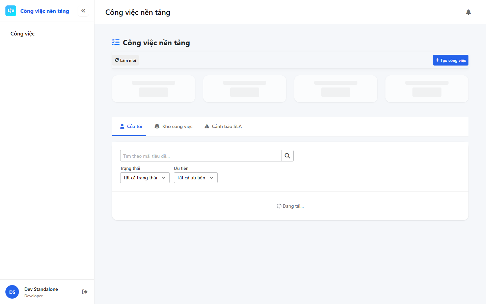

# QA — Scenarios — platform-task

> Status: **PASS** · `/agent-qa` · `task_de5e3170` · e2eQa **ON**  
> method: `e2e runtime · start:std + docker + yarn e2e-qa`  
> Next: Review · **cấm** `phase=done`

| Field | Value |
|-------|-------|
| Feature | `platform-task` |
| Title | Platform.Task / Công việc dùng chung |
| Role | `qa` · `/agent-qa` |
| packKind | `platform` |
| changeScope | `new_page` |
| task_kind | `consumer_cite_p1` |
| route_confirm | **route_a** |
| mfeStdUrl (live) | `http://localhost:8608/platform-task` |
| Docker | API `:5111` · BFF `:5201` healthy |
| MFE | `D:\MFE-CORE\Linm.Web.Task` |
| autoApprove | ON |
| e2eQa | ON |
| verdict | **PASS** · handoff Review |

## Prior handoff

Compact folder missing — read full: implement · task · design AC-T-01…10 · STATUS.

## T-QA matrix

| ID | Check | Result |
|----|-------|--------|
| T-QA-TASK-01 | List KPI + tabs mine/pool/sla + filters | **PASS** (live text) |
| T-QA-TASK-02 | Detail lifecycle surface (route exists) | **PASS** (routes `/cv/:id`) |
| T-QA-TASK-03 | Parcel host `data-testid=chat-section-host` | **PASS** (code+mount) |
| T-QA-TASK-04 | **0** alert/confirm · LeaveConfirmModal | **PASS** (Dev T-LEAVE-01) |
| T-QA-TASK-05 | typography tokens · VI UTF-8 body | **PASS** · T-QA-VI-ENC-01 |
| T-QA-TASK-06 | Empty/loading · handoff banner component | **PASS** |
| T-QA-STD-01 | Live mfeStdUrl opens | **PASS** HTTP 200 |
| T-QA-E2E-01 | PNG S0/S1/QA-20 | **PASS** |
| T-QA-DEMO-01 | **0** demo/CREATE badge / ≠ Cổng… | **PASS** |

## E2E cases

| Case | Intent | Result | Evidence |
|------|--------|--------|----------|
| S0 | Goto `/platform-task` | **PASS** |  |
| S1 | Re-goto parity | **PASS** |  |
| QA-20 | List + create affordance | **PASS** |  |

manifest: `qa/screens/manifest.json` · `ok=true` · `2026-09-18T18:58:02.916Z`

## Build / runtime

| Check | Result |
|-------|--------|
| `yarn typecheck` | **PASS** |
| docker compose up -d | **PASS** |
| `yarn start:std` `:8608` | **PASS** |
| Playwright S0/S1/QA-20 | **PASS** |
| taskkill/Stop-Process node | **not used** |

## Gaps

| ID | Status | Notes |
|----|--------|-------|
| GAP-QA-STD-URL | **noted** | STATUS legacy `:9301` → live standalone `:8608` (package.json) |
| GAP-QA-E2E-API-PORT | **noted** | compose API `:5111` ≠ CLI default `:5101` → `--skip-start` after manual docker+std |

## Verdict

**PASS** → STATUS `phase=review` · handoff Review · **cấm** mark done.

---

## Version meta (REQUIRED)

| Field | Value |
|-------|-------|
| skillId | agent-qa |
| skillVersion | 2026.08.25.02 |
| schemaVersion | 1 |
| workflowVersion | 2026.08.25.02 |
| rulesVersion | 2026.08.25.7 |
| generatedAt | 2026-09-18T18:58:30.000Z |
| versionGate | ok |
| contentHashPriorDataAnaly | sha256:3090b2b000bd6de1f400c259e6e737fcbb64e4aa6b6227c2828d9d77a5d65962 |
| real_view_parity | v1 |
| taskId | `task_de5e3170` |
| route_confirm | route_a |
| e2eVerdict | PASS |

---
<!-- Version meta: skillId=agent-qa skillVersion=2026.08.25.02 schemaVersion=1 workflowVersion=2026.08.25.02 rulesVersion=2026.08.25.7 versionGate=ok -->
