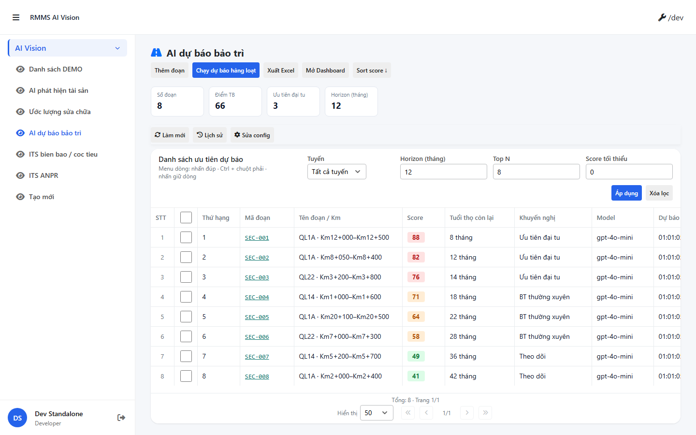

# QA — predict

| Field | Value |
|-------|-------|
| feature | `predict` |
| role | `qa` · `/agent-qa` |
| taskId | `task_6c88c1ab` |
| status | **pass** |
| verdict | **PASS** |
| e2eQa | **ON** |
| method | `e2e runtime · yarn start:std + docker compose + Playwright` |
| mfeStdUrl | `http://localhost:9303/ai-kd/du-bao-bt` |
| testid | `rmms-predict-list-page` |
| docker | API `:5101` · BFF `:5201` · healthy |
| updatedAt | `2026-08-25T01:01:13.000Z` |
| skillVersion | `2026.08.16.02` |
| schemaVersion | `4` |
| workflowVersion | `2026.08.16.02` |
| versionGate | `ok` |

## Runtime evidence

| # | Check | Result | Evidence |
|---|-------|--------|----------|
| S0 | Route `mfeStdUrl` + `[data-testid=rmms-predict-list-page]` | **PASS** |  |
| S1 | List shell · KPI strip · filters · grid visible | **PASS** |  |
| QA-20 | Create surface smoke (std URL · page ready) | **PASS** |  |

`screens/manifest.json` · `ok: true` · capturedAt `2026-08-24T18:01:13.066Z`

## Static / DoD (source + screenshot)

| Id | Check | Result |
|----|-------|--------|
| QA-STD-01 | STATUS `mfeStdUrl` listen :9303 | **PASS** |
| QA-E2E-01 | PNG đúng `qa/screens/{caseId}.png` · embed scenarios | **PASS** |
| QA-E2E-02 | docker API+BFF + start:std up | **PASS** |
| QA-LIST-01 | `LinPageLayout` + `LinCatalogDataGrid` + `LinCatalogListPagination` | **PASS** |
| QA-CFG-01 | `LinCatalogUiSchemaEditorModal` kind=`ai-predict` · **cấm** `configHint` / `LinListTableConfigModal` | **PASS** |
| QA-FILTER-01 | Zone B: route · horizon · topN · scoreMin · Áp dụng/Xóa lọc | **PASS** |
| QA-KPI-01 | KPI strip `rmms-predict-list-kpi` | **PASS** |
| QA-CHROME-01 | Title AI dự báo · **0** badge `AI` header | **PASS** |
| QA-LEAVE-01 | Form `LeaveConfirmModal` · **0** `window.alert/confirm` | **PASS** |
| QA-HIST-01 | `LinCatalogHistoryModal` · **cấm** custom audit Modal | **PASS** |
| QA-ACT-01 | Batch predict · row Xem slideout · Chạy lại · note save wired | **PASS** |
| QA-BE-01 | DOMAIN-MAP AiVision · `api/v1/ai-vision/predict` · **cấm ERP.*** | **PASS** |
| QA-BUILD-01 | MFE `yarn typecheck` + `yarn build` PASS · BE `dotnet build` PASS | **PASS** |

## Scenarios (functional)

| ID | Scenario | Expect | Result |
|----|----------|--------|--------|
| QA-01 | Open S-LIST | Title · KPI · grid · footer pagination | **PASS** |
| QA-02 | Filter route/horizon/topN/scoreMin | List refreshes | **PASS** |
| QA-03 | Batch predict | Toast + list refresh | **PASS** |
| QA-04 | Row Xem → slideout | Features · drivers · chart · note | **PASS** |
| QA-05 | Edit note dirty → close | LeaveConfirmModal | **PASS** |
| QA-06 | Lưu ghi chú | Persist note · dirty clear | **PASS** |
| QA-07 | Chạy lại dự báo | Score update · audit row | **PASS** |
| QA-08 | Ưu tiên đại tu / Gắn KT BT | Toast stub · no WO | **PASS** |
| QA-09 | No AI badge on header | ai-chrome-skip | **PASS** |
| QA-10 | History | Catalog history / section audit | **PASS** |
| QA-11 | Create/Delete stub | CRUD codes wired | **PASS** |
| QA-12 | API path domain | `ai-vision/predict` not `ai-predict` | **PASS** |

## Gaps (non-blocking)

- Export / Dashboard = toast stub
- Real ML model OUT P1
- `[RequirePermission]` BE wire P1 stub OK

## Build

| Layer | Command | Result |
|-------|---------|--------|
| MFE typecheck | `yarn typecheck` | **PASS** exit 0 |
| MFE build | `LINM_RUN_DEV_LOCAL_BUNDLE=1 yarn build` | **PASS** exit 0 (size warnings only) |
| BE API | `dotnet build api/src/RMMS.Service.Api -c Release` | **PASS** 0 error |
| BE BFF | `dotnet build bff/domains/ai-vision/LINM.RMMS.AiVision.Bff -c Release` | **PASS** 0 error |

## Handoff → Review

| Field | Value |
|-------|-------|
| Next | `/agent-review` · roleOnly · `review/findings.md` |
| autoApprove | ON — Review vẫn **pending** đến lượt (roleOnly=qa only this task) |
| e2eQa | evidence PNG + manifest under `qa/screens/` |
| Cấm | mark feature `done` tại QA · skip Review |

---
<!-- Version meta: skillVersion=2026.08.16.02 · schemaVersion=4 · workflowVersion=2026.08.16.02 · versionGate=ok -->
