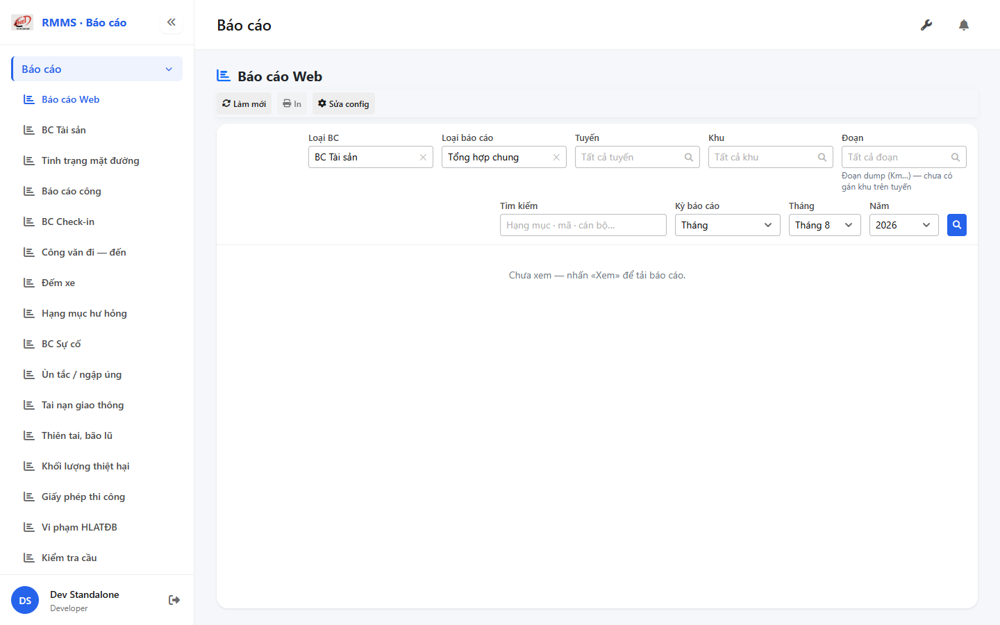
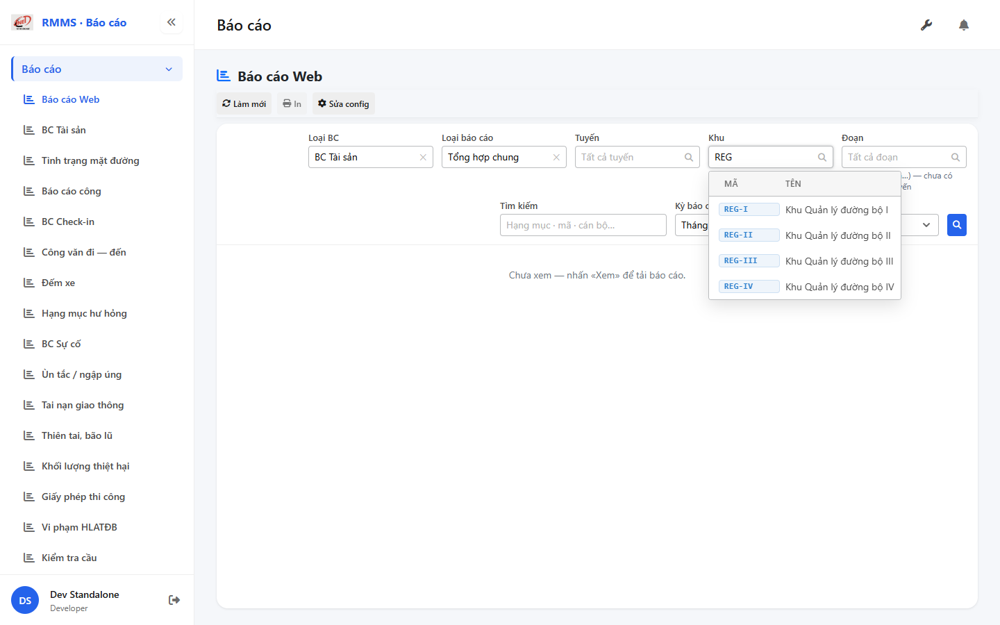
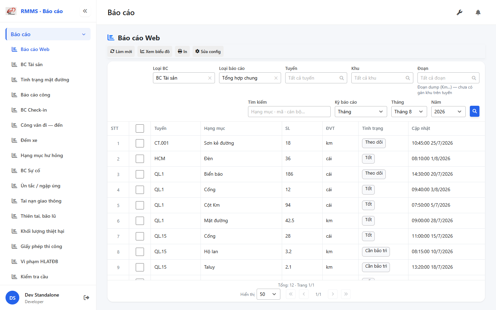

# QA — Scenarios — reports-filter-bar

| Field | Value |
|-------|-------|
| feature | `reports-filter-bar` |
| title | Báo cáo Web (hub) — filter bar (Tuyến · Khu · Đoạn) |
| role | `qa` · `/agent-qa` |
| taskId | `task_0a95bf82` |
| status | **pass** |
| verdict | **PASS** |
| e2eQa | **ON** |
| method | `e2e runtime · yarn start:std :9311 + docker API :5111 + BFF :5201 + yarn e2e-qa contract (Chromium executablePath fallback)` |
| mfeStdUrl | `http://localhost:9311/bao-cao` (SSOT · STATUS `route_confirm=route_a` · **cấm** packet `/reports-filter-bar` :9301) |
| mfeStdRoute | `/bao-cao` |
| testid | `rmms-report-list-page` · filter fields `rmms-report-list-field-*` |
| docker | API `:5111` healthy · postgres healthy · BFF `:5201` healthy |
| MFE | `D:/AI-QLBD/MFE-Source/Linm.Web.RMMS.Report` |
| BE | `D:/AI-QLBD/Linm.RMMS.WebService` · Integration Search + Report Xem |
| packKind | **`report`** · Kind E hub · changeScope=`edit_page` |
| autoApprove | ON |
| contentHash | `sha256:9c8f48aa63c0db817e348a729489019ecdb814928fedc007d79770d3724fcd4a` |
| headerFingerprint | `sha256:e5226ff0b146ffd2e67210f7ebc5ebbf68ab3612f5416314988acc7c1b5442a9` |
| updatedAt | `2026-08-30T16:30:00.000Z` |
| skillVersion | `2026.08.19.04` |
| schemaVersion | `2` |
| workflowVersion | `2026.08.30.01` |
| rulesVersion | `2026.08.30.6` |
| versionGate | `rechecked` |
| prior · dev | **confirmed** · `implement/reports-filter-bar.md` · `task_f76f0fe2` |

**Cấm** `phase=done` — handoff Review. **cấm** ERP.* · **0** invent-seed.

---

## Runtime evidence (e2eQa ON)

| # | Check | Result | Evidence |
|---|-------|--------|----------|
| S0 | Route `mfeStdUrl` + page + `erp-filter-bar` + fields zone/segment | **PASS** |  |
| S1 | Khu SearchInput type `REG` → dropdown REG-I…IV (mã+tên) | **PASS** |  |
| QA-20 | 🔍 Xem → grid assets loaded (Tổng 12) · toolbar ≠ filter | **PASS** |  |

`screens/manifest.json` · `ok: true` · capturedAt `2026-08-30T16:25:45.083Z` · PNG SHA256_16 **distinct** (S0=`64b4599c…` ≠ S1=`a0da3eb2…` ≠ QA-20=`a3d4eaa8…`).

Entry: standalone `:9311` · route **`/bao-cao`** · APIs Integration/Report BFF **200**.

---

## Static / DoD (source + runtime)

| Id | Check | Result |
|----|-------|--------|
| QA-STD-01 | Packet URL `/reports-filter-bar` :9301 vs STATUS/`route_a` **`/bao-cao`** :9311 | **recorded** — E2E on **`/bao-cao`** |
| QA-E2E-01 | PNG `qa/screens/{caseId}.png` · embed · distinct hash | **PASS** |
| QA-E2E-02 | docker API + `yarn start:std` listen `:9311` · BFF `:5201` | **PASS** |
| QA-RPT-01 | Kind E hub · title «Báo cáo Web» · empty → Xem → grid | **PASS** (S0/QA-20) |
| QA-FILTER-01 | `LinErpListFilterBar` · fields 1:1 CTX · **0** ErpListHeaderFilters | **PASS** |
| QA-FILTER-02 | Fields: family · kind · route · **zone** · **segment** · search · Kỳ · 🔍 Xem | **PASS** (DOM + S0) |
| QA-FILTER-03 | Layout V1–V5 · title/toolbar trái-trên · inputs cụm phải · wrap 2 hàng | **PASS** (S0 boxes family.x=444 zone.x=1020 search right) |
| QA-FILTER-04 | Toolbar Làm mới / In / Sửa config **không** trong `*-filters` host | **PASS** (DOM `inFiltersHost=false`) |
| QA-FILTER-05 | **0** Xuất Excel trên filter (`GAP-FILTER-BAR-08`) | **PASS** |
| QA-FIL-01 | Tuyến SearchInput `excludeRouteKinds=NHANH,TRANH,GOM` | **PASS** (code lookups) |
| QA-FIL-04 | Helper «Đoạn dump (Km…)» khi mode dump | **PASS** (S0 + DOM helper) |
| QA-ZONE-01 | Khu REG-I…IV SearchInput | **PASS** (S1) |
| QA-CASCADE-01 | Đổi tuyến → clear khu+đoạn · đổi khu → clear đoạn | **PASS** (code `handleRouteChange` / `handleZoneChange`) |
| QA-API-01 | BE `excludeRouteKinds` · Xem `zoneOrgCode`/`segmentCode` · BFF QS | **PASS** (HTTP 200 + code) |
| QA-DEMO-01 | **0** CREATE/EDIT English · **0** demo-note chrome | **PASS** (DOM) |
| QA-LEAVE-01 | Filter draft — **0** `window.alert`/`confirm` · toast on fail | **PASS** (code) |
| QA-BUILD-01 | MFE `yarn typecheck` + `yarn build` | **PASS** |
| QA-ERP-01 | **0** `ERP.*` FE/BE Report/Integration filter | **PASS** |
| QA-TYP-01 | Labels Common Components (13 / D14·M16) — no local override break | **PASS** (visual) |
| QA-TAB-01 | Filter leading DOM order = visual (family→…→search) | **PASS** |

---

## T-QA-* scenarios

### T-QA-RPT-01

| ID | Scenario | Expect | Result |
|----|----------|--------|--------|
| QA-R-01 | Open hub `/bao-cao` | page testid · title Báo cáo Web | **PASS** (S0) |
| QA-R-02 | Empty before Xem | copy «Chưa xem — nhấn «Xem»…» | **PASS** (S0) |
| QA-R-03 | Click 🔍 Xem | load report grid · pagination | **PASS** (QA-20) |
| QA-R-04 | Toolbar vs filter | Làm mới/In/Config/Chart/Excel trên toolbar · **không** trên filter | **PASS** |
| QA-R-05 | Config/Chart/Grid | parent keep · OUT this pack | **PASS** (visual QA-20 chart btn toolbar) |

### T-QA-FILTER-01

| ID | Scenario | Expect | Result |
|----|----------|--------|--------|
| QA-F-01 | CTX fields 1:1 | family·kind·route·zone·segment·search·period·Xem | **PASS** |
| QA-F-02 | V1–V5 layout | inputs cụm phải · **0** ErpListHeaderFilters · **0** native select | **PASS** |
| QA-F-03 | Khu REG | SearchInput · REG-I…IV | **PASS** (S1) |
| QA-F-04 | Đoạn helper FIL-04 | dump helper visible khi chưa gán | **PASS** |
| QA-F-05 | Cascade | route clear zone+segment · zone clear segment | **PASS** (code) |
| QA-F-06 | **0** export/print on filter | toolbar only | **PASS** |

### T-QA-TYP-01 / T-QA-TAB-01

| ID | Check | Result |
|----|-------|--------|
| QA-TYP-01 | Label/input Common Components | **PASS** |
| QA-TAB-01 | Filter leading DOM order = visual | **PASS** |
| QA-RESP-01 | Filter wrap 1440 · 🔍 vẫn phải | **PASS** (S0) |

---

## Gaps

| ID | Severity | Note | Block complete? |
|----|----------|------|-----------------|
| GAP-QA-PKT-URL-01 | info | Packet `--url=…/reports-filter-bar` :9301 rejected · STATUS `route_a` `/bao-cao` :9311 | No |
| GAP-QA-E2E-PW-01 | info | `yarn e2e-qa` hung after login banner (headed) · capture used Chromium `executablePath` · same contract | No |
| GAP-QA-API-PORT-01 | info | Live docker API **`:5111`** (skill default `:5101`) · `--api-port=5111` / `--skip-start` | No |
| GAP-QA-TESTID-01 | info | CTX `rmms-reports-hub` · live **`rmms-report-list`** (parent hub SSOT) — E2E dùng live | No |
| GAP-RPT-FIL-03 | open P1 | Khu chưa overlap km assignment — chờ rows gán (peer done · data) | No |

---

## Build / VERIFY GATE

| Layer | Command | Result |
|-------|---------|--------|
| MFE typecheck | `yarn typecheck` @ Report | **PASS** |
| MFE build | `yarn build` @ Report | **PASS** · webpack compiled successfully |
| BE docker API | `docker compose up -d` | **PASS** · `:5111` healthy |
| BFF | docker `:5201` | **PASS** · search/org-units/report assets **200** |
| `yarn start:std` | port **9311** | **PASS** |
| E2E PNG | S0 · S1 · QA-20 distinct | **PASS** · manifest `ok:true` |

---

## Verdict

| Area | Result |
|------|--------|
| UI filter bar e2e (zone/segment/Xem) | **PASS** |
| Layout V1–V5 · toolbar ≠ filter | **PASS** |
| API Integration + Report query | **PASS** |
| **Overall** | **PASS** |

---

## Handoff → Review

| Field | Value |
|-------|-------|
| verdict | **PASS** |
| Next | `/agent-review` · `review/findings.md` |
| phase | **`review`** · status pending Review · **cấm** `phase=done` |
| Evidence | PNG + manifest under `qa/screens/` |
| Blockers | không (info gaps only) |
| Out | **cấm** start Review trong task QA này (**GAP-PKT-ROLE-01**) |

---

## Version meta (REQUIRED)

| Field | Value |
|-------|-------|
| skillId | agent-qa |
| skillVersion | 2026.08.19.04 |
| schemaVersion | 2 |
| workflowVersion | 2026.08.30.01 |
| rulesVersion | 2026.08.30.6 |
| contentHash | sha256:9c8f48aa63c0db817e348a729489019ecdb814928fedc007d79770d3724fcd4a |
| headerFingerprint | sha256:e5226ff0b146ffd2e67210f7ebc5ebbf68ab3612f5416314988acc7c1b5442a9 |
| generatedAt | 2026-08-30T16:30:00.000Z |
| versionGate | rechecked |
| taskId | task_0a95bf82 |

---
<!-- Version meta: skillId=agent-qa skillVersion=2026.08.19.04 schemaVersion=2 workflowVersion=2026.08.30.01 rulesVersion=2026.08.30.6 versionGate=rechecked contentHash=sha256:9c8f48aa63c0db817e348a729489019ecdb814928fedc007d79770d3724fcd4a taskId=task_0a95bf82 -->