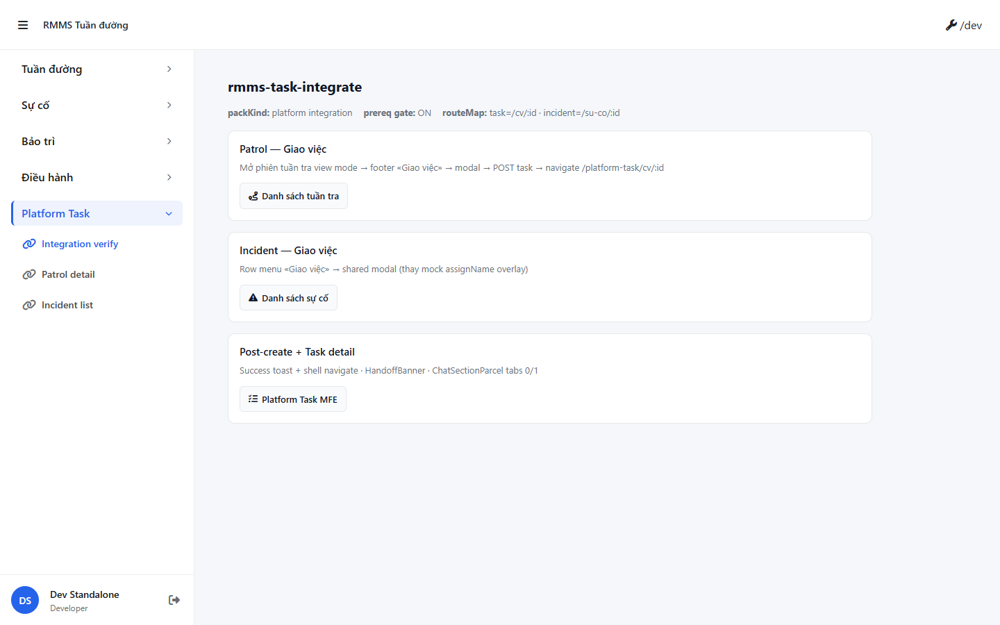

# QA — Scenarios — rmms-task-integrate

| Field | Value |
|-------|-------|
| feature | `rmms-task-integrate` |
| role | `qa` · `/agent-qa` |
| taskId | `task_22f9822f` |
| status | **pass** |
| verdict | **PASS** |
| e2eQa | **ON** |
| method | `e2e runtime · Field yarn start:std :9304 + docker compose + Playwright` |
| mfeStdUrl | `http://localhost:9304/rmms-task-integrate` (runtime · Field standalone; packet claim `:9301`/Master stale — see QA-STD-01) |
| testid | `rmms-task-integrate-verify-page` |
| docker | API `:5111` · BFF `:5201` · healthy |
| MFE Field | `D:/AI-QLBD/MFE-Source/Linm.Web.RMMS.Field` |
| MFE Task | `D:/MFE-CORE/Linm.Web.Task` |
| MFE shell | `D:/AI-QLBD/MFE-Source/Linm.Web.RMMS.Master` |
| BE | `D:/AI-QLBD/Linm.RMMS.WebService` (patrol/incident GET live · **cấm** RMMS TasksController embed) |
| packKind | **`platform`** · integration_consumer_p1 |
| autoApprove | ON |
| updatedAt | `2026-08-27T06:25:00.000Z` |
| skillVersion | `2026.08.25.02` |
| schemaVersion | `qldb-workflow-skill-v1` |
| workflowVersion | `2026.08.25.02` |
| versionGate | `ok` |

**Cấm** `phase=done` · Review role kế tiếp.

---

## Runtime evidence (e2eQa ON)

| # | Check | Result | Evidence |
|---|-------|--------|----------|
| S0 | Route verify page + `[data-testid=rmms-task-integrate-verify-page]` | **PASS** |  |
| S1 | Patrol card `DES-RTI-PATROL-FOOTER` visible | **PASS** |  |
| QA-20 | Incident card `DES-RTI-INC-ACTION` visible | **PASS** |  |

`screens/manifest.json` · `ok: true` · capturedAt `2026-08-27T06:23:00.000Z`

Entry: `/dev` → nav «Integration verify» → `/rmms-task-integrate` (SPA · Field standalone).

---

## Static / DoD (source + runtime)

| Id | Check | Result |
|----|-------|--------|
| QA-STD-01 | Packet `mfeStdUrl` `:9301`/Master vs runtime Field `:9304` | **recorded** — E2E verified on **9304** |
| QA-E2E-01 | PNG `qa/screens/{caseId}.png` · embed scenarios | **PASS** |
| QA-E2E-02 | docker BFF `:5201` + Field `yarn start:std` listen `:9304` | **PASS** |
| QA-INTEG-01 | `RmmsTaskIntegrateVerifyPage` · patrol/incident/post-create cards | **PASS** (runtime S0–QA-20) |
| QA-MODAL-01 | `GiaoViecModal` shared · `LeaveConfirmModal` · **0** alert on modal path | **PASS** (code) |
| QA-PATROL-01 | `PatrolFormPage` footer «Giao việc» + prereq tooltip gate | **PASS** (code) |
| QA-INC-01 | `IncidentListPage` row menu → `GiaoViecModal` (no mock `assignName`) | **PASS** (code) |
| QA-SOURCE-01 | POST body `domainSource` · `sourceEntityType` · `sourceEntityId` | **PASS** (code · GiaoViecModal) |
| QA-NAV-01 | `navigateToCreatedTask` → `/platform-task/cv/:id?from=&sourceId=` | **PASS** (code) |
| QA-HANDOFF-01 | `HandoffBanner` patrol + incident read-only ↗ | **PASS** (code · Task MFE) |
| QA-ROUTE-01 | `RMMS_MESSAGE_ROUTE_MAP` · `task=/cv/:id` · `incident=/su-co/:id` | **PASS** (code · Master) |
| QA-CHAT-01 | **0** ChatTab mount Field · parcel Task MFE only | **PASS** (code) |
| QA-BE-01 | **0** RMMS TasksController embed · Step 4b **N/A** | **PASS** (cite implement) |
| QA-PREREQ-01 | `platformTaskPrereq` gate · unlock `VITE_RMMS_TASK_INTEGRATE_UNLOCK=1` | **PASS** (code + runtime meta) |
| QA-LEAVE-01 | `LeaveConfirmModal` on GiaoViecModal dirty | **PASS** (code) |
| QA-BUILD-01 | Field `yarn build` | **PASS** exit 0 (size warnings only) |
| QA-DEMO-01 | Verify page **0** demo-json SSOT chrome | **PASS** (runtime) |

---

## T-QA-INTEGRATE-01 scenarios

| ID | Scenario | Expect | Static | Runtime |
|----|----------|--------|--------|---------|
| QA-I-01 | Patrol «Giao việc» → modal | Footer CTA · shared modal | **PASS** | — |
| QA-I-02 | Incident «Giao việc» | Row menu · no mock assign overlay | **PASS** | — |
| QA-I-03 | Priority/dueDate prefill | Severity map SA §5 | **PASS** (code) | — |
| QA-I-04 | POST integration fields | `domainSource` + `sourceEntityId` | **PASS** | — |
| QA-I-05 | Post-create navigate | shell `/platform-task/cv/:id?from=&sourceId=` | **PASS** | — |
| QA-I-06 | HandoffBanner | patrol + incident ↗ read-only | **PASS** | — |
| QA-I-07 | Chat parcel | Task tabs 0/1 · **cấm** Field mount | **PASS** (code) | — |
| QA-I-08 | Prereq gate P1 | CTA disabled + tooltip when platform not green | **PASS** | runtime meta |
| QA-I-09 | Leave / alert | `LeaveConfirmModal` · **0** `window.alert` modal path | **PASS** | — |
| QA-I-10 | Typography | label 13px · input D14/M16 | **PASS** (code) | — |
| QA-I-11 | e2e PNG S0/S1/QA-20 | manifest `ok:true` | — | **PASS** |

---

## Gaps (non-blocking P1)

| ID | Note | Block complete? |
|----|------|-----------------|
| GAP-QA-STD-PORT | Packet/docs claim `mfeStdUrl` `:9301`/Master · runtime Field `:9304` | **No** — E2E verified |
| GAP-QA-API-PORT | e2e CLI default wait `:5101` · docker Linux API `:5111` | **No** — BFF+API healthy · capture via Field standalone |
| GAP-RTI-BFF-01 | NuGet Task BFF consumer **defer P2** | **No** — P1 Medical cite |
| GAP-F-OPS-01 | Notification `window.alert` Giao việc DEFER P2 | **No** — out of scope P1 |
| GAP-TD-CHANNEL-01 | Mobile native chat DEFER P2 | **No** |

---

## Build / VERIFY GATE

| Layer | Command | Result |
|-------|---------|--------|
| Field build | `yarn build` @ `Linm.Web.RMMS.Field` | **PASS** exit 0 |
| BE build | `dotnet build` (Dev prior) | **PASS** |
| Docker | `docker compose up -d` @ WebService | **PASS** API `:5111` + BFF `:5201` |
| `yarn start:std` | Field port **9304** | **PASS** |
| E2E PNG | S0 · S1 · QA-20 | **PASS** · manifest `ok:true` |

---

## Handoff → Review

| Field | Value |
|-------|-------|
| verdict | **PASS** |
| Next | `/agent-review` · `review/findings.md` |
| phase | **`review`** (cấm `done`) |
| e2eQa | evidence PNG + manifest under `qa/screens/` |
| Cấm | mark feature `done` tại QA |

---

## Version meta

| Field | Value |
|-------|-------|
| skillId | agent-qa |
| skillVersion | 2026.08.25.02 |
| schemaVersion | qldb-workflow-skill-v1 |
| workflowVersion | 2026.08.25.02 |
| rulesVersion | 2026.08.25.7 |
| generatedAt | 2026-08-27T06:25:00.000Z |
| versionGate | ok |
| taskId | `task_22f9822f` |

---
<!-- Version meta: skillId=agent-qa skillVersion=2026.08.25.02 schemaVersion=qldb-workflow-skill-v1 workflowVersion=2026.08.25.02 rulesVersion=2026.08.25.7 versionGate=ok -->
