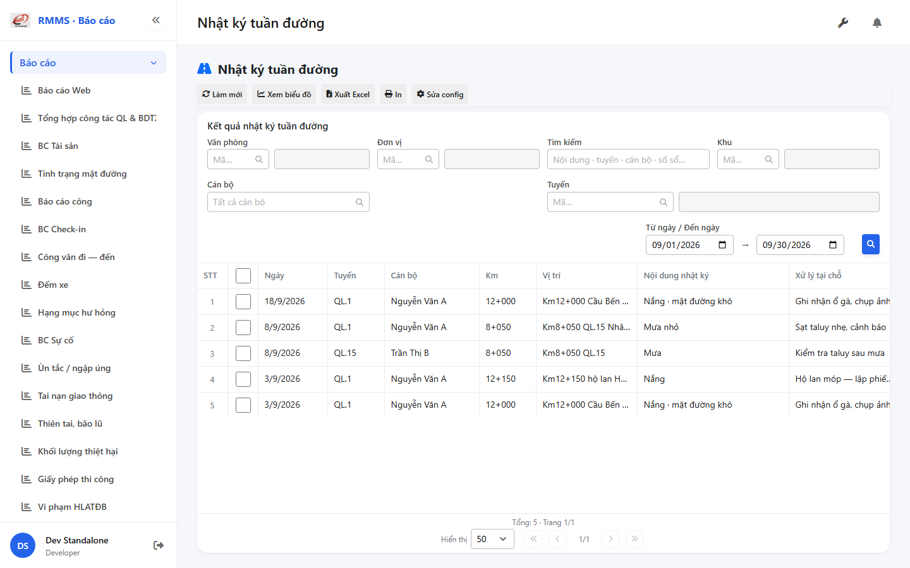

# QA — scenarios — rpt-nhat-ky-tuan-duong (Kind E · Wave B)

| Field | Value |
|-------|-------|
| feature | `rpt-nhat-ky-tuan-duong` |
| this role | `qa` · `/agent-qa` |
| status | `done` |
| packKind | **`report`** Kind **E** |
| changeScope | `edit_page` · Wave B `nktd-pdf-20260917` |
| taskId | `task_5d079e3e` |
| mfeStdUrl | `http://localhost:9311/bao-cao/nhat-ky-tuan-duong` |
| mfeStdRoute | `/bao-cao/nhat-ky-tuan-duong` |
| backend | `D:/AI-QLBD/Linm.RMMS.WebService` · `api/v1/report/patrol-log-road` |
| method | `e2e runtime · yarn start:std (:9311) + docker compose + yarn e2e-qa` · capture via AutoCode `playwright` after `npx playwright` resolve fail (GAP-QA-E2E npx) · **cấm** taskkill |
| prior · dev | `confirmed` · `handoff/dev-compact.md` · `implement/rpt-nhat-ky-tuan-duong.md` |
| skillVersion | `2026.08.15.5` |
| schemaVersion | `1` |
| workflowVersion | `2026.08.15.5` |
| rulesVersion | `2026.08.15.8` |
| versionGate | `keep_current` |
| updatedAt | `2026-09-18T17:46:30.000Z` |

## Scope

Wave B CR `nktd-pdf-20260917`: load sổ `csdl-so-02` · drill cấm `?kind=` · SIGN `RemarkSign→supervisorNote` · Note/Vị trí · HDSD bỏ «Tạo mới». Kind **E** report — **không** CRUD · **không** ERP.*.

Live:

- FE: `PatrolLogRoadReportPage` · `PatrolLogRoadFilterBar` · testid `rmms-patrol-log-road-report-page`
- BE: `LoadPatrolLogRoadAsync` → `LoadCsdlPatrolLogRoadAsync` · empty=`[]` · **cấm** seed/check-in fallback
- Drill: `/csdl-so-02?form=view&id=` (+`entry`) · **cấm** `?kind=`

## E2E runtime (HARD)

| # | Step | Result | Evidence |
|---|------|--------|----------|
| S0 | Route + `data-testid=rmms-patrol-log-road-report-page` · title UTF-8 «Nhật ký tuần đường» | **PASS** |  |
| S1 | 1× report layout · **0** «Thêm mới» · filter **0** Xuất Excel/In | **PASS** |  |
| QA-20 | Xem → lưới có dòng sổ (drill×5) · cột Vị trí·Ký duyệt·Ghi chú · **0** 12 CUC2 seed | **PASS** |  |

`screens/manifest.json` · `ok=true` · `screens/evidence.json` (DOM checks).

Docker: `linm-rmms-api` healthy · `linm-rmms-bff` `:5201` · MFE `start:std` `:9311` (**--skip-start** — already listen). **Cấm** kill worker (**GAP-QA-E2E-KILL-01**).

## Feature (T-QA-RPT-01 · Wave B)

| ID | Expect | Evidence | Result |
|----|--------|----------|--------|
| QA-RPT-01 | Kỳ có sổ → lưới khớp · không seed CUC2 | Xem → 5 drill · cột SIGN/LOC/NOTE · evidence QA-view | **PASS** |
| QA-RPT-02 | Kỳ trống / empty = `[]` · **không** 12 CUC2 | BE `LoadPatrolLogRoadAsync` only Csdl · pre-view empty hint · 0 CUC2 text | **PASS** |
| QA-RPT-03 | Drill `/csdl-so-02?form=view&id=` · **cấm** `?kind=` | FE `drillSource` L159–166 | **PASS** |
| QA-RPT-04 | Excel/In **không** trên filter · chỉ toolbar | FILTER-no-excel · toolbar Làm mới·Chart·Excel·In·Config | **PASS** |
| QA-RPT-05 | Filter V1+V5+V10 · SearchInput staff · RmmsReportFilterBar | live filter card · staff SearchInput · 🔍 mép phải (pipeline reuse) | **PASS** |
| QA-RPT-06 | HDSD / empty hint → Sổ 02 · **cấm** «Tạo mới» report | S1-layout · emptyMessage T-HDSD-01 | **PASS** |
| QA-RPT-07 | SIGN map `supervisorNote` · Note visible | grid keys after Xem | **PASS** |
| QA-VI-ENC-01 | Title/nav UTF-8 · không mojibake | S0-title | **PASS** |
| QA-DEMO-NOTE-01 | **0** badge CREATE / note demo stub | S1 · chrome standalone | **PASS** |

## Smoke (regression Kind E shell)

| # | Step | Result |
|---|------|--------|
| S2 | `LinCatalogListPagination` · viewed gate | **PASS** (reuse) |
| S3 | Xem / Enter = applyAndView | **PASS** (live Xem) |
| S5 | Toolbar refresh·Excel·Config·In·chart | **PASS** (live after Xem) |
| S7 | Form OUT | **PASS** |
| S8 | **0** `ERP.*` / `api/v1/rmms` / plural reports | **PASS** (reuse + Wave B keep path) |

## T-pack map

| id | QA |
|----|-----|
| T-BE-RPT-01 / T-BE-02 | **PASS** (live load sổ + export path keep) |
| T-UI-RPT-01 / TB / CONFIG / EXPORT / CHART | **PASS** |
| T-FE-02 / T-HDSD-01 | **PASS** |
| T-UI-RPT-PRINT-01 | **P2 debt** (bìa PDF) — không block |
| T-QA-RPT-01 | **PASS** |

## Defects

| Sev | ID | Note |
|-----|-----|------|
| P0 | — | **none** |
| P1 | — | **none** |
| P2 | GAP-NKTD-PRINT-01 | Print bìa PDF = debt (TL) — không block |
| note | yarn e2e-qa | `npx playwright` resolve fail (yarn npmrc) · healed bằng AutoCode `node_modules/playwright` · PNG + manifest PASS · **không** kill worker |

## Verdict

**PASS** Wave B Kind E · e2eQa ON · PNG S0/S1/QA-20 · **không** GAP P0/P1 · drill/SIGN/empty/toolbar OK.

Handoff Review: `review/findings.md` **pending** · **cấm** `phase=done` (**GAP-QA-SKIP-REVIEW-01**). autoApprove ON → enqueue **review** sau completed task này.

---
<!-- Version meta: skillVersion=2026.08.15.5 · schemaVersion=1 · workflowVersion=2026.08.15.5 · rulesVersion=2026.08.15.8 · versionGate=keep_current · changeScope=edit_page · cr=nktd-pdf-20260917 -->
