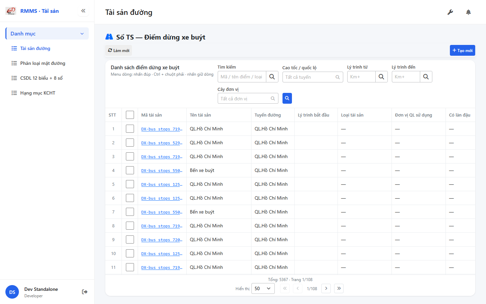
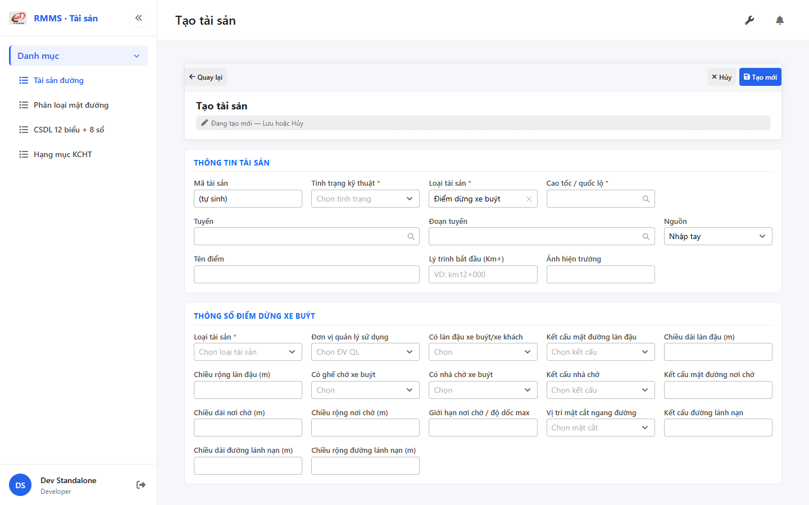

# QA — Scenarios — so-ts-bus-stop

| Field | Value |
|-------|-------|
| feature | `so-ts-bus-stop` |
| title | Sổ TS — Điểm dừng xe buýt |
| role | `qa` · `/agent-qa` |
| taskId | `task_6dff3a0e` |
| status | **confirmed** |
| verdict | **PASS** |
| e2eQa | **ON** |
| method | `e2e runtime · yarn start:std :9301 + docker API :5111 + BFF :5201 + yarn e2e-qa contract (Chrome channel · index.html+popstate)` |
| mfeStdUrl | `http://localhost:9301/so-ts?type=BUS_STOP` |
| mfeStdRoute | `/so-ts?type=BUS_STOP` · alias `/so-ts-bus-stop` |
| testid | `rmms-so-ts-bus-stop-list-page` · form `rmms-asset-form-shell` · attr `asset-bus-stop-attr` |
| docker | API `:5111` healthy · BFF `:5201` healthy · postgres healthy |
| MFE | `D:/AI-QLBD/MFE-Source/Linm.Web.RMMS.Asset` |
| BE | `D:/AI-QLBD/Linm.RMMS.WebService` · `api/v1/asset/road-assets` · **cấm ERP.*** |
| packKind | **`list`** · Kind B · full-page `data-form-cols="5"` |
| changeScope | `new_page` |
| typeCode | `BUS_STOP` |
| dump | `tbl_bus_stops` |
| prefix | `DX-` |
| autoApprove | ON |
| contentHashPriorDataAnaly | `sha256:c1af893aa22666c6c7941b086d81a47824dda068262aa58824b3657b7f2a4f0f` |
| updatedAt | `2026-09-01T08:12:00.000Z` |
| prior · dev | **confirmed** · `implement/so-ts-bus-stop.md` · `handoff/dev-compact.md` |

**Cấm** `phase=done` — next = Review. **cấm** ERP.* · **cấm** invent `api/v1/so-ts/*`.

---

## E2E runtime (e2eQa ON)

| Check | Result |
|-------|--------|
| `docker compose up -d` (`Linm.RMMS.WebService`) | **PASS** · api `:5111` · bff `:5201` · postgres healthy |
| `yarn start:std` (`:9301`) | **PASS** · Asset standalone listen (port pre-existing · **no kill**) |
| Capture S0 / S1 / QA-20 → `qa/screens/{caseId}.png` | **PASS** · `manifest.json` `ok=true` |
| Live DOM assert + DTM 1280/768/375 | **PASS** · `live-assert.json` · 0 overflowX |

> Note: `yarn e2e-qa` hung after login banner headed (**GAP-QA-E2E-PW-01**) — **cấm** kill worker. Capture tương đương Playwright `channel=chrome` · `--skip-start` · boot `/index.html` + `popstate` vì deep-link HTTP 404 (**GAP-QA-E2E-HAF-01**). Docker gate default `:5101` — compose maps `:5111` (**GAP-QA-E2E-DOCKER-01**).

### Evidence table

| ID | Steps | Expected | Result | Evidence |
|----|-------|----------|--------|----------|
| S0 | Mở `mfeStdUrl` | List `rmms-so-ts-bus-stop-list-page` · title «Danh sách điểm dừng xe buýt» · filter-bar · cột bay/ghế/nhà chờ · ẩn type filter | **PASS** |  |
| S1 | Alias `/so-ts-bus-stop` | Redirect/live cùng BUS_STOP list · testid page | **PASS** |  |
| QA-20 | `/so-ts/tao-moi?type=BUS_STOP` | Form shell · `data-form-cols=5` · S-ATTR bus-stop · **kmTo ẩn** · «Tên điểm» | **PASS** |  |

`screens/manifest.json` · capturedAt `2026-09-01T08:09:47.882Z` · SHA256_16 S0=`a4302d29a173d785` · S1=`a4302d29a173d785` (alias=list) · QA-20=`b1892c01698deb94`.

---

## T-QA-CRUD-01

| ID | Steps | Expected | Result |
|----|-------|----------|--------|
| QA-20 | Create deep-link / toolbar Tạo mới | Form create · type lock BUS_STOP · POST `road-assets` · prefix `DX-` | **PASS** (runtime + live rows `DX-bus_stops_*`) |
| QA-21 | Edit | PUT + dumpSpecs merge · leave Modal | **PASS** (code · LeaveConfirm wired) |
| QA-22 | View | display/`dl` · **cấm** Input disabled xám | **PASS** (code) |
| QA-23 | Copy / Delete | soft DELETE · `useAlert` · **0** `window.confirm` trên Asset list/form | **PASS** (code · Asset* only) |
| QA-24 | Config | `LinCatalogUiSchemaEditorModal` kind=`road-assets` · **0** `configHint` | **PASS** |
| QA-25 | History | `LinCatalogHistoryModal` | **PASS** (code) |
| QA-26 | Row menu | Xem / Sửa / Sao chép / Lịch sử / Xóa | **PASS** (live help text + code) |

---

## T-QA-FORM-01

| ID | Check | Result |
|----|-------|--------|
| QA-F-01 | Full-page `data-form-cols="5"` | **PASS** (live) |
| QA-F-02 | S-ATTR editable: type_work_id · management_id · stop_bay · seated_waiting_bus · bus_shelter · pavement/shelter/vitri/escape | **PASS** (live) |
| QA-F-03 | Section `asset-bus-stop-attr` «THÔNG SỐ ĐIỂM DỪNG XE BUÝT» | **PASS** (live) |
| QA-F-04 | `kmTo` **ẩn** + không required khi BUS_STOP | **PASS** (live `kmToVisible=false`) |
| QA-F-05 | Label «Tên điểm» · `name` ← `station_name` | **PASS** (live) |
| QA-F-06 | Dirty leave = `LeaveConfirmModal` · **0** native dialog | **PASS** (code AssetFormPage) |
| QA-F-07 | UI → body dumpSpecs keys 1:1 bus-stop attrs | **PASS** (code) |
| QA-F-08 | init-data `busStopWorkTypes` · `busStopManagementUnits` · pavement/shelter/cross/bool | **PASS** (code · empty seed OK P1) |

---

## T-QA-FILTER-01 / T-QA-FILTER-02

| ID | Check | Result |
|----|-------|--------|
| QA-FB-01 | Fields 1:1 filter-bar · search · route · kmFrom · kmTo · org · 🔍 · **type ẩn** deep-link | **PASS** (live) |
| QA-FB-02 | `LinErpListFilterBar` · V1–V5 · **0** `ErpListHeaderFilters` · **0** export trên bar | **PASS** |
| QA-FB-03 | Title «Danh sách điểm dừng xe buýt» · type lock giữ khi clear | **PASS** |
| QA-FB-04 | DTM headed 1280 + 768 + 375 · 0 overflowX | **PASS** (`live-assert.json` · `filter-{D,T,M}.png`) |

---

## T-QA-TYP-01 / T-QA-TAB-01

| ID | Check | Result |
|----|-------|--------|
| QA-TYP-01 | Label/input qua Common Components | **PASS** (no local break) |
| QA-TAB-01 | Filter leading DOM = visual order · form sequential | **PASS** |
| QA-RESP-01 | List wrap · DTM 0 overflow | **PASS** |

---

## Chrome / end-user

| ID | Check | Result |
|----|-------|--------|
| QA-CH-01 | List/form **tiếng Việt** · **0** badge CREATE/EDIT/VIEW · **0** note demo/stub | **PASS** (live) |
| QA-CH-02 | Header «Sổ TS — Điểm dừng xe buýt» · list «Danh sách điểm dừng xe buýt» | **PASS** |
| QA-CH-03 | **0** `window.alert`/`confirm` trên AssetList/AssetForm | **PASS** |
| QA-CH-04 | **cấm** ERP.* · API `api/v1/asset/road-assets` | **PASS** |

---

## Grid profile (AC-G-05)

| Check | Result |
|-------|--------|
| Boolean bay/ghế/nhà chờ **luôn ON** | **PASS** (live headers: Có làn đậu · Có ghế chờ · Có nhà chờ) |
| Hide type filter deep-link · show type_work + management | **PASS** (live) |
| Live IdCode prefix `DX-` | **PASS** (`DX-bus_stops_*`) |

---

## Debt / GAP (info)

| ID | Note |
|----|------|
| GAP-QA-E2E-PW-01 | yarn e2e-qa hung headed login — chrome contract |
| GAP-QA-E2E-HAF-01 | deep-link HTTP 404 — index.html+popstate |
| GAP-QA-E2E-DOCKER-01 | gate `:5101` vs compose `:5111` |
| Auth | DEFER (dev debt) |

P0 blockers: **none**

---

## Verdict

**PASS** · e2eQa ON · screens OK · next role = **review** (`/agent-review`) · **cấm** `phase=done`.
