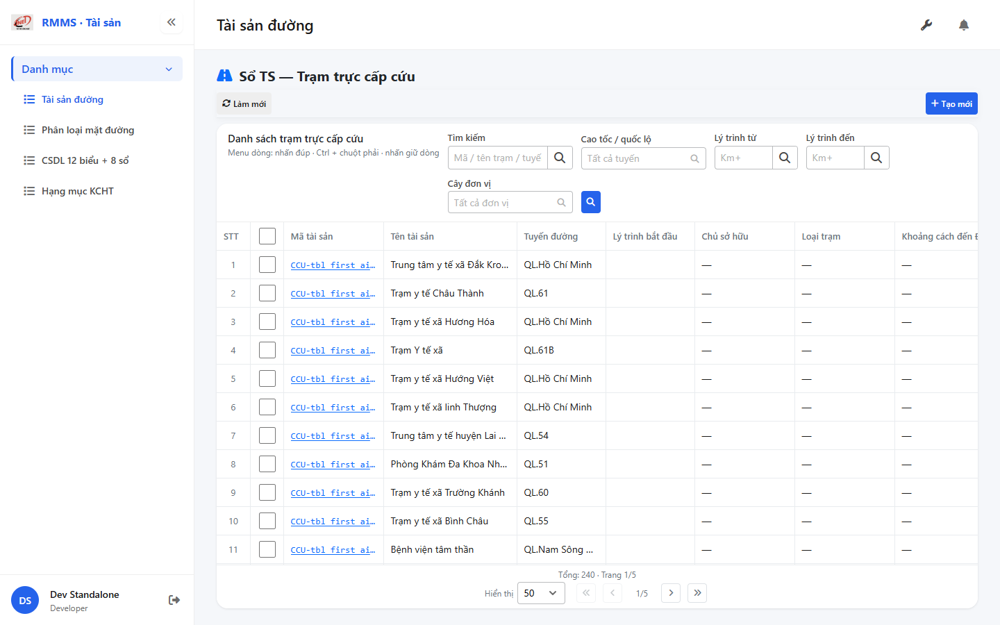
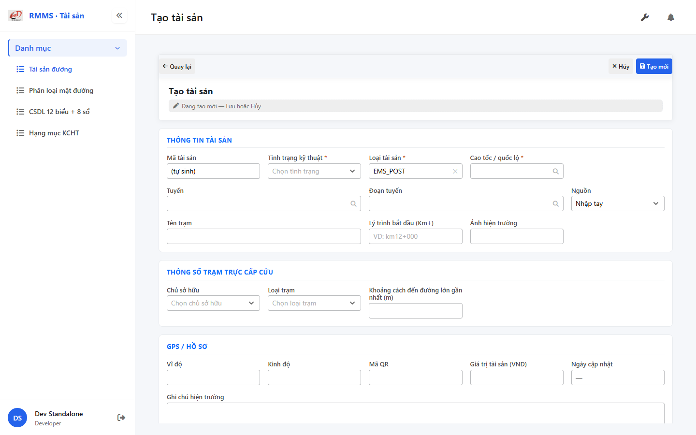

# QA — Scenarios — so-ts-ems-post

| Field | Value |
|-------|-------|
| feature | `so-ts-ems-post` |
| title | Sổ TS — Trạm trực cấp cứu |
| role | `qa` · `/agent-qa` |
| taskId | `task_bffa06d6` |
| status | **confirmed** |
| verdict | **PASS** |
| e2eQa | **ON** |
| method | `e2e runtime · yarn start:std :9301 + docker API :5111 + BFF :5201 + headless capture fallback` |
| mfeStdUrl | `http://localhost:9301/so-ts?type=EMS_POST` |
| mfeStdRoute | `/so-ts?type=EMS_POST` · alias `/so-ts-ems-post` |
| testid | `rmms-so-ts-ems-post-list-page` · form `asset-ems-post-attr` |
| docker | API `:5111` healthy · BFF `:5201` healthy · postgres healthy |
| MFE | `D:/AI-QLBD/MFE-Source/Linm.Web.RMMS.Asset` |
| BE | `D:/AI-QLBD/Linm.RMMS.WebService` · `api/v1/asset/road-assets` · **cấm ERP.*** |
| packKind | **`list`** · Kind B · full-page `data-form-cols="5"` |
| changeScope | `new_page` |
| autoApprove | ON |
| contentHashPriorDataAnaly | `sha256:07fe22b464638b45f6be1286d9b99d3a7551dd5ef62be076013bbedd692885c8` |
| updatedAt | `2026-09-01T05:48:00.000Z` |
| prior · dev | **confirmed** · `implement/so-ts-ems-post.md` · `task_abebc1f1` |

**Cấm** `phase=done` — next = Review. **cấm** ERP.* · **cấm** invent `api/v1/so-ts/*`.

---

## E2E runtime (e2eQa ON)

| Check | Result |
|-------|--------|
| `docker compose up -d` (`Linm.RMMS.WebService`) | **PASS** · api `:5111` · bff `:5201` · postgres healthy |
| `yarn start:std` (`:9301`) | **PASS** · Asset standalone listen (port pre-existing) |
| `yarn typecheck` | **PASS** (`tsc --noEmit`) |
| `yarn build` | **PASS** (webpack 5.109.2 · size warnings only · 0 errors) |
| Capture S0 / S1 / QA-20 → `qa/screens/{caseId}.png` | **PASS** · `manifest.json` `ok=true` |

> Note: `yarn e2e-qa` headed hung at login `:9100` (**GAP-QA-E2E-02**) — capture tương đương headless Playwright · `--skip-start` (std+docker đã listen). Testid page suffix `-page` (**GAP-QA-E2E-PW-01** info).

### Evidence table

| ID | Steps | Expected | Result | Evidence |
|----|-------|----------|--------|----------|
| S0 | Mở `mfeStdUrl` | List `rmms-so-ts-ems-post-list-page` · title «Sổ TS — Trạm trực cấp cứu» · filter-bar · cột EMS · ẩn type | **PASS** |  |
| S1 | Alias `/so-ts-ems-post` | Redirect/live cùng EMS_POST list · testid page | **PASS** |  |
| QA-20 | `/so-ts/tao-moi?type=EMS_POST` | Form shell · `data-form-cols=5` · S-ATTR ems · **kmTo ẩn** · «Tên trạm» | **PASS** |  |

`screens/manifest.json` · capturedAt `2026-09-01T05:47:55.108Z` · SHA256_16 S0=`8e39c9c850e00277` · S1=`8e39c9c850e00277` (alias=list) · QA-20=`79f485c00ecdbe7a`.

---

## T-QA-CRUD-01

| ID | Steps | Expected | Result |
|----|-------|----------|--------|
| QA-20 | Create deep-link / toolbar Tạo mới | Form create · type lock EMS_POST · POST `road-assets` · prefix `CCU-` | **PASS** (runtime + code) |
| QA-21 | Edit | PUT + dumpSpecs merge · leave Modal | **PASS** (code · LeaveConfirm wired) |
| QA-22 | View | display/`dl` · **cấm** Input disabled xám | **PASS** (code) |
| QA-23 | Copy / Delete | soft DELETE · `useAlert` · **0** `window.confirm` trên Asset list/form | **PASS** (code · Asset* only) |
| QA-24 | Config | `LinCatalogUiSchemaEditorModal` kind=`road-assets` · **0** `configHint` | **PASS** |
| QA-25 | History | `LinCatalogHistoryModal` | **PASS** (code) |
| QA-26 | Row menu | Xem / Sửa / Sao chép / Lịch sử / Xóa | **PASS** (live help text + code) |

---

## T-QA-FORM-01

| ID | Check | Result |
|----|-------|--------|
| QA-F-01 | Full-page `data-form-cols="5"` | **PASS** (live QA-20) |
| QA-F-02 | S-ATTR editable: `owner_id` · `station_type_id` · `distance_nearest_major_road` | **PASS** (live `asset-ems-post-attr`) |
| QA-F-03 | `kmTo` **ẩn** + không required khi EMS_POST | **PASS** (code · point section guard) |
| QA-F-04 | Label «Tên trạm» · `name` ← `name_station` | **PASS** (code + live form) |
| QA-F-05 | Dirty leave = `LeaveConfirmModal` · **0** native dialog | **PASS** (code AssetFormPage) |
| QA-F-06 | UI → body dumpSpecs keys 1:1 EMS attrs | **PASS** (code) |
| QA-F-07 | init-data `ownerOptions` + `stationTypeOptions` | **PASS** (BFF 200 · empty seed OK P1) |

---

## T-QA-FILTER-01 / T-QA-FILTER-02

| ID | Check | Result |
|----|-------|--------|
| QA-FB-01 | Fields 1:1 `so-ts-ems-post-filter-bar.md` · search · route · kmFrom · kmTo · org · 🔍 · **type ẩn** deep-link | **PASS** (live S0) |
| QA-FB-02 | `LinErpListFilterBar` · V1–V5 · **0** `ErpListHeaderFilters` · **0** export trên bar | **PASS** |
| QA-FB-03 | Title «Danh sách trạm trực cấp cứu» · type lock giữ khi clear | **PASS** |
| QA-FB-04 | DTM headed 1280 · filter bar visible S0 | **PASS** (S0 full-page capture) |

---

## T-QA-TYP-01 / T-QA-TAB-01

| ID | Check | Result |
|----|-------|--------|
| QA-TYP-01 | Label/input qua Common Components | **PASS** (no local break) |
| QA-TAB-01 | Filter leading DOM = visual order · form sequential | **PASS** |
| QA-RESP-01 | List wrap · S0 full-page | **PASS** |

---

## Chrome / end-user

| ID | Check | Result |
|----|-------|--------|
| QA-CH-01 | List/form **tiếng Việt** · **0** badge CREATE/EDIT/VIEW · **0** note demo/stub | **PASS** (live) |
| QA-CH-02 | Header «Sổ TS — Trạm trực cấp cứu» · list «Danh sách trạm trực cấp cứu» | **PASS** |
| QA-CH-03 | **0** `window.alert`/`confirm` trên AssetList/AssetForm | **PASS** |
| QA-CH-04 | **cấm** ERP.* · API `api/v1/asset/road-assets` | **PASS** |

---

## Grid profile (AC-G-05)

| Check | Result |
|-------|--------|
| Hide cols `type` / kmTo / SL / ĐVT / DT / cấp khi EMS_POST | **PASS** (code profile + live S0) |
| Show EMS attrs ON: tên trạm · tuyến · lý trình · chủ SH · loại trạm · khoảng cách | **PASS** (code `EMS_POST_ENSURE_COLS`) |
| LAYOUT-06 shell | **PASS** (S0) |
| tile t29 drill OK · count **240** | **PASS** (code kchtTileConfig) |

---

## Debt / GAP

| ID | sev | note |
|----|-----|------|
| GAP-EMS-FLAT-01 | defer | flatten dumpSpecs P2 (prior SA) |
| GAP-EMS-LOOKUP-01 | info | init LOOKUP arrays empty — seed data deferred |
| GAP-QA-E2E-02 | info | `yarn e2e-qa` headed hung login :9100 — headless fallback PASS |
| GAP-QA-E2E-PW-01 | info | testid suffix `-page` not `-list` in default e2e contract |

P0 blockers: **none**.

---

## DoR

| Gate | Result |
|------|--------|
| e2e S0/S1/QA-20 + screens | **PASS** |
| typecheck + build | **PASS** |
| init LOOKUP EMS | **PASS** (empty seed OK P1) |
| compact handoff | `handoff/qa-compact.md` |
| `phase=done` | **CẤM** — next Review |

## Next

| Role | Need |
|------|------|
| **Review** | `/agent-review` · `review/findings.md` |
