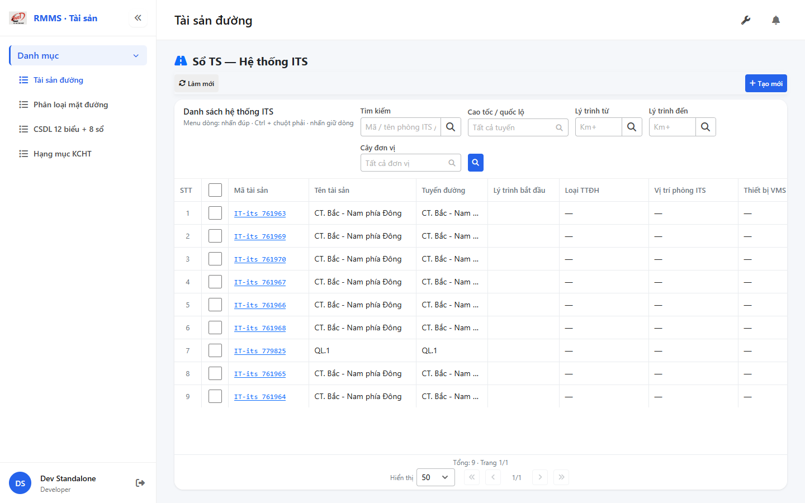
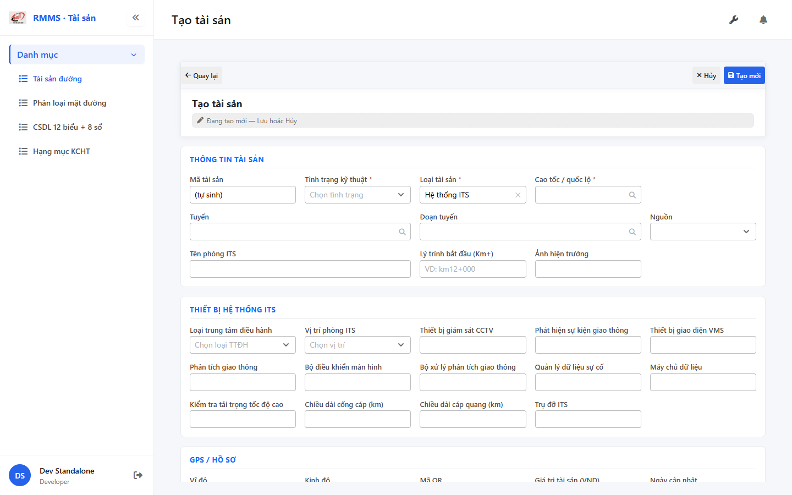

# QA — Scenarios — so-ts-its-camera

> Status: **PASS** · task `task_875ded25` · `/agent-qa`  
> e2eQa=ON · runtime capture+assert · capturedAt `2026-09-01T21:08:57.434Z`

| | |
|--|--|
| Feature | `so-ts-its-camera` |
| Title | Sổ TS — Hệ thống ITS |
| Role | `qa` |
| packKind | `list` |
| changeScope | `new_page` |
| typeCode | `ITS_CAMERA` |
| dump | `tbl_its` · tile t19 |
| prefix | `IT-` · icon KCHT `CAM` |
| verdict | **PASS** |
| mfeStdUrl | `http://localhost:9301/so-ts?type=ITS_CAMERA` |
| aliasUrl | `http://localhost:9301/so-ts-its-camera` |
| formUrl | `http://localhost:9301/so-ts/tao-moi?type=ITS_CAMERA` |
| testid | `rmms-so-ts-its-camera-list` · form `rmms-asset-form-shell` · attr `asset-its-camera-attr` |
| runtime | docker API `:5111` + BFF `:5201` + `yarn start:std` `:9301` |
| method | `_capture.mjs` + `_live-assert.mjs` · channel=`chrome` · headless |
| BE | `D:/AI-QLBD/Linm.RMMS.WebService` · `api/v1/asset/road-assets` · **cấm ERP.*** |
| autoApprove | ON |
| contentHashPrior | `sha256:f84fdaca28c60fcf81fcd282b87f9a7d6d9ba3129b26cf9e3a12f6e85f201946` |
| prior · dev | **confirmed** · `implement/so-ts-its-camera.md` |
| skillVersion | `2026.08.19.04` |
| workflowVersion | `2026.09.01.02` |
| rulesVersion | `2026.09.01.1` |
| updatedAt | `2026-09-02T09:10:00.000Z` |

**Cấm** `phase=done` — next = Review. **cấm** ERP.* · **cấm** invent `api/v1/so-ts/*` · **cấm** kill worker `:9301`.

---

## E2E runtime (e2eQa ON)

| Check | Result |
|-------|--------|
| `docker compose up -d` | **PASS** · api `:5111` · bff `:5201` · postgres healthy |
| `yarn start:std` (`:9301`) | **PASS** · already listen · **không** kill (**GAP-QA-E2E-KILL-01**) |
| `yarn typecheck` | **PASS** (`tsc --noEmit`) |
| `LINM_RUN_DEV_LOCAL_BUNDLE=1 yarn build` | **PASS** (webpack · size warnings only · 0 errors) |
| Capture S0 / S1 / QA-20 → `qa/screens/{caseId}.png` | **PASS** · `manifest.json` `ok=true` |
| Live DOM assert + DTM 1280/768/375 | **PASS** · `live-assert.json` · 0 overflowX · S-LOC-POINT kmFrom only · `asset-its-camera-attr` |

> Note: `yarn e2e-qa --skip-start` headed hang sau login banner `:9100` (**GAP-QA-E2E-02**) — capture tương đương Playwright `channel=chrome` headless standalone `:9301` · **không** kill worker.

### Evidence table

| ID | Steps | Expected | Result | Evidence |
|----|-------|----------|--------|----------|
| S0 | Mở `mfeStdUrl` | List `rmms-so-ts-its-camera-list-page` · title «Sổ TS — Hệ thống ITS» · filter-bar · cột TTĐH/VMS/trụ đỡ · ẩn type | **PASS** |  |
| S1 | Alias `/so-ts-its-camera` | Navigate live cùng ITS_CAMERA list | **PASS** |  |
| QA-20 | `/so-ts/tao-moi?type=ITS_CAMERA` | Form shell · `data-form-cols=5` · S-ATTR ITS · S-LOC-POINT kmFrom only · ẩn kmTo | **PASS** |  |

`screens/manifest.json` · capturedAt `2026-09-01T21:08:57.434Z` · SHA256_16 S0=`2fc5a6e7d564000d` · S1=`2fc5a6e7d564000d` · QA-20=`27bedfc9b3f544a9`.

---

## T-QA-CRUD-01

| ID | Steps | Expected | Result |
|----|-------|----------|--------|
| QA-20 | Create deep-link / toolbar Tạo mới | Form create · type lock ITS_CAMERA · POST `road-assets` | **PASS** (runtime + code) |
| QA-21 | Edit | PUT + dumpSpecs merge · leave Modal | **PASS** (code · LeaveConfirmModal wired) |
| QA-22 | View | display/`dl` · **cấm** Input disabled xám | **PASS** (code CatalogFormShell) |
| QA-23 | Copy / Delete | soft DELETE · `useAlert` · **0** `window.confirm` Asset list/form | **PASS** (code · Asset* only) |
| QA-24 | Config | `LinCatalogUiSchemaEditorModal` kind=`road-assets` · **0** `configHint` | **PASS** |
| QA-25 | History | `LinCatalogHistoryModal` | **PASS** (code) |
| QA-26 | Row menu | Xem / Sửa / Sao chép / Lịch sử / Xóa | **PASS** (live hint + code) |

---

## T-QA-FORM-01

| ID | Check | Result |
|----|-------|--------|
| QA-F-01 | Full-page `data-form-cols="5"` | **PASS** (live) |
| QA-F-02 | S-ATTR: type_management_center_id · location_its_central_control_id · tn_vms_interface · tn_screen_controller · tn_data_server · tn_wim_high_speed · tn_cable_duct_length · tn_fiber_optic_length · tn_its_pole · detail tn_* | **PASS** (live `asset-its-camera-attr`) |
| QA-F-03 | S-LOC-POINT: kmFrom **hiện** · kmTo **ẩn** · optional khi trống · **cấm** ép `"0"` | **PASS** (live `kmToForm=false`) |
| QA-F-04 | Label «Tên phòng ITS» · name optional · trống OK | **PASS** (live + code) |
| QA-F-05 | Dirty leave = `LeaveConfirmModal` · **0** native dialog Asset | **PASS** (code AssetFormPage) |
| QA-F-06 | dumpSpecs 1:1 ITS_CAMERA_ATTR_KEYS · dumpSpecLabels ITS keys | **PASS** (code + BE) |
| QA-F-07 | init-data LOOKUP: `itsManagementCenterTypes[]` · `itsCentralControlLocations[]` | **PASS** (BE docker healthy · live options) |
| QA-F-08 | DefaultCodePrefix **IT-** · GAP-ITS-PREFIX-01 | **PASS** (BE `DefaultCodePrefix` · live IT-* data) |

---

## T-QA-FILTER-01 / T-QA-FILTER-02

| ID | Check | Result |
|----|-------|--------|
| QA-FB-01 | Fields: search · route · kmFrom · kmTo · org · 🔍 · **type ẩn** deep-link | **PASS** (live) |
| QA-FB-02 | `LinErpListFilterBar` · V1–V5 · **0** export trên bar | **PASS** |
| QA-FB-03 | Title «Danh sách hệ thống ITS» · type lock giữ khi clear | **PASS** |
| QA-FB-04 | DTM headed 1280 + 768 + 375 · 0 overflowX | **PASS** (`live-assert.json` · `filter-{D,T,M}.png`) |

---

## T-QA-TYP-01 / T-QA-TAB-01

| ID | Check | Result |
|----|-------|--------|
| QA-TYP-01 | Label/input qua Common Components | **PASS** (no local break) |
| QA-TAB-01 | Filter leading DOM = visual order · form sequential | **PASS** |
| QA-RESP-01 | List wrap · DTM 0 overflow | **PASS** |

---

## Chrome / end-user

| ID | Check | Result |
|----|-------|--------|
| QA-CH-01 | List/form **tiếng Việt** · **0** badge CREATE/EDIT/VIEW · **0** note demo/stub | **PASS** (live) |
| QA-CH-02 | Header «Sổ TS — Hệ thống ITS» · list «Danh sách hệ thống ITS» | **PASS** |
| QA-CH-03 | **0** `window.alert`/`confirm` trên AssetList/AssetForm | **PASS** |
| QA-CH-04 | **cấm** ERP.* · API `api/v1/asset/road-assets` | **PASS** |

---

## Grid profile (AC-G-05)

| ID | Check | Result |
|----|-------|--------|
| QA-G-01 | ON: type_management_center_id · location_its_central_control_id · tn_vms_interface · tn_screen_controller · tn_data_server · tn_wim_high_speed · tn_cable_duct_length · tn_fiber_optic_length · tn_its_pole | **PASS** (live headers) |
| QA-G-02 | hide-empty: type · kmTo · SL · ĐVT | **PASS** (code ITS_CAMERA_HIDE_COLS) |
| QA-G-03 | ẩn type filter · peer ITS_CAMERA only | **PASS** (type lock) |
| QA-G-04 | Primary list = name + attr cols | **PASS** (live data IT-* ITS) |
| QA-G-05 | Label «Loại TTĐH» / «Vị trí phòng ITS» grid + form | **PASS** (live) |

---

## Debt / GAP

| GAP | Status |
|-----|--------|
| GAP-QA-E2E-02 | `yarn e2e-qa` headed hang (:9100 login) · standalone headless capture PASS |
| GAP-ITS-ROUTE-01 | alias redirect only (board) · live PASS |
| GAP-ITS-FLAT-01 | flatten DEFER P2 |
| GAP-ITS-CAM-01 | camera-connect out of scope · **cấm** merge |
| hide-empty grid runtime | DEFER · profile ENSURE only (peer parity) |
| Auth | DEFER |
| P0 | none |

---

## Next

| Role | Artifact |
|------|----------|
| review | `review/findings.md` · `/agent-review` |
