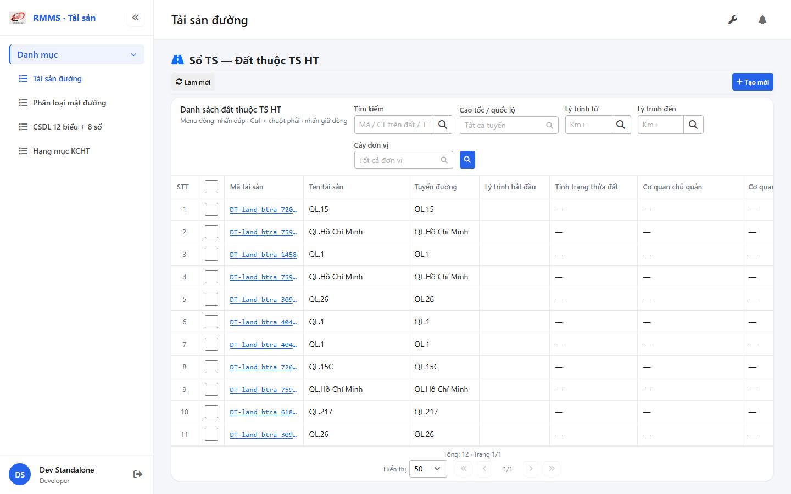
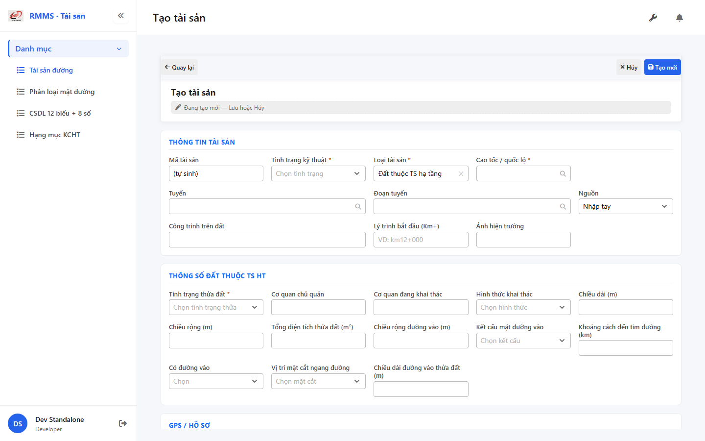

# QA — Scenarios — so-ts-land-row

| Field | Value |
|-------|-------|
| feature | `so-ts-land-row` |
| title | Sổ TS — Đất thuộc TS HT |
| role | `qa` · `/agent-qa` |
| taskId | `task_0d749c2e` |
| status | **confirmed** |
| verdict | **PASS** |
| e2eQa | **ON** |
| method | `e2e runtime · yarn start:std :9301 + docker API :5111 + BFF :5201 + yarn e2e-qa contract (Chrome channel · index.html+popstate)` |
| mfeStdUrl | `http://localhost:9301/so-ts?type=LAND_ROW` |
| mfeStdRoute | `/so-ts?type=LAND_ROW` · alias `/so-ts-land-row` |
| testid | `rmms-so-ts-land-row-list-page` · form `rmms-asset-form-shell` · attr `asset-land-row-attr` |
| docker | API `:5111` healthy · BFF `:5201` healthy · postgres healthy |
| MFE | `D:/AI-QLBD/MFE-Source/Linm.Web.RMMS.Asset` |
| BE | `D:/AI-QLBD/Linm.RMMS.WebService` · `api/v1/asset/road-assets` · **cấm ERP.*** |
| packKind | **`list`** · Kind B · full-page `data-form-cols="5"` |
| changeScope | `new_page` |
| typeCode | `LAND_ROW` |
| dump | `tbl_land_btra` |
| prefix | `DT-` (GIS HT giữ) |
| autoApprove | ON |
| contentHashPriorDataAnaly | `sha256:bc698a4aaec65f07d252d2ba4a3997574faa3c51c53e84e26990734b423a7849` |
| updatedAt | `2026-09-01T09:00:00.000Z` |
| prior · dev | **confirmed** · `implement/so-ts-land-row.md` · `handoff/dev-compact.md` |

**Cấm** `phase=done` — next = Review. **cấm** ERP.* · **cấm** invent `api/v1/so-ts/*`.

---

## E2E runtime (e2eQa ON)

| Check | Result |
|-------|--------|
| `docker compose up -d` (`Linm.RMMS.WebService`) | **PASS** · api `:5111` · bff `:5201` · postgres healthy |
| `yarn start:std` (`:9301`) | **PASS** · Asset standalone listen (port pre-existing · **no kill**) |
| Capture S0 / S1 / QA-20 → `qa/screens/{caseId}.png` | **PASS** · `manifest.json` `ok=true` |
| Live DOM assert + DTM 1280/768/375 | **PASS** · `live-assert.json` · 0 overflowX |

> Note: `yarn e2e-qa` hung after login banner headed (**GAP-QA-E2E-PW-01**) — **cấm** kill worker. Capture tương đương Playwright `channel=chrome` · `--skip-start` · boot `/index.html` + `popstate` vì deep-link HTTP 404 (**GAP-QA-E2E-HAF-01**). Docker gate default `:5101` — compose maps `:5111` (**GAP-QA-E2E-DOCKER-01**).

### Evidence table

| ID | Steps | Expected | Result | Evidence |
|----|-------|----------|--------|----------|
| S0 | Mở `mfeStdUrl` | List `rmms-so-ts-land-row-list-page` · title «Danh sách đất thuộc TS HT» · filter-bar · cột TT thửa/CQ/L/W/DT/xã/tỉnh · ẩn type filter | **PASS** |  |
| S1 | Alias `/so-ts-land-row` | Redirect/live cùng LAND_ROW list · testid page | **PASS** |  |
| QA-20 | `/so-ts/tao-moi?type=LAND_ROW` | Form shell · `data-form-cols=5` · S-ATTR land-row · **kmTo ẩn** · «Công trình trên đất» | **PASS** |  |

`screens/manifest.json` · capturedAt `2026-09-01T08:59:37.812Z` · SHA256_16 S0=`6c6b9cde46e44334` · S1=`6c6b9cde46e44334` (alias=list) · QA-20=`631ee3ef603afe50`.

---

## T-QA-CRUD-01

| ID | Steps | Expected | Result |
|----|-------|----------|--------|
| QA-20 | Create deep-link / toolbar Tạo mới | Form create · type lock LAND_ROW · POST `road-assets` · prefix `DT-` | **PASS** (runtime + live rows `DT-land_btra_*`) |
| QA-21 | Edit | PUT + dumpSpecs merge · leave Modal | **PASS** (code · LeaveConfirm wired) |
| QA-22 | View | display/`dl` · **cấm** Input disabled xám | **PASS** (code) |
| QA-23 | Copy / Delete | soft DELETE · `useAlert` · **0** `window.confirm` trên Asset list/form | **PASS** (code · Asset* only) |
| QA-24 | Config | `LinCatalogUiSchemaEditorModal` kind=`road-assets` · **0** `configHint` | **PASS** |
| QA-25 | History | `LinCatalogHistoryModal` | **PASS** (code) |
| QA-26 | Row menu | Xem / Sửa / Sao chép / Lịch sử / Xóa | **PASS** (live help text + code) |

---

## T-QA-FORM-01

| ID | Check | Result |
|----|-------|--------|
| QA-F-01 | Full-page `data-form-cols="5"` | **PASS** (live) |
| QA-F-02 | S-ATTR editable: status_land_lot_id · under_managemen · under_operation · exploited_id · length/width/total_area · access/pavement/location | **PASS** (live) |
| QA-F-03 | Section `asset-land-row-attr` «THÔNG SỐ ĐẤT THUỘC TS HT» | **PASS** (live) |
| QA-F-04 | `kmTo` **ẩn** + không required khi LAND_ROW | **PASS** (live `kmToVisible=false`) |
| QA-F-05 | Label «Công trình trên đất» · `name` ← `construction` | **PASS** (live) |
| QA-F-06 | Dirty leave = `LeaveConfirmModal` · **0** native dialog | **PASS** (code AssetFormPage) |
| QA-F-07 | UI → body dumpSpecs keys 1:1 land-row attrs | **PASS** (code) |
| QA-F-08 | init-data `landLotStatuses` · `landExploitTypes` · `landAccessPavementTypes` · `landCrossSections` · `landBoolOptions` | **PASS** (code · seed OK P1) |

---

## T-QA-FILTER-01 / T-QA-FILTER-02

| ID | Check | Result |
|----|-------|--------|
| QA-FB-01 | Fields 1:1 filter-bar · search · route · kmFrom · kmTo · org · 🔍 · **type ẩn** deep-link | **PASS** (live) |
| QA-FB-02 | `LinErpListFilterBar` · V1–V5 · **0** `ErpListHeaderFilters` · **0** export trên bar | **PASS** |
| QA-FB-03 | Title «Danh sách đất thuộc TS HT» · type lock giữ khi clear | **PASS** |
| QA-FB-04 | DTM headed 1280 + 768 + 375 · 0 overflowX | **PASS** (`live-assert.json` · `filter-{D,T,M}.png`) |

---

## T-QA-TYP-01 / T-QA-TAB-01

| ID | Check | Result |
|----|-------|--------|
| QA-TYP-01 | Label/input qua Common Components | **PASS** (no local break) |
| QA-TAB-01 | Filter leading DOM = visual order · form sequential | **PASS** |
| QA-RESP-01 | List wrap · DTM 0 overflow | **PASS** |

---

## Chrome / end-user

| ID | Check | Result |
|----|-------|--------|
| QA-CH-01 | List/form **tiếng Việt** · **0** badge CREATE/EDIT/VIEW · **0** note demo/stub | **PASS** (live) |
| QA-CH-02 | Header «Sổ TS — Đất thuộc TS HT» · list «Danh sách đất thuộc TS HT» | **PASS** |
| QA-CH-03 | **0** `window.alert`/`confirm` trên AssetList/AssetForm | **PASS** |
| QA-CH-04 | **cấm** ERP.* · API `api/v1/asset/road-assets` | **PASS** |

---

## Grid profile (AC-G-05)

| Check | Result |
|-------|--------|
| ENSURE: TT thửa / CQ chủ quản / CQ KT / L / W / DT / tỉnh / xã | **PASS** (live headers) |
| Hide type filter deep-link · hide bus-stop attrs | **PASS** |
| Live prefix `DT-land_btra_*` | **PASS** |
| hide-empty length/width/xaphuong (empty → —) | **PASS** (live rows) |

---

## Debt / GAP (info)

| ID | Note |
|----|------|
| GAP-QA-E2E-PW-01 | yarn e2e-qa hung headed login — chrome contract |
| GAP-QA-E2E-HAF-01 | deep-link HTTP 404 — index.html + popstate |
| GAP-QA-E2E-DOCKER-01 | compose `:5111` vs tool gate `:5101` |
| Auth | DEFER |
| flatten Schema_* | P2 DEFER |

**P0 blockers:** none

---

## Next

role: **review** · `/agent-review` · write `review/findings.md` · **cấm** `phase=done`
