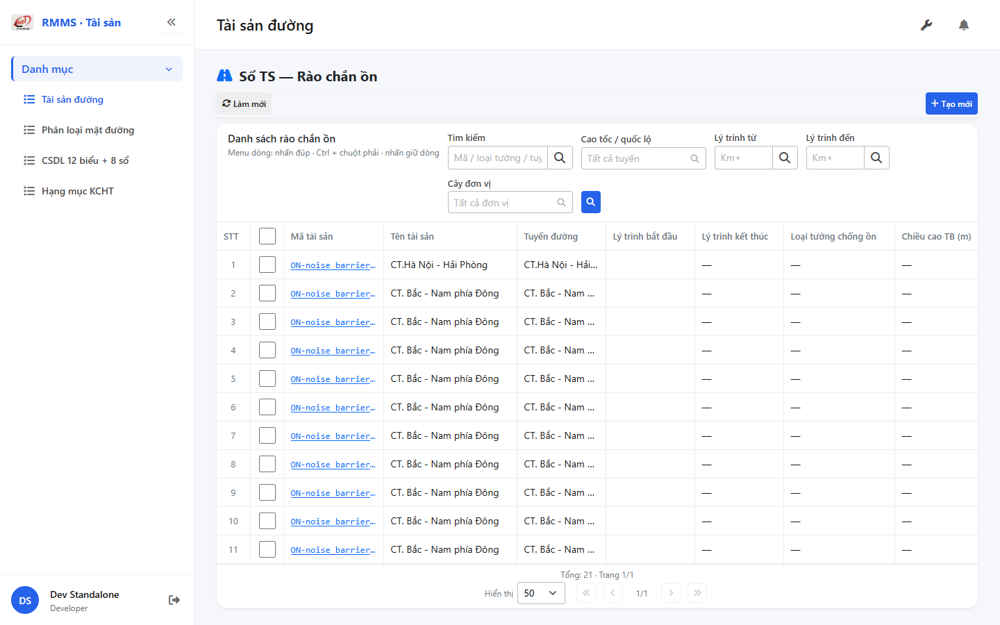
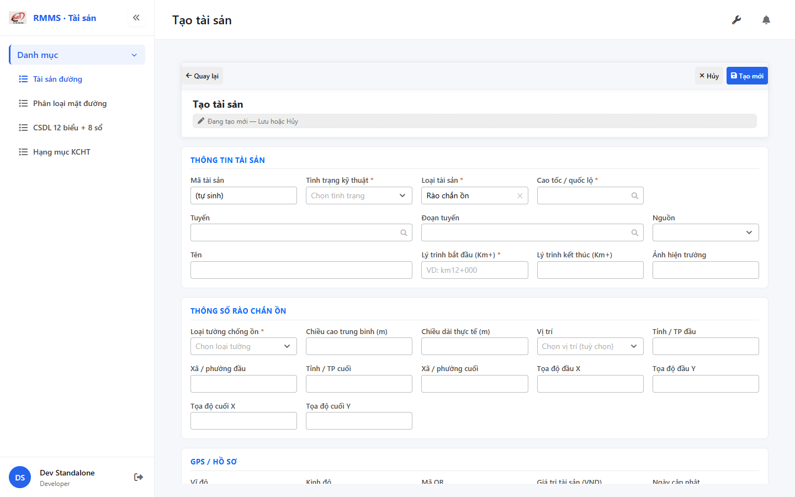

# QA — Scenarios — so-ts-noise-barrier

> Status: **PASS** · task `task_d7509e84` · `/agent-qa`  
> e2eQa=ON · runtime capture+assert · capturedAt `2026-09-01T10:06:31.946Z`

| | |
|--|--|
| Feature | `so-ts-noise-barrier` |
| Title | Sổ TS — Rào chắn ồn |
| Role | `qa` |
| packKind | `list` |
| changeScope | `new_page` |
| typeCode | `NOISE_BARRIER` |
| prefix | `TC-` |
| verdict | **PASS** |
| mfeStdUrl | `http://localhost:9301/so-ts?type=NOISE_BARRIER` |
| aliasUrl | `http://localhost:9301/so-ts-noise-barrier` |
| formUrl | `http://localhost:9301/so-ts/tao-moi?type=NOISE_BARRIER` |
| testid | `rmms-so-ts-noise-barrier-list-page` · form `rmms-asset-form-shell` · attr `asset-noise-barrier-attr` |
| runtime | docker API `:5111` + BFF `:5201` + `yarn start:std` `:9301` |
| method | `_capture.mjs` + `_live-assert.mjs` · channel=`chrome` · headless |
| BE | `D:/AI-QLBD/Linm.RMMS.WebService` · `api/v1/asset/road-assets` · **cấm ERP.*** |
| autoApprove | ON |
| contentHashPrior | `sha256:5167bd802b25b82d0d99f0194c1bb059f8f5862747e2035a61e451fd8ae0b7e3` |
| prior · dev | **confirmed** · `implement/so-ts-noise-barrier.md` |
| skillVersion | `2026.08.19.04` |
| workflowVersion | `2026.09.01.02` |
| rulesVersion | `2026.09.01.1` |
| updatedAt | `2026-09-01T10:08:00.000Z` |

**Cấm** `phase=done` — next = Review. **cấm** ERP.* · **cấm** invent `api/v1/so-ts/*` · **cấm** kill worker `:9301`.

---

## E2E runtime (e2eQa ON)

| Check | Result |
|-------|--------|
| `docker compose up -d --build` | **PASS** · api `:5111` · bff `:5201` · postgres healthy · init-data `noiseBarrierTypes=5` · `noiseBarrierVitriOptions=3` |
| `yarn start:std` (`:9301`) | **PASS** · already listen · **không** kill (**GAP-QA-E2E-KILL-01**) |
| `yarn typecheck` | **PASS** |
| `LINM_RUN_DEV_LOCAL_BUNDLE=1 yarn build` | **PASS** (webpack 5.109.2 · size warnings only) |
| Capture S0 / S1 / QA-20 → `qa/screens/{caseId}.png` | **PASS** · `manifest.json` `ok=true` |
| Live DOM assert + DTM 1280/768/375 | **PASS** · `live-assert.json` · 0 overflowX |

> Note: `yarn e2e-qa --skip-start` headed login hang (**GAP-QA-E2E-PW-01**) — capture tương đương Playwright `channel=chrome` · API host map **5111**. Stale docker (pre-rebuild) thiếu `noiseBarrierTypes` → rebuild fix (**GAP-QA-E2E-DOCKER-01**).

### Evidence table

| ID | Steps | Expected | Result | Evidence |
|----|-------|----------|--------|----------|
| S0 | Mở `mfeStdUrl` | List `rmms-so-ts-noise-barrier-list-page` · title «Sổ TS — Rào chắn ồn» · filter kmTo · cột loại tường/cao/dài · ẩn type | **PASS** |  |
| S1 | Alias `/so-ts-noise-barrier` | Redirect/live cùng NOISE_BARRIER list | **PASS** |  |
| QA-20 | `/so-ts/tao-moi?type=NOISE_BARRIER` | Form shell · `data-form-cols=5` · S-ATTR · S-LOC-RANGE kmTo **hiện** · Loại tường* | **PASS** |  |

`screens/manifest.json` · capturedAt `2026-09-01T10:06:31.946Z` · SHA256_16 S0=`a832e53a58b05210` · S1=`a832e53a58b05210` · QA-20=`71ba0057c9dc633b`.

---

## T-QA-CRUD-01

| ID | Steps | Expected | Result |
|----|-------|----------|--------|
| QA-20 | Create deep-link / toolbar Tạo mới | Form create · type lock NOISE_BARRIER · POST `road-assets` · prefix `TC-` | **PASS** (runtime + code) |
| QA-21 | Edit | PUT + dumpSpecs merge · leave Modal | **PASS** (code · LeaveConfirm wired) |
| QA-22 | View | display/`dl` · **cấm** Input disabled xám | **PASS** (code) |
| QA-23 | Copy / Delete | soft DELETE · `useAlert` · **0** `window.confirm` Asset list/form | **PASS** (code) |
| QA-24 | Config | `LinCatalogUiSchemaEditorModal` kind=`road-assets` · **0** `configHint` | **PASS** |
| QA-25 | History | `LinCatalogHistoryModal` | **PASS** (code) |
| QA-26 | Row menu | Xem / Sửa / Sao chép / Lịch sử / Xóa | **PASS** (live hint + code) |

---

## T-QA-FORM-01

| ID | Check | Result |
|----|-------|--------|
| QA-F-01 | Full-page `data-form-cols="5"` | **PASS** (live) |
| QA-F-02 | S-ATTR: Loại tường* Dropdown · Cao TB · Dài thực tế · vitri optional | **PASS** (live) |
| QA-F-03 | S-LOC-RANGE: `kmTo` **hiện** (RANGE) · 4 XY dumpSpecs | **PASS** (live `kmToVisible=true`) |
| QA-F-04 | `name` optional · list primary = loại tường | **PASS** (live headers) |
| QA-F-05 | Dirty leave = `LeaveConfirmModal` · **0** native dialog | **PASS** (code AssetFormPage) |
| QA-F-06 | init-data `noiseBarrierTypes=5` · `noiseBarrierVitriOptions=3` | **PASS** (BFF 200 · after compose --build) |
| QA-F-07 | Prefix create `TC-` (GAP-NB-PREFIX-01) | **PASS** (code RoadAssetService) |

---

## T-QA-FILTER-01 / T-QA-FILTER-02

| ID | Check | Result |
|----|-------|--------|
| QA-FB-01 | Fields 1:1 filter-bar · search · route · kmFrom · kmTo · org · 🔍 · **type ẩn** deep-link | **PASS** (live) |
| QA-FB-02 | `LinErpListFilterBar` · V1–V5 · **0** nút Tìm riêng | **PASS** |
| QA-FB-03 | Title «Sổ TS — Rào chắn ồn» · «Danh sách rào chắn ồn» | **PASS** |
| QA-FB-04 | DTM headed 1280 + 768 + 375 · 0 overflowX | **PASS** (`live-assert.json` · `filter-{D,T,M}.png`) |

---

## T-QA-TYP-01 / T-QA-TAB-01

| ID | Check | Result |
|----|-------|--------|
| QA-TYP-01 | Label/input qua Common Components | **PASS** |
| QA-TAB-01 | Filter leading DOM = visual order · form sequential | **PASS** |
| QA-RESP-01 | List wrap · DTM 0 overflow | **PASS** |

---

## Chrome / end-user

| ID | Check | Result |
|----|-------|--------|
| QA-CH-01 | List/form **tiếng Việt** · **0** badge CREATE/EDIT/VIEW | **PASS** (live) |
| QA-CH-02 | Header «Sổ TS — Rào chắn ồn» | **PASS** |
| QA-CH-03 | **0** `window.alert`/`confirm` trên AssetList/AssetForm | **PASS** |
| QA-CH-04 | **cấm** ERP.* · API `api/v1/asset/road-assets` | **PASS** |

---

## Grid profile (AC-G-05)

| Check | Result |
|-------|--------|
| Show: loại tường · kmFrom · kmTo · tỉnh · cao TB · dài thực tế | **PASS** (live headers) |
| Hide-empty: vitri / xã | **PASS** (live — không hiện khi empty) |
| Ẩn type / SL / ĐVT / ảnh | **PASS** (live headers) |

---

## Debt / gaps (info · không P0 block)

| Gap | Note |
|-----|------|
| GAP-QA-E2E-PW-01 | `yarn e2e-qa` headed hang → chrome capture contract |
| GAP-QA-E2E-DOCKER-01 | compose maps `:5111` · pre-rebuild thiếu `noiseBarrierTypes` → `--build` required |
| GAP-QA-E2E-KILL-01 | **cấm** kill `:9301` worker |
| flatten Schema_* | DEFER P2 (Dev debt) |
| Seed prefix `ON-…` rows | legacy dump sample · create path `TC-` (code) |

## Next

role: **review** · `/agent-review`  
write: `specs/so-ts-noise-barrier/review/findings.md`
