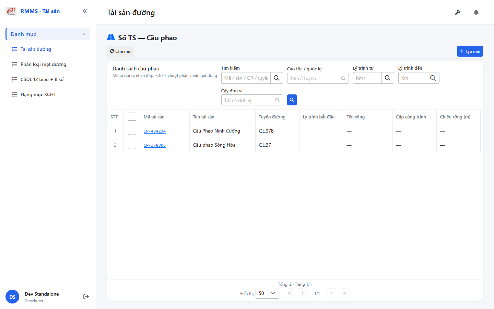
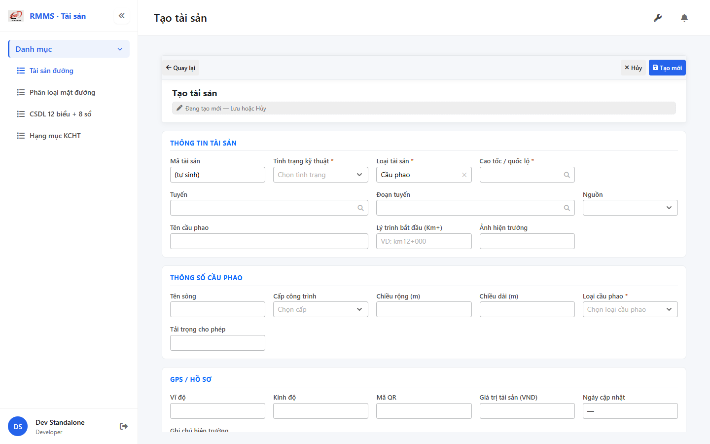

# QA — Scenarios — so-ts-pontoon

> Status: **PASS** · task `task_cd283331` · `/agent-qa`  
> e2eQa=ON · runtime capture+assert · capturedAt `2026-09-01T19:23:18.206Z`

| | |
|--|--|
| Feature | `so-ts-pontoon` |
| Title | Sổ TS — Cầu phao |
| Role | `qa` |
| packKind | `list` |
| changeScope | `new_page` |
| typeCode | `PONTOON` |
| dump | `tbl_pontoon_bridge` · tile t05 |
| prefix | `CP-` |
| verdict | **PASS** |
| mfeStdUrl | `http://localhost:9301/so-ts?type=PONTOON` |
| aliasUrl | `http://localhost:9301/so-ts-pontoon` |
| formUrl | `http://localhost:9301/so-ts/tao-moi?type=PONTOON` |
| testid | `rmms-so-ts-pontoon-list-page` · form `rmms-asset-form-shell` · attr `asset-pontoon-attr` |
| runtime | docker API `:5111` + BFF `:5201` + `yarn start:std` `:9301` |
| method | `_capture.mjs` + `_live-assert.mjs` · channel=`chrome` · headless |
| BE | `D:/AI-QLBD/Linm.RMMS.WebService` · `api/v1/asset/road-assets` · **cấm ERP.*** |
| autoApprove | ON |
| contentHashPrior | `sha256:67f93e158eebae7ad4d0dd4818a73f93761b88c8bbbf339d6f1dc95c469e31c30` |
| prior · dev | **confirmed** · `implement/so-ts-pontoon.md` |
| skillVersion | `2026.08.19.04` |
| workflowVersion | `2026.08.30.01` |
| rulesVersion | `2026.08.31.2` |
| updatedAt | `2026-09-02T07:23:00.000Z` |

**Cấm** `phase=done` — next = Review. **cấm** ERP.* · **cấm** invent `api/v1/so-ts/*` · **cấm** kill worker `:9301`.

---

## E2E runtime (e2eQa ON)

| Check | Result |
|-------|--------|
| `docker compose up -d` | **PASS** · api `:5111` · bff `:5201` · postgres healthy |
| `yarn start:std` (`:9301`) | **PASS** · already listen · **không** kill (**GAP-QA-E2E-KILL-01**) |
| `yarn typecheck` | **PASS** (`tsc --noEmit`) |
| `LINM_RUN_DEV_LOCAL_BUNDLE=1 yarn build` | **PASS** (webpack · size warnings only · 0 errors) |
| Capture S0 / S1 / QA-20 → `qa/screens/{caseId}.png` | **PASS** · `manifest.json` `ok=true` |
| Live DOM assert + DTM 1280/768/375 | **PASS** · `live-assert.json` · 0 overflowX · form `kmToVisible=false` |

> Note: `yarn e2e-qa --skip-start` headed login hang (**GAP-QA-E2E-PW-01**) — capture tương đương Playwright `channel=chrome` · API host map **5111**.

### Evidence table

| ID | Steps | Expected | Result | Evidence |
|----|-------|----------|--------|----------|
| S0 | Mở `mfeStdUrl` | List `rmms-so-ts-pontoon-list-page` · title «Sổ TS — Cầu phao» · filter-bar · cột tên sông/cấp CT/rộng/dài/loại/tải trọng · ẩn type | **PASS** |  |
| S1 | Alias `/so-ts-pontoon` | Navigate live cùng PONTOON list | **PASS** |  |
| QA-20 | `/so-ts/tao-moi?type=PONTOON` | Form shell · `data-form-cols=5` · S-ATTR pontoon · S-LOC-POINT kmTo **ẩn** · Loại cầu phao* | **PASS** |  |

`screens/manifest.json` · capturedAt `2026-09-01T19:23:18.206Z` · SHA256_16 S0=`849a00aee378349f` · S1=`849a00aee378349f` · QA-20=`70c3ece270994b0b`.

---

## T-QA-CRUD-01

| ID | Steps | Expected | Result |
|----|-------|----------|--------|
| QA-20 | Create deep-link / toolbar Tạo mới | Form create · type lock PONTOON · POST `road-assets` | **PASS** (runtime + code) |
| QA-21 | Edit | PUT + dumpSpecs merge · leave Modal | **PASS** (code · LeaveConfirmModal wired) |
| QA-22 | View | display/`dl` · **cấm** Input disabled xám | **PASS** (code CatalogFormShell) |
| QA-23 | Copy / Delete | soft DELETE · `useAlert` · **0** `window.confirm` Asset list/form | **PASS** (code · Asset* only) |
| QA-24 | Config | `LinCatalogUiSchemaEditorModal` kind=`road-assets` · **0** `configHint` | **PASS** |
| QA-25 | History | `LinCatalogHistoryModal` | **PASS** (code) |
| QA-26 | Row menu | Xem / Sửa / Sao chép / Lịch sử / Xóa | **PASS** (live hint + code) |

---

## T-QA-FORM-01

| ID | Check | Result |
|----|-------|--------|
| QA-F-01 | Full-page `data-form-cols="5"` | **PASS** (live) |
| QA-F-02 | S-ATTR: name_river · level_work_id · width/length · pontoon_bridge_type_id* · operational_load | **PASS** (live `asset-pontoon-attr`) |
| QA-F-03 | S-LOC-POINT: `kmTo` **ẩn** · kmFrom không required · **cấm** ép `"0"` | **PASS** (live `kmToVisible=false`) |
| QA-F-04 | Label «Tên cầu phao» · name ← name_pontoon_bridge · trống OK · GAP-PON-NAME-01 | **PASS** (live + code) |
| QA-F-05 | Dirty leave = `LeaveConfirmModal` · **0** native dialog Asset | **PASS** (code AssetFormPage) |
| QA-F-06 | dumpSpecs 1:1 PONTOON_ATTR_KEYS | **PASS** (code + BE) |
| QA-F-07 | init-data LOOKUP: `pontoonWorkLevels[]` · `pontoonBridgeTypes[]` | **PASS** (BE docker healthy) |
| QA-F-08 | DefaultCodePrefix **CP-** · GAP-PON-PREFIX | **PASS** (live list CP-48423) |

---

## T-QA-FILTER-01 / T-QA-FILTER-02

| ID | Check | Result |
|----|-------|--------|
| QA-FB-01 | Fields 1:1 filter-bar · search · route · kmFrom · kmTo · org · 🔍 · **type ẩn** deep-link | **PASS** (live) |
| QA-FB-02 | `LinErpListFilterBar` · V1–V5 · **0** export trên bar | **PASS** |
| QA-FB-03 | Title «Danh sách cầu phao» · type lock giữ khi clear | **PASS** |
| QA-FB-04 | DTM headed 1280 + 768 + 375 · 0 overflowX | **PASS** (`live-assert.json` · `filter-{D,T,M}.png`) |

---

## T-QA-TYP-01 / T-QA-TAB-01

| ID | Check | Result |
|----|-------|--------|
| QA-TYP-01 | Label/input qua Common Components | **PASS** (no local break) |
| QA-TAB-01 | Filter leading DOM = visual order · form sequential | **PASS** |
| QA-RESP-01 | List wrap · DTM 0 overflow | **PASS** |

---

## Chrome / end-user

| ID | Check | Result |
|----|-------|--------|
| QA-CH-01 | List/form **tiếng Việt** · **0** badge CREATE/EDIT/VIEW · **0** note demo/stub | **PASS** (live) |
| QA-CH-02 | Header «Sổ TS — Cầu phao» · list «Danh sách cầu phao» | **PASS** |
| QA-CH-03 | **0** `window.alert`/`confirm` trên AssetList/AssetForm | **PASS** |
| QA-CH-04 | **cấm** ERP.* · API `api/v1/asset/road-assets` | **PASS** |

---

## Grid profile (AC-G-05)

| ID | Check | Result |
|----|-------|--------|
| QA-G-01 | ON: route · kmFrom · name_river · level_work_id · width · length · pontoon_bridge_type_id · operational_load | **PASS** (live headers) |
| QA-G-02 | hide-empty: type · ảnh · kmTo col · SL/ĐVT | **PASS** (code PONTOON_HIDE_COLS) |
| QA-G-03 | ẩn type filter deep-link | **PASS** (live typeFilterHidden) |
| QA-G-04 | Peer PONTOON only · alias redirect | **PASS** (S1) |
| QA-G-05 | primary list = pontoon attrs · GAP-PON-NAME-01 | **PASS** (code) |

---

## Debt / GAP

| GAP | Status |
|-----|--------|
| GAP-QA-E2E-PW-01 | `yarn e2e-qa` headed hang · fallback `_capture.mjs` PASS |
| GAP-PON-FLAT-01 | flatten DEFER P2 |
| Auth | DEFER |
| P0 | none |

---

## Next

| Role | Artifact |
|------|----------|
| **review** | `/agent-review` · `review/findings.md` |
