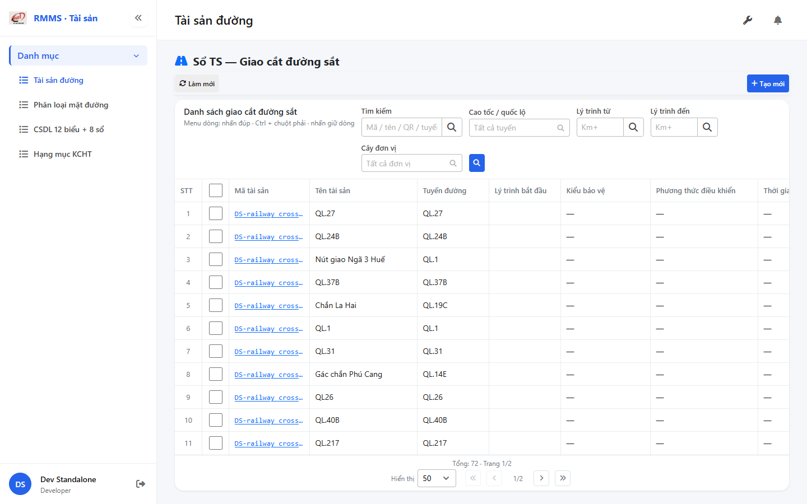
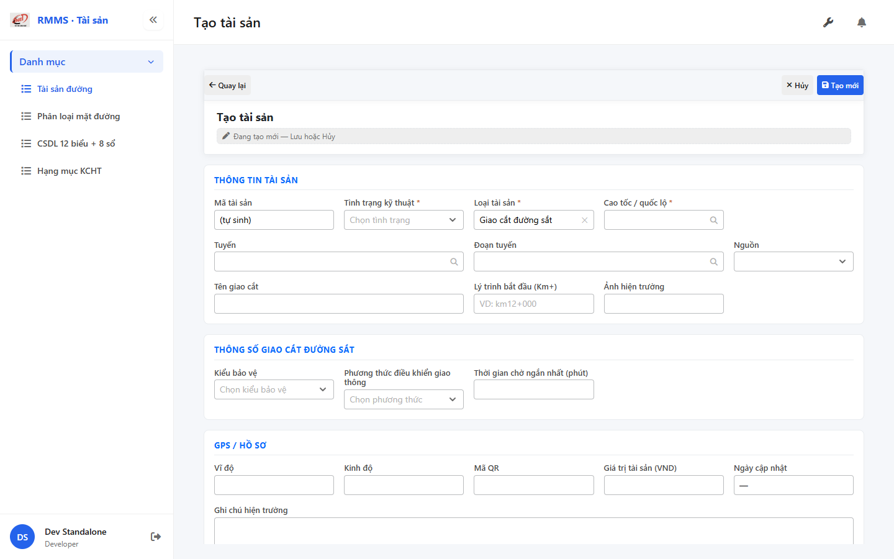

# QA — Scenarios — so-ts-rail-cross

> Status: **PASS** · task `task_87d3ccf8` · `/agent-qa`  
> e2eQa=ON · runtime capture+assert · capturedAt `2026-09-01T19:47:59.283Z`

| | |
|--|--|
| Feature | `so-ts-rail-cross` |
| Title | Sổ TS — Giao cắt đường sắt |
| Role | `qa` |
| packKind | `list` |
| changeScope | `new_page` |
| typeCode | `RAIL_CROSS` |
| dump | `tbl_railway_crossing` · tile t15 |
| prefix | `DS-` · icon KCHT `NG` |
| verdict | **PASS** |
| mfeStdUrl | `http://localhost:9301/so-ts?type=RAIL_CROSS` |
| aliasUrl | `http://localhost:9301/so-ts-rail-cross` |
| formUrl | `http://localhost:9301/so-ts/tao-moi?type=RAIL_CROSS` |
| testid | `rmms-so-ts-rail-cross-list` · form `rmms-asset-form-shell` · attr `asset-rail-cross-attr` |
| runtime | docker API `:5111` + BFF `:5201` + `yarn start:std` `:9301` |
| method | `_capture.mjs` + `_live-assert.mjs` · channel=`chrome` · headless |
| BE | `D:/AI-QLBD/Linm.RMMS.WebService` · `api/v1/asset/road-assets` · **cấm ERP.*** |
| autoApprove | ON |
| contentHashPrior | `sha256:da352cefd55373525e18a8b132228f5a6f7c46713d7b6a742fecf5416e410d5c` |
| prior · dev | **confirmed** · `implement/so-ts-rail-cross.md` |
| skillVersion | `2026.08.19.04` |
| workflowVersion | `2026.09.01.02` |
| rulesVersion | `2026.09.01.1` |
| updatedAt | `2026-09-02T07:48:00.000Z` |

**Cấm** `phase=done` — next = Review. **cấm** ERP.* · **cấm** invent `api/v1/so-ts/*` · **cấm** kill worker `:9301`.

---

## E2E runtime (e2eQa ON)

| Check | Result |
|-------|--------|
| `docker compose up -d` | **PASS** · api `:5111` · bff `:5201` · postgres healthy |
| `yarn start:std` (`:9301`) | **PASS** · already listen · **không** kill (**GAP-QA-E2E-KILL-01**) |
| `yarn typecheck` | **PASS** (`tsc --noEmit`) |
| `LINM_RUN_DEV_LOCAL_BUNDLE=1 yarn build` | **PASS** (webpack · size warnings only · 0 errors) |
| Capture S0 / S1 / QA-20 → `qa/screens/{caseId}.png` | **PASS** · `manifest.json` `ok=true` |
| Live DOM assert + DTM 1280/768/375 | **PASS** · `live-assert.json` · 0 overflowX · form `kmToHidden` · `asset-rail-cross-attr` |

> Note: `yarn e2e-qa --skip-start` hang sau login banner (**GAP-QA-E2E-PW-01**) — capture tương đương Playwright `channel=chrome` · API host map **5111** · **không** kill worker.

### Evidence table

| ID | Steps | Expected | Result | Evidence |
|----|-------|----------|--------|----------|
| S0 | Mở `mfeStdUrl` | List `rmms-so-ts-rail-cross-list-page` · title «Sổ TS — Giao cắt đường sắt» · filter-bar · cột kiểu bảo vệ/PT điều khiển/thời gian chờ · ẩn type | **PASS** |  |
| S1 | Alias `/so-ts-rail-cross` | Navigate live cùng RAIL_CROSS list | **PASS** |  |
| QA-20 | `/so-ts/tao-moi?type=RAIL_CROSS` | Form shell · `data-form-cols=5` · S-ATTR rail-cross · S-LOC-POINT kmTo **ẩn** · Dropdown protection/traffic · waiting phút | **PASS** |  |

`screens/manifest.json` · capturedAt `2026-09-01T19:47:59.283Z` · SHA256_16 S0=`6069efc291bae8ef` · S1=`6069efc291bae8ef` · QA-20=`1dee9007ff9f4c79`.

---

## T-QA-CRUD-01

| ID | Steps | Expected | Result |
|----|-------|----------|--------|
| QA-20 | Create deep-link / toolbar Tạo mới | Form create · type lock RAIL_CROSS · POST `road-assets` | **PASS** (runtime + code) |
| QA-21 | Edit | PUT + dumpSpecs merge · leave Modal | **PASS** (code · LeaveConfirmModal wired) |
| QA-22 | View | display/`dl` · **cấm** Input disabled xám | **PASS** (code CatalogFormShell) |
| QA-23 | Copy / Delete | soft DELETE · `useAlert` · **0** `window.confirm` Asset list/form | **PASS** (code · Asset* only) |
| QA-24 | Config | `LinCatalogUiSchemaEditorModal` kind=`road-assets` · **0** `configHint` | **PASS** |
| QA-25 | History | `LinCatalogHistoryModal` | **PASS** (code) |
| QA-26 | Row menu | Xem / Sửa / Sao chép / Lịch sử / Xóa | **PASS** (live hint + code) |

---

## T-QA-FORM-01

| ID | Check | Result |
|----|-------|--------|
| QA-F-01 | Full-page `data-form-cols="5"` | **PASS** (live) |
| QA-F-02 | S-ATTR: protection_type_id · traffic_control_method_id · shortest_waiting_time (phút) | **PASS** (live `asset-rail-cross-attr`) |
| QA-F-03 | S-LOC-POINT: `kmTo` **ẩn** · kmFrom không required · **cấm** ép `"0"` | **PASS** (live `kmToHidden=true`) |
| QA-F-04 | Label «Tên giao cắt» · name ← name_crossing · trống OK | **PASS** (live + code) |
| QA-F-05 | Dirty leave = `LeaveConfirmModal` · **0** native dialog Asset | **PASS** (code AssetFormPage) |
| QA-F-06 | dumpSpecs 1:1 RAIL_CROSS_ATTR_KEYS · dumpSpecLabels traffic_control + shortest_waiting | **PASS** (code + BE) |
| QA-F-07 | init-data LOOKUP: `railCrossProtectionTypes[]` · `railCrossTrafficControlMethods[]` | **PASS** (BE docker healthy · live options) |
| QA-F-08 | DefaultCodePrefix **DS-** · GAP-RC-PREFIX-01 | **PASS** (BE `DefaultCodePrefix` · live DS-railway_crossing_*) |

---

## T-QA-FILTER-01 / T-QA-FILTER-02

| ID | Check | Result |
|----|-------|--------|
| QA-FB-01 | Fields: search · route · kmFrom · kmTo · org · 🔍 · **type ẩn** deep-link | **PASS** (live) |
| QA-FB-02 | `LinErpListFilterBar` · V1–V5 · **0** export trên bar | **PASS** |
| QA-FB-03 | Title «Danh sách giao cắt đường sắt» · type lock giữ khi clear | **PASS** |
| QA-FB-04 | DTM headed 1280 + 768 + 375 · 0 overflowX | **PASS** (`live-assert.json` · `filter-{D,T,M}.png`) |

---

## T-QA-TYP-01 / T-QA-TAB-01

| ID | Check | Result |
|----|-------|--------|
| QA-TYP-01 | Label/input qua Common Components | **PASS** (no local break) |
| QA-TAB-01 | Filter leading DOM = visual order · form sequential | **PASS** |
| QA-RESP-01 | List wrap · DTM 0 overflow | **PASS** |

---

## Chrome / end-user

| ID | Check | Result |
|----|-------|--------|
| QA-CH-01 | List/form **tiếng Việt** · **0** badge CREATE/EDIT/VIEW · **0** note demo/stub | **PASS** (live) |
| QA-CH-02 | Header «Sổ TS — Giao cắt đường sắt» · list «Danh sách giao cắt đường sắt» | **PASS** |
| QA-CH-03 | **0** `window.alert`/`confirm` trên AssetList/AssetForm | **PASS** |
| QA-CH-04 | **cấm** ERP.* · API `api/v1/asset/road-assets` | **PASS** |

---

## Grid profile (AC-G-05)

| ID | Check | Result |
|----|-------|--------|
| QA-G-01 | ON: protection_type_id · traffic_control_method_id · shortest_waiting_time · route · kmFrom | **PASS** (live headers) |
| QA-G-02 | hide-empty: type · kmTo · qty · unit · ảnh | **PASS** (code RAIL_CROSS_HIDE_COLS) |
| QA-G-03 | ẩn type filter · peer RAIL_CROSS only | **PASS** (type lock) |
| QA-G-04 | Primary list = name/tuyến/lytrinh + attr cols | **PASS** (live data DS-railway_crossing_*) |
| QA-G-05 | Label «Thời gian chờ (phút)» grid + form | **PASS** (live) |

---

## Debt / GAP

| GAP | Status |
|-----|--------|
| GAP-QA-E2E-PW-01 | `yarn e2e-qa` hang (:9100 down) · fallback `_capture.mjs` PASS |
| GAP-RC-ROUTE-01 | alias redirect only (board) · live PASS |
| GAP-RC-FLAT-01 | flatten DEFER P2 |
| Auth | DEFER |
| P0 | none |

---

## Next

| Role | Artifact |
|------|----------|
| **review** | `/agent-review` · `review/findings.md` |
