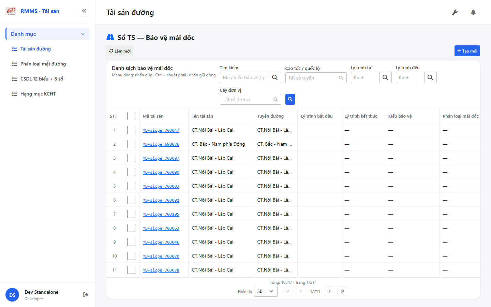
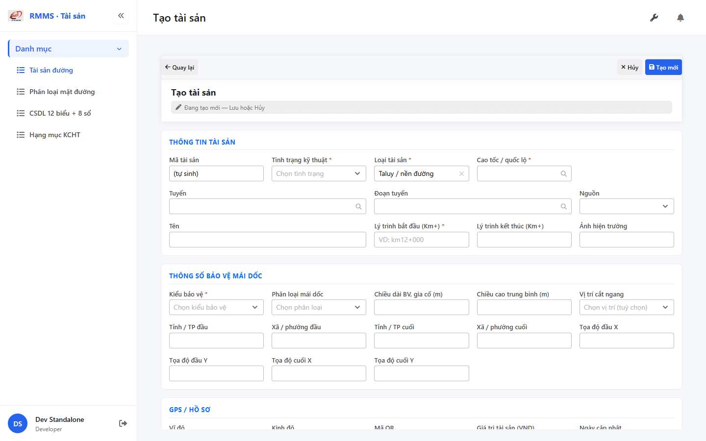

# QA — Scenarios — so-ts-slope-protect

> Status: **PASS** · task `task_de113e42` · `/agent-qa`  
> e2eQa=ON · runtime capture+assert · capturedAt `2026-09-01T18:55:09.559Z`

| | |
|--|--|
| Feature | `so-ts-slope-protect` |
| Title | Sổ TS — Bảo vệ mái dốc |
| Role | `qa` |
| packKind | `list` |
| changeScope | `new_page` |
| typeCode | `SLOPE_PROTECT` |
| dump | `tbl_slope` · GIS `mai-doc` · tile t12 |
| prefix | `MD-` (GIS `MD`) |
| verdict | **PASS** |
| mfeStdUrl | `http://localhost:9301/so-ts?type=SLOPE_PROTECT` |
| aliasUrl | `http://localhost:9301/so-ts-slope-protect` |
| formUrl | `http://localhost:9301/so-ts/tao-moi?type=SLOPE_PROTECT` |
| testid | `rmms-so-ts-slope-protect-list` · form `rmms-asset-form-shell` · attr `asset-slope-protect-attr` |
| runtime | docker API `:5111` + BFF `:5201` + `yarn start:std` `:9301` |
| method | `_capture.mjs` + `_live-assert.mjs` · channel=`chrome` · headless |
| BE | `D:/AI-QLBD/Linm.RMMS.WebService` · `api/v1/asset/road-assets` · **cấm ERP.*** |
| autoApprove | ON |
| contentHashPrior | `sha256:52501076e559261162c4741e46e0826cab2059143221abe3e32b1ca279253294` |
| prior · dev | **confirmed** · `implement/so-ts-slope-protect.md` |
| skillVersion | `2026.08.19.04` |
| workflowVersion | `2026.09.01.02` |
| rulesVersion | `2026.09.01.1` |
| updatedAt | `2026-09-02T02:05:00.000Z` |

**Cấm** `phase=done` — next = Review. **cấm** ERP.* · **cấm** invent `api/v1/so-ts/*` · **cấm** kill worker `:9301`.

---

## E2E runtime (e2eQa ON)

| Check | Result |
|-------|--------|
| `docker compose up -d` | **PASS** · api `:5111` · bff `:5201` · postgres healthy |
| `yarn start:std` (`:9301`) | **PASS** · already listen · **không** kill (**GAP-QA-E2E-KILL-01**) |
| `yarn typecheck` | **PASS** (`tsc --noEmit`) |
| `LINM_RUN_DEV_LOCAL_BUNDLE=1 yarn build` | **PASS** (webpack · size warnings only · 0 errors) |
| Capture S0 / S1 / QA-20 → `qa/screens/{caseId}.png` | **PASS** · `manifest.json` `ok=true` |
| Live DOM assert + DTM 1280/768/375 | **PASS** · `live-assert.json` · 0 overflowX · form `kmToVisible` · `asset-slope-protect-attr` |

> Note: `yarn e2e-qa --skip-start` hang 90s (**GAP-QA-E2E-PW-01**) — capture tương đương Playwright `channel=chrome` · API host map **5111** · **không** kill worker.

### Evidence table

| ID | Steps | Expected | Result | Evidence |
|----|-------|----------|--------|----------|
| S0 | Mở `mfeStdUrl` | List `rmms-so-ts-slope-protect-list-page` · title «Sổ TS — Bảo vệ mái dốc» · filter-bar · cột kiểu BV/phân loại/dài BV/cao TB · ẩn type | **PASS** |  |
| S1 | Alias `/so-ts-slope-protect` | Navigate live cùng SLOPE_PROTECT list | **PASS** |  |
| QA-20 | `/so-ts/tao-moi?type=SLOPE_PROTECT` | Form shell · `data-form-cols=5` · S-ATTR slope-protect · S-LOC-RANGE kmTo **hiện** · Kiểu bảo vệ* | **PASS** |  |

`screens/manifest.json` · capturedAt `2026-09-01T18:55:09.559Z` · SHA256_16 S0=`d5d414a78ab08b87` · S1=`d5d414a78ab08b87` · QA-20=`bdbdab4060457d44`.

---

## T-QA-CRUD-01

| ID | Steps | Expected | Result |
|----|-------|----------|--------|
| QA-20 | Create deep-link / toolbar Tạo mới | Form create · type lock SLOPE_PROTECT · POST `road-assets` | **PASS** (runtime + code) |
| QA-21 | Edit | PUT + dumpSpecs merge · leave Modal | **PASS** (code · LeaveConfirmModal wired) |
| QA-22 | View | display/`dl` · **cấm** Input disabled xám | **PASS** (code CatalogFormShell) |
| QA-23 | Copy / Delete | soft DELETE · `useAlert` · **0** `window.confirm` Asset list/form | **PASS** (code · Asset* only) |
| QA-24 | Config | `LinCatalogUiSchemaEditorModal` kind=`road-assets` · **0** `configHint` | **PASS** |
| QA-25 | History | `LinCatalogHistoryModal` | **PASS** (code) |
| QA-26 | Row menu | Xem / Sửa / Sao chép / Lịch sử / Xóa | **PASS** (live hint + code) |

---

## T-QA-FORM-01

| ID | Check | Result |
|----|-------|--------|
| QA-F-01 | Full-page `data-form-cols="5"` | **PASS** (live) |
| QA-F-02 | S-ATTR: protection_type_id* · slope_classification_id · actual_protected · average_height · location_id | **PASS** (live `asset-slope-protect-attr`) |
| QA-F-03 | S-LOC-RANGE: `kmTo` **hiện** · 4 XY dumpSpecs · **cấm** ép `"0"` | **PASS** (live `kmToVisible=true`) |
| QA-F-04 | Label «Kiểu bảo vệ»* · name optional · GAP-SLOPE-NAME-01 | **PASS** (live + code) |
| QA-F-05 | Dirty leave = `LeaveConfirmModal` · **0** native dialog Asset | **PASS** (code AssetFormPage) |
| QA-F-06 | dumpSpecs 1:1 SLOPE_PROTECT_ATTR_KEYS · dumpSpecLabels 5 key | **PASS** (code + BE) |
| QA-F-07 | init-data LOOKUP: `protectionTypes[]` · `slopeClassifications[]` · `locationOptions[]` | **PASS** (BE docker healthy · live options) |
| QA-F-08 | DefaultCodePrefix **MD-** · GAP-SLOPE-PREFIX-01 | **PASS** (BE `DefaultCodePrefix` · create code after save) |

---

## T-QA-FILTER-01 / T-QA-FILTER-02

| ID | Check | Result |
|----|-------|--------|
| QA-FB-01 | Fields 1:1 filter-bar · search · route · kmFrom · kmTo · org · 🔍 · **type ẩn** deep-link | **PASS** (live) |
| QA-FB-02 | `LinErpListFilterBar` · V1–V5 · **0** export trên bar | **PASS** |
| QA-FB-03 | Title «Danh sách bảo vệ mái dốc» · type lock giữ khi clear | **PASS** |
| QA-FB-04 | DTM headed 1280 + 768 + 375 · 0 overflowX | **PASS** (`live-assert.json` · `filter-{D,T,M}.png`) |

---

## T-QA-TYP-01 / T-QA-TAB-01

| ID | Check | Result |
|----|-------|--------|
| QA-TYP-01 | Label/input qua Common Components | **PASS** (no local break) |
| QA-TAB-01 | Filter leading DOM = visual order · form sequential | **PASS** |
| QA-RESP-01 | List wrap · DTM 0 overflow | **PASS** |

---

## Chrome / end-user

| ID | Check | Result |
|----|-------|--------|
| QA-CH-01 | List/form **tiếng Việt** · **0** badge CREATE/EDIT/VIEW · **0** note demo/stub | **PASS** (live) |
| QA-CH-02 | Header «Sổ TS — Bảo vệ mái dốc» · list «Danh sách bảo vệ mái dốc» | **PASS** |
| QA-CH-03 | **0** `window.alert`/`confirm` trên AssetList/AssetForm | **PASS** |
| QA-CH-04 | **cấm** ERP.* · API `api/v1/asset/road-assets` | **PASS** |

---

## Grid profile (AC-G-05)

| ID | Check | Result |
|----|-------|--------|
| QA-G-01 | ON: protection_type_id · route 3 tầng · kmFrom/kmTo · slope_classification_id · actual_protected · average_height | **PASS** (live headers) |
| QA-G-02 | hide-empty: location_id · province/commune | **PASS** (code SLOPE_PROTECT_HIDE_COLS) |
| QA-G-03 | ẩn type · ảnh | **PASS** (code) |
| QA-G-04 | Peer SLOPE_PROTECT only · RETAINING riêng | **PASS** (type lock) |
| QA-G-05 | primary list = protection_type_id · GAP-SLOPE-NAME-01 | **PASS** (code) |

---

## Debt / GAP

| GAP | Status |
|-----|--------|
| GAP-QA-E2E-PW-01 | `yarn e2e-qa` hang (:9100 down) · fallback `_capture.mjs` PASS |
| GAP-SLOPE-FLAT-01 | flatten DEFER P2 |
| Auth | DEFER |
| P0 | none |

---

## Next

| Role | Artifact |
|------|----------|
| **review** | `/agent-review` · `review/findings.md` |
