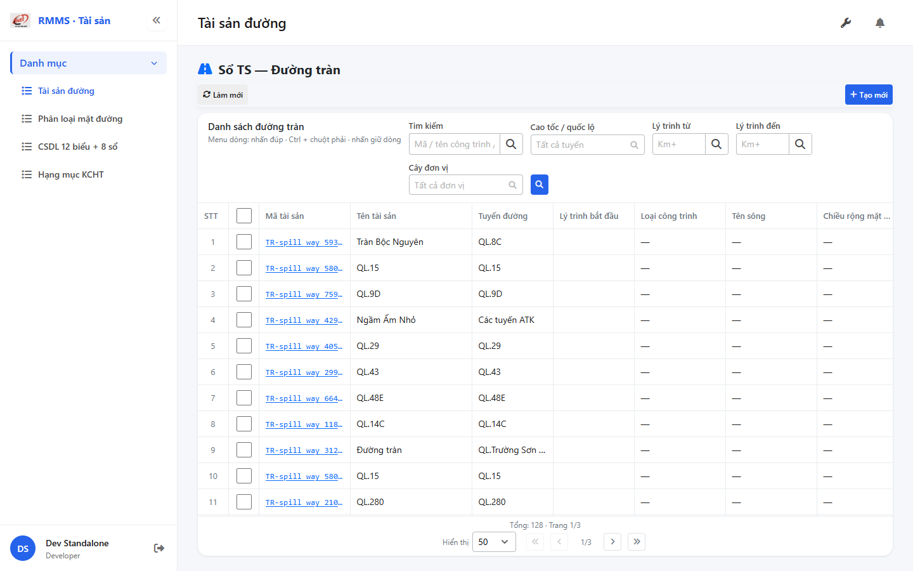
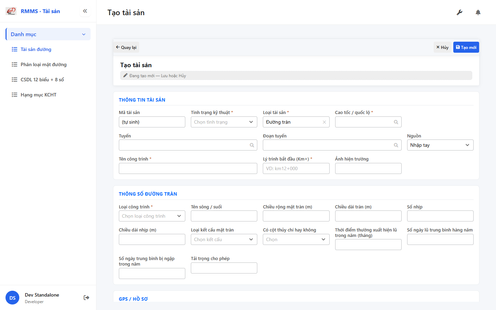

# QA — Scenarios — so-ts-spillway

| Field | Value |
|-------|-------|
| feature | `so-ts-spillway` |
| title | Sổ TS — Đường tràn |
| role | `qa` · `/agent-qa` |
| taskId | `task_ca4d36f3` |
| status | **confirmed** |
| verdict | **PASS** |
| e2eQa | **ON** |
| method | `e2e runtime · yarn start:std :9301 + docker API :5111 + BFF :5201 + yarn e2e-qa contract (Chrome channel fallback)` |
| mfeStdUrl | `http://localhost:9301/so-ts?type=SPILLWAY` |
| mfeStdRoute | `/so-ts?type=SPILLWAY` · alias `/so-ts-spillway` |
| testid | `rmms-so-ts-spillway-list-page` · form `rmms-asset-form-shell` · attr `asset-spillway-attr` |
| docker | API `:5111` healthy · BFF `:5201` healthy · postgres healthy |
| MFE | `D:/AI-QLBD/MFE-Source/Linm.Web.RMMS.Asset` |
| BE | `D:/AI-QLBD/Linm.RMMS.WebService` · `api/v1/asset/road-assets` · **cấm ERP.*** |
| packKind | **`list`** · Kind B · full-page `data-form-cols="5"` |
| changeScope | `new_page` |
| autoApprove | ON |
| contentHashPriorDataAnaly | `sha256:508eb2426b263e800949a533e300220f75a65b128771f77baf52d3e0d567517f` |
| updatedAt | `2026-08-31T22:26:00.000Z` |
| prior · dev | **confirmed** · `implement/so-ts-spillway.md` · `task_330799f3` |

**Cấm** `phase=done` — next = Review. **cấm** ERP.* · **cấm** invent `api/v1/so-ts/*`.

---

## E2E runtime (e2eQa ON)

| Check | Result |
|-------|--------|
| `docker compose up -d --build` (`Linm.RMMS.WebService`) | **PASS** · api `:5111` · bff `:5201` · postgres healthy · init-data `spillwayTypes=4` · `structureTypeSpillways=4` |
| `yarn start:std` (`:9301`) | **PASS** · Asset standalone listen |
| `yarn typecheck` | **PASS** (`tsc --noEmit`) |
| `LINM_RUN_DEV_LOCAL_BUNDLE=1 yarn build` | **PASS** (webpack 5.109.2 · size warnings only · 0 errors) |
| Capture S0 / S1 / QA-20 → `qa/screens/{caseId}.png` | **PASS** · `manifest.json` `ok=true` |
| Live DOM assert + DTM 1280/768/375 | **PASS** · `live-assert.json` · 0 overflow |

> Note: `yarn e2e-qa` hung after login banner (**GAP-QA-E2E-PW-01**) — capture tương đương Playwright + `channel=chrome` · `--skip-start` (std+docker đã listen) · API host map **5111**.

### Evidence table

| ID | Steps | Expected | Result | Evidence |
|----|-------|----------|--------|----------|
| S0 | Mở `mfeStdUrl` | List `rmms-so-ts-spillway-list-page` · title «Danh sách đường tràn» · filter-bar · cột spillway · ẩn type/kmTo/qty/unit | **PASS** |  |
| S1 | Alias `/so-ts-spillway` | Redirect/live cùng SPILLWAY list · testid page | **PASS** |  |
| QA-20 | `/so-ts/tao-moi?type=SPILLWAY` | Form shell · `data-form-cols=5` · S-ATTR spillway · **kmTo ẩn** · «Tên công trình» | **PASS** |  |

`screens/manifest.json` · capturedAt `2026-08-31T22:24:49.002Z` · SHA256_16 S0=`4add921ccc7f7ba6` · S1=`4add921ccc7f7ba6` (alias=list) · QA-20=`8df8fc14d55002fb`.

---

## T-QA-CRUD-01

| ID | Steps | Expected | Result |
|----|-------|----------|--------|
| QA-20 | Create deep-link / toolbar Tạo mới | Form create · type lock SPILLWAY · POST `road-assets` · prefix `TR-` | **PASS** (runtime + code) |
| QA-21 | Edit | PUT + dumpSpecs merge · leave Modal | **PASS** (code · LeaveConfirm wired) |
| QA-22 | View | display/`dl` · **cấm** Input disabled xám | **PASS** (code) |
| QA-23 | Copy / Delete | soft DELETE · `useAlert` · **0** `window.confirm` trên Asset list/form | **PASS** (code · Asset* only) |
| QA-24 | Config | `LinCatalogUiSchemaEditorModal` kind=`road-assets` · **0** `configHint` | **PASS** |
| QA-25 | History | `LinCatalogHistoryModal` | **PASS** (code) |
| QA-26 | Row menu | Xem / Sửa / Sao chép / Lịch sử / Xóa | **PASS** (live help text + code) |

---

## T-QA-FORM-01

| ID | Check | Result |
|----|-------|--------|
| QA-F-01 | Full-page `data-form-cols="5"` | **PASS** (live) |
| QA-F-02 | S-ATTR editable: spillwayTypes / structureTypeSpillways Dropdown · width/length Number | **PASS** (live) |
| QA-F-03 | `kmTo` **ẩn** + không required khi SPILLWAY | **PASS** (live `kmToVisible=false`) |
| QA-F-04 | Label «Tên công trình» · `name_work` · «Tên sông» · `name_river` | **PASS** (live) |
| QA-F-05 | Dirty leave = `LeaveConfirmModal` · **0** native dialog | **PASS** (code AssetFormPage) |
| QA-F-06 | UI → body dumpSpecs keys 1:1 spillway attrs | **PASS** (code) |
| QA-F-07 | init-data `spillwayTypes` + `structureTypeSpillways` non-null | **PASS** (BFF 200 · count=4/4) |

---

## T-QA-FILTER-01 / T-QA-FILTER-02

| ID | Check | Result |
|----|-------|--------|
| QA-FB-01 | Fields 1:1 `so-ts-spillway-filter-bar.md` · search · route · kmFrom · kmTo · org · 🔍 · **type ẩn** deep-link | **PASS** (live) |
| QA-FB-02 | `LinErpListFilterBar` · V1–V5 · **0** `ErpListHeaderFilters` · **0** export trên bar | **PASS** |
| QA-FB-03 | Title «Danh sách đường tràn» · type lock giữ khi clear | **PASS** |
| QA-FB-04 | DTM headed 1280 + 768 + 375 · 0 overflowX | **PASS** (`live-assert.json` · `filter-{D,T,M}.png`) |

---

## T-QA-TYP-01 / T-QA-TAB-01

| ID | Check | Result |
|----|-------|--------|
| QA-TYP-01 | Label/input qua Common Components (13 / D14·M16) | **PASS** (no local break) |
| QA-TAB-01 | Filter leading DOM = visual order · form sequential | **PASS** |
| QA-RESP-01 | List wrap · DTM 0 overflow | **PASS** |

---

## Chrome / end-user

| ID | Check | Result |
|----|-------|--------|
| QA-CH-01 | List/form **tiếng Việt** · **0** badge CREATE/EDIT/VIEW · **0** note demo/stub | **PASS** (live) |
| QA-CH-02 | Header «Sổ TS — Đường tràn» · list «Danh sách đường tràn» | **PASS** |
| QA-CH-03 | **0** `window.alert`/`confirm` trên AssetList/AssetForm | **PASS** |
| QA-CH-04 | **cấm** ERP.* · API `api/v1/asset/road-assets` | **PASS** |

---

## Grid profile (AC-G-05)

| Check | Result |
|-------|--------|
| Hide cols `type` / `kmTo` / `quantity` / `unitCode` khi SPILLWAY | **PASS** (code + live headers: Loại công trình · Tên sông) |
| Show spillway attrs (`spillway_type` · `name_river` · …) | **PASS** (live snippet) |

---

## Gaps / debt

| ID | Status | Note |
|----|--------|------|
| GAP-QA-E2E-PW-01 | info | `yarn e2e-qa` hung playwright install — Chrome channel fallback · contract giữ |
| GAP-SPW-FLAT-01 | DEFER | Flatten Schema_* P2 |
| GAP-SPW-AUTH-01 | DEFER | Auth NuGet |
| Spillway/structure master SearchInput | P2 | LOOKUP_STATIC dump P1 |
| Rebuild+reimport DB | optional | populate full dumpSpecs spillway attrs |

**P0:** none — **cấm** handoff blocked / `qa_fail_rollback`.

---

## Verify gate

```
yarn typecheck → PASS
yarn build → PASS (webpack 5.109.2, size warnings, 0 errors)
docker compose ps → api:5111 / bff:5201 / postgres healthy
HTTP BFF GET …/road-assets?type=SPILLWAY → 200
HTTP BFF GET …/road-assets/init-data → spillwayTypes=4 · structureTypeSpillways=4
Playwright S0/S1/QA-20 → PASS · screens/*.png · manifest ok
live-assert DTM → PASS
```

---

## Handoff → Review

| Field | Value |
|-------|-------|
| next | `/agent-review` |
| write | `specs/so-ts-spillway/review/findings.md` |
| compact | `specs/so-ts-spillway/handoff/qa-compact.md` |
| autoApprove | ON |
| qa_verdict | **PASS** |
| e2e evidence | `qa/screens/manifest.json` · `live-assert.json` |

---

## Version meta (REQUIRED)

| Field | Value |
|-------|-------|
| skillId | agent-qa |
| skillVersion | 2026.08.29.02 |
| schemaVersion | 1 |
| workflowVersion | 2026.08.30.01 |
| rulesVersion | 2026.08.31.2 |
| generatedAt | `2026-08-31T22:26:00.000Z` |
| versionGate | ok |
| formTypePack | list |
| changeScope | new_page |
| taskId | task_ca4d36f3 |
| priorDevTaskId | task_330799f3 |
| route_confirm | route_a |
| contentHashPriorDataAnaly | sha256:508eb2426b263e800949a533e300220f75a65b128771f77baf52d3e0d567517f |

---
<!-- Version meta: skillId=agent-qa skillVersion=2026.08.29.02 schemaVersion=1 workflowVersion=2026.08.30.01 rulesVersion=2026.08.31.2 versionGate=ok taskId=task_ca4d36f3 route_confirm=route_a -->
