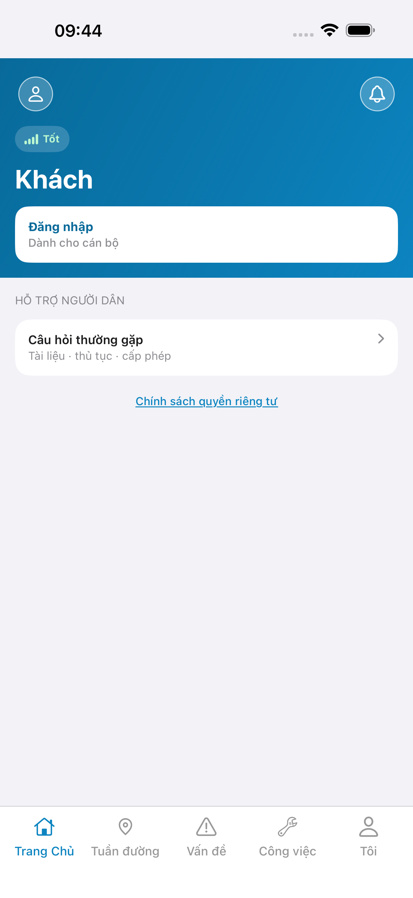
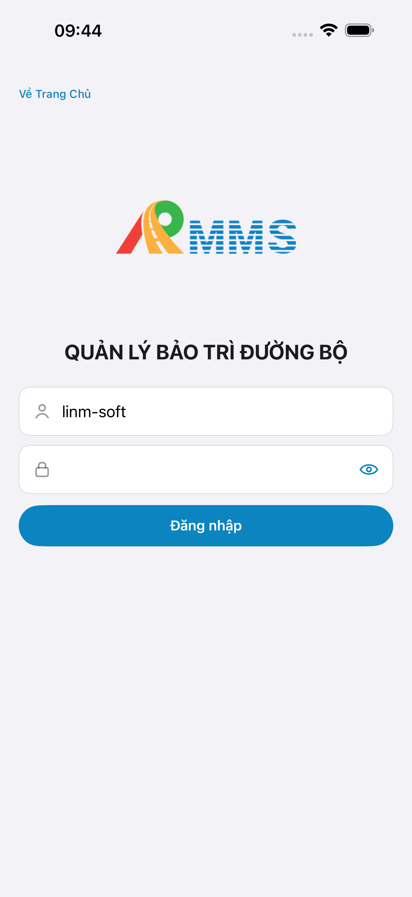
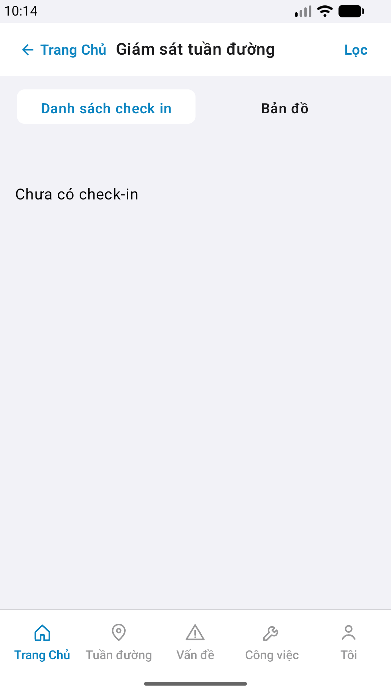
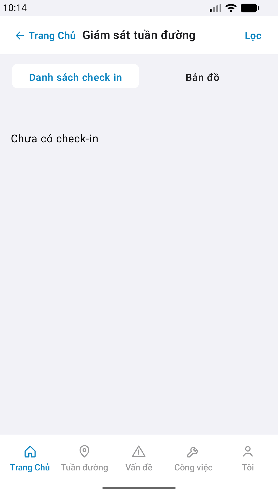

# QA — Scenarios — supervise-detail (mobile · Chi tiết check-in)

| Field | Value |
|-------|-------|
| feature | `supervise-detail` |
| this role | `qa` · `/agent-qa-mobile` |
| status | **blocked** |
| packKind | **`screen`** |
| changeScope | `edit_page` · gap=`cleanup_mock` re-QA |
| taskId | `task_02d20b55` |
| e2eQa | **ON** · `yarn e2e-qa-mobile` · `ios_test_phase=phase1_iphone` · **A4-IPAD DEFER** |
| store_qa | **run_store** (autoApprove=ON) |
| e2e result | **ok:false** · iOS Maestro **PASS** · Android Maestro **FAIL** |
| method | e2e runtime · yarn e2e-qa-mobile · Maestro + simctl/adb · **cấm** GenerateImage · **cấm** yarn start:std / mfeStdUrl |
| align | iOS A3 vs demo `#sc-supervise-detail` **Aligned** · Android P6 **blocked** |
| updatedAt | `2026-09-01T03:30:00.000Z` |

**Scope:** `#sc-supervise-detail` only. Entry via list card. Seed Id=`a0000001-2026-0810-0001-000000000001` · CompanyCode=`LINM` · CC-20260810-001.

## VERIFY GATE

| Gate | Result |
|------|--------|
| iOS Maestro iPhone 17 Pro Max | **PASS** · live detail |
| Android Maestro | **FAIL** · `sup-empty` · no GET attendance-logs |
| BFF :5202 / API | **PASS** |
| `yarn e2e-qa-mobile` | **FAIL** · ok:false · GAP-QA-STORE-03 |

## Device AC

| ID | Expect | Result |
|----|--------|--------|
| AC-D-01 | tile → list → detail | **iOS PASS** · **Android FAIL** |
| AC-F-01 | live hero+rows | **iOS PASS** · Android **FAIL** |
| AC-F-03 | GET by id live-only | **iOS PASS** (Nguyễn Văn A · CC-20260810-001) |
| AC-F-06 | orgFallback | **iOS PASS** |

## Store Must

| Case | Store | Evidence | Result |
|------|-------|----------|--------|
| A11-LAUNCH | A11 |  | **PASS** |
| A10-BFF | A10 · P11 | — | **PASS** |
| A9-LOGIN | A9 · P10 |  | **PASS** |
| A3-CORE | A3 · A11 |  | **PASS** |
| P6-CORE | P6 · P11 |  | **FAIL** |
| P6-CORE-2 | P6 |  | **FAIL** |
| A4-IPAD | A4 | DEFER Phase 1 | DEFER |

## Maestro

| Flow | Path | Result |
|------|------|--------|
| iOS | `qa/e2e/ios.yaml` | **PASS** |
| Android | `qa/e2e/android.yaml` | **FAIL** · GAP-QA-SUP-DET-AND-LIST-01 |

## Visual align

iOS A3 **Aligned** vs demo. Android CORE **blocked**. Must open **1**.

## Gaps

| ID | Note | Block complete? |
|----|------|-----------------|
| GAP-QA-SUP-DET-AND-LIST-01 | Android `#sc-supervise` no GET attendance-logs after login | **Yes** |
| GAP-QA-STORE-03 | Maestro-AND / P6 FAIL | **Yes** |

## Handoff → review

**Blocked** — queue `failed` → `qa_fail_rollback`.
