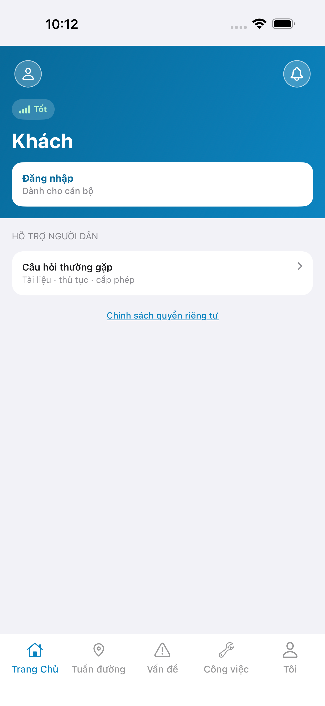
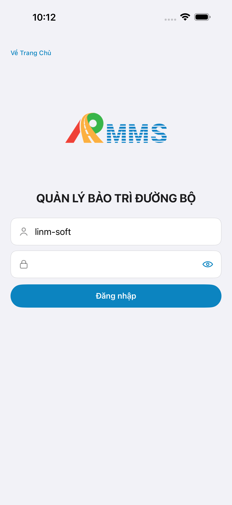
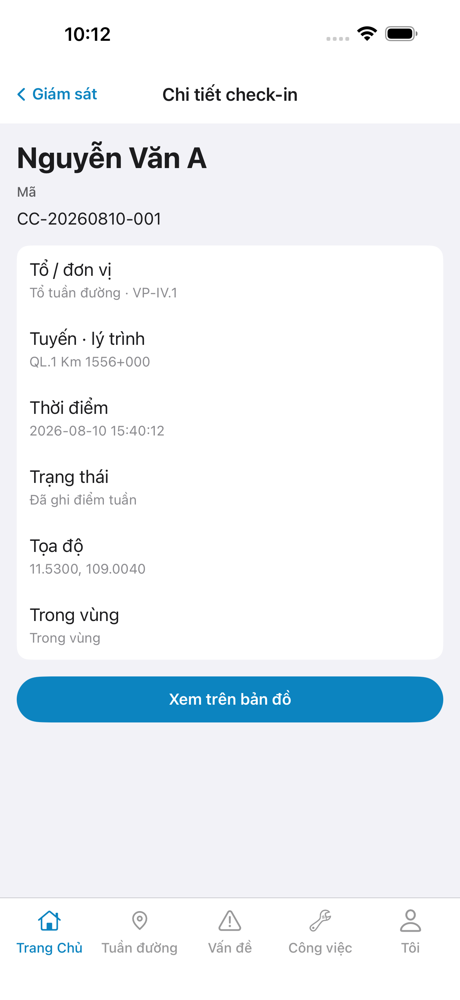
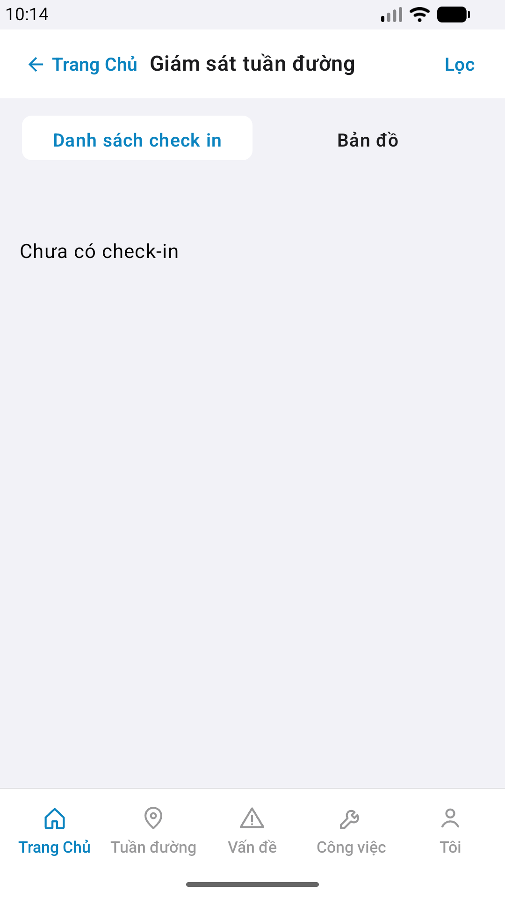
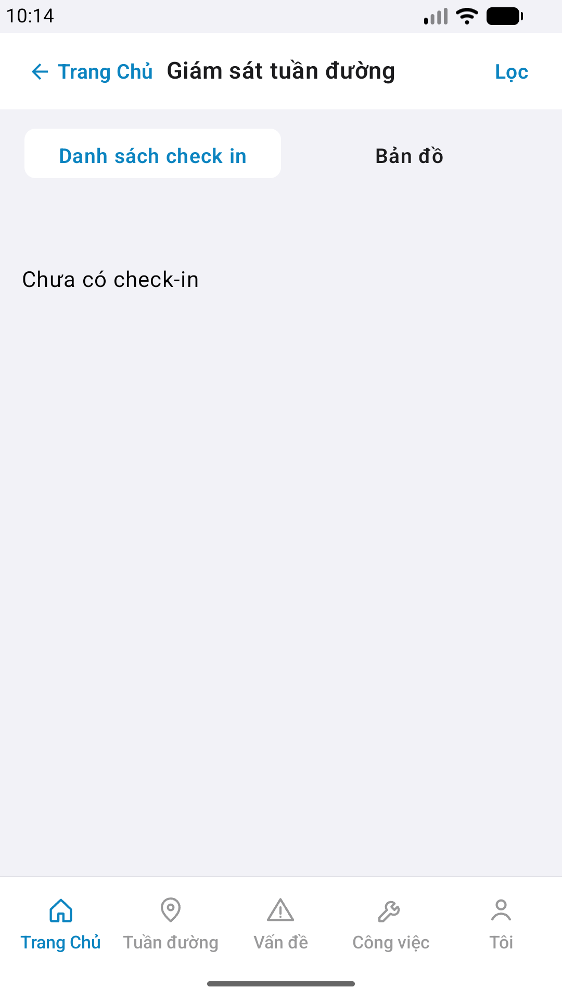

# Capture — supervise-detail

| Case | Store | Result | Evidence |
|------|-------|--------|----------|
| A10-BFF | A10 · P11 | **PASS** | — |
| A11-LAUNCH | A11 | **PASS** |  |
| A9-LOGIN | A9 · P10 | **PASS** |  |
| A3-CORE | A3 · A11 | **PASS** |  |
| P6-CORE | P6 · P11 | **FAIL** |  |
| P6-CORE-2 | P6 | **FAIL** |  |

iOS: iPhone 17 Pro Max · method: yarn e2e-qa-mobile · `2026-09-01T03:14:00.000Z` · CLI ok:false · GAP-QA-SUP-DET-AND-LIST-01
