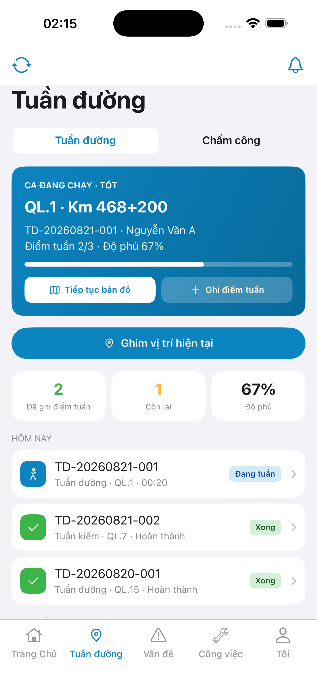
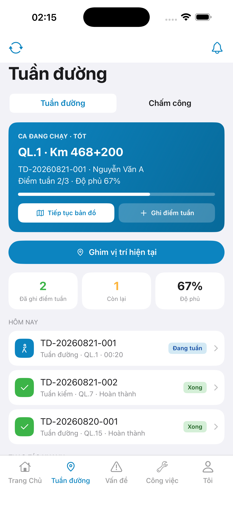
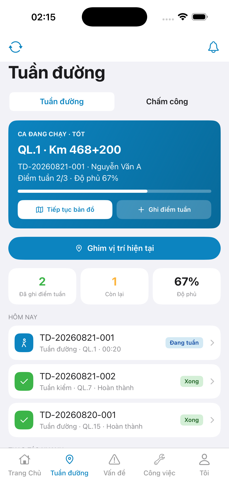
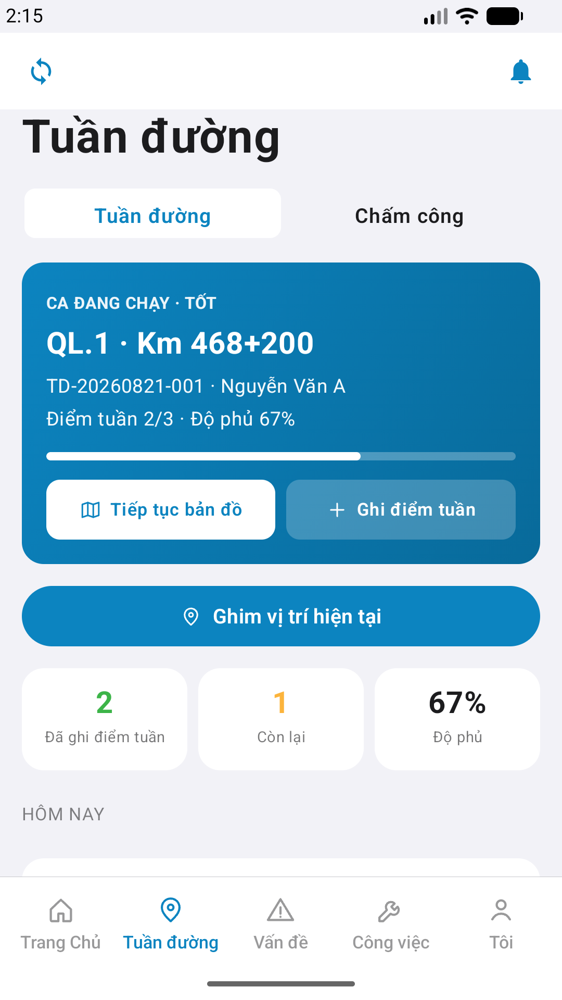

# QA — Scenarios — supervise (mobile list · Giám sát)

| Field | Value |
|-------|-------|
| feature | `supervise` |
| this role | `qa` · `/agent-qa-mobile` |
| status | **confirmed** |
| packKind | **`list`** |
| taskId | `task_45c8bd53` |
| e2eQa | **ON** · `yarn e2e-qa-mobile` · `ios_test_phase=phase1_iphone` · **A4-IPAD DEFER** |
| store_qa | **run_store** (autoApprove=ON) |
| e2e result | **ok:true** · `2026-08-19T15:57:57.249Z` · dest **iPhone 17 Pro Max** 1320×2868 RGB · AVD **1080×1920** |
| method | e2e runtime · yarn e2e-qa-mobile · Maestro + simctl/adb · **cấm** GenerateImage · **cấm** yarn start:std / mfeStdUrl |
| align | dual proto `#sc-supervise` · live A3 ↔ P6 · **Aligned** · Must **0** |
| updatedAt | `2026-08-19T16:00:00.000Z` |

**Scope:** slug `supervise` list `#sc-supervise` only. **Cấm** AC sibling screens (`patrol-map` · `checkin-detail`).

## VERIFY GATE

| Gate | Result |
|------|--------|
| iOS `xcodegen` | **PASS** |
| iOS `xcodebuild` dest **iPhone 17 Pro** | **PASS** (`BUILD SUCCEEDED` · scheme `LinmRmms`) |
| Android `./gradlew :app:assembleDebug` | **PASS** |
| Mobile.Bff `dotnet build` | **PASS** (0 warning · 0 error) |
| Maestro iOS + Android | **PASS** · Home `tile-supervise` → `#sc-supervise` |
| API :5101 + BFF :5202 | **PASS** (docker) |
| `yarn e2e-qa-mobile` | **PASS** · `ok:true` |

## Device AC

| ID | Expect | Result |
|----|--------|--------|
| AC-D-01 | Home tile Giám sát → `#sc-supervise` visible | **PASS** (Maestro iOS+Android) |
| AC-D-02 | GPS deny | **N/A** (list không GPS) |
| AC-D-03 | Leave dirty | **N/A** (no form) |
| AC-D-04 | Cấm native alert · toast only | **PASS** (code · shots không sheet / `UIAlert`) |
| AC-D-05 | Keyboard | **N/A** (no text field on list) |
| AC-D-06 | Safe area TopBar + scroll list | **PASS** (A3 6.9" · P6 + P6-2 fold) |
| AC-D-07 | Biometric | **N/A** |
| AC-D-08 | Signal | **N/A** (màn list không hero signal) |
| AC-D-09 | Bearer BFF prefix GET `patrol/attendance-logs` | **PASS** (BFF :5202 · A10-BFF) |
| AC-D-10 | Tab 5 · home selected on parent | **PASS** (A3/P6 tab **Trang Chủ** active under push) |
| AC-D-11 | Camera / push | **N/A** (thumb placeholder P1) |
| AC-D-12 | Type 13 / ≥16 | **PASS** (visual + SSOT parity) |
| AC-D-13 | Dual copy VN | **PASS** (A3 ↔ P6) |
| AC-D-14 | Cấm watermark / device label | **PASS** |
| AC-F-01 | Login → tile `tile-supervise` → `#sc-supervise` | **PASS** (Maestro iOS+Android) |
| AC-F-02 | Back `btn-sup-back` / **Trang Chủ** → pop `#sc-home` | **PASS** (Maestro iOS optional id + Android `btn-sup-back`) |
| AC-F-03 | Appear ≥1 rich-card (live hoặc demo SSOT) | **PASS** (A3/P6 · **Nguyễn Văn A** · **Trần Khánh**) |
| AC-F-04 | **Lọc** → toast **Lọc tuyến · ngày** · cấm filter sheet | **PASS** (Maestro wait toast · P6-CORE-2 banner) |
| AC-F-05 | Segment idx 0 **Danh sách check in** · idx 1 **Bản đồ** toast · cấm push map | **PASS** (A3/P6 segment list owner · Maestro tap **Bản đồ**) |
| AC-F-06 | Tap card → toast **Chi tiết check-in** · cấm push detail | **PASS** (Maestro tap **Nguyễn Văn A** · không sheet) |
| AC-F-07 | Org empty Note → «Tổ tuần đường · VP-IV.1» | **PASS** (A3/P6 card 1) |
| AC-F-08 | Cấm watermark Gói | **PASS** |

## Store Must

| Case | Store | Evidence | Result |
|------|-------|----------|--------|
| A11-LAUNCH | A11 |  | **PASS** |
| A10-BFF | A10 · P11 | — | **PASS** |
| A9-LOGIN | A9 · P10 |  | **PASS** |
| A3-CORE | A3 · A11 |  | **PASS** |
| P6-CORE | P6 · P11 |  | **PASS** |
| P6-CORE-2 | P6 |  | **PASS** |
| A4-IPAD | A4 | **DEFER** Phase 1 · family `1` | DEFER |

## Maestro

| Flow | Path | Result |
|------|------|--------|
| iOS | `qa/e2e/ios.yaml` | **PASS** · login seed → `tile-supervise` → `#sc-supervise` · toast **Lọc** via text (kit id) |
| Android | `qa/e2e/android.yaml` | **PASS** · `tile-supervise` → `#sc-supervise` · toast **Lọc tuyến · ngày** trên P6-2 |

## Gaps

| ID | Note | Block complete? |
|----|------|-----------------|
| GAP-QA-A11Y-SUP-FILTER-01 | iOS `LinmTopBar` trailing `btn-sup-filter` không expose XCUITest · Maestro dùng text **Lọc** · Android `testTag` OK | **No** |
| GAP-QA-SUP-TAB-01 | Push `#sc-supervise` vẫn hiện Tab 5 (shell MainTab) · IA lock «không tab bar trên màn» · Should Review | **No** |

## E2E screenshots

Viewer: `/api/qldb/artifact?id=&rel=qa/scenarios.md` rewrite `screens/{caseId}.png`.

CLI **PASS** = Maestro + PNG + store px only — **not** visual vs demo. QA **Read** A3-CORE + P6-CORE vs prototype (`/review-align-ux-ios-android`). Demo `.row-icon`/`#i-*` missing on live → Must **GAP-MOB-UX-COMP-03** · log `qa/bugs/`. Skip vision → **GAP-MOB-E2E-VIS-01**.

| Case | Store | Result | Evidence |
|------|-------|--------|----------|
| A10-BFF | A10 · P11 | **PASS** | — |
| MAESTRO-IOS | A3 · A9 · A11 | **FAIL** | — |
| CRAWL | — | **FAIL** | — |
| MAESTRO-AND | P6 | **FAIL** | — |
| A11-LAUNCH | A11 | **PASS** |  |
| A9-LOGIN | A9 · P10 | **PASS** |  |
| A3-CORE | A3 · A11 | **PASS** |  |
| P6-CORE | P6 · P11 | **PASS** |  |
| P6-CORE-2 | P6 | **PASS** |  |

Viewer: `/api/qldb/artifact?id=&rel=qa/scenarios.md` rewrite `screens/{caseId}.png`.

CLI **PASS** = Maestro + PNG + store px only — **not** visual vs demo. QA **Read** A3-CORE + P6-CORE vs prototype (`/review-align-ux-ios-android`). Demo `.row-icon`/`#i-*` missing on live → Must **GAP-MOB-UX-COMP-03** · log `qa/bugs/`. Skip vision → **GAP-MOB-E2E-VIS-01**.

| Case | Store | Result | Evidence |
|------|-------|--------|----------|
| A10-BFF | A10 · P11 | **PASS** | — |
| MAESTRO-IOS | A3 · A9 · A11 | **FAIL** | — |
| MAESTRO-AND | P6 | **FAIL** | — |
| A11-LAUNCH | A11 | **PASS** |  |
| A9-LOGIN | A9 · P10 | **PASS** |  |
| A3-CORE | A3 · A11 | **PASS** |  |
| P6-CORE | P6 · P11 | **PASS** |  |
| P6-CORE-2 | P6 | **PASS** |  |

Viewer: `/api/qldb/artifact?id=&rel=qa/scenarios.md` rewrite `screens/{caseId}.png`.

| Case | Store | Result | Evidence |
|------|-------|--------|----------|
| A10-BFF | A10 · P11 | **PASS** | — |
| A11-LAUNCH | A11 | **PASS** |  |
| A9-LOGIN | A9 · P10 | **PASS** |  |
| A3-CORE | A3 · A11 | **PASS** |  |
| P6-CORE | P6 · P11 | **PASS** |  |
| P6-CORE-2 | P6 | **PASS** |  |

## Notes

- Maestro iOS: **cấm** rely `id: btn-sup-filter` (kit a11y) — tap text **Lọc**.
- px: iOS A3 **1320×2868** RGB · Play P6 **1080×1920** RGB.
- **Cấm** READY_TO_SUBMIT ở QA — next `/agent-review-mobile`.
- Sibling map / check-in detail: **out of scope**. Form submit **N/A** (list không CTA Lưu/Gửi).
- Step 4b **N/A** — reuse `GET patrol/attendance-logs`.

## Handoff → Review

| Field | Value |
|-------|-------|
| phase_to | `review` |
| Next slash | `/agent-review-mobile` |
| store | `qa/store/supervise/` · CAPTURE.md |
| align | live A3 ↔ P6 dual list · Must **0** |
| Chain this turn | **không** (roleOnly=`qa`) |

## Version meta

skillId=agent-qa-mobile · skillVersion=2026.08.19.28 · workflowVersion=2026.08.19.29 · generatedAt=2026-08-19T16:00:00.000Z · taskId=task_45c8bd53
