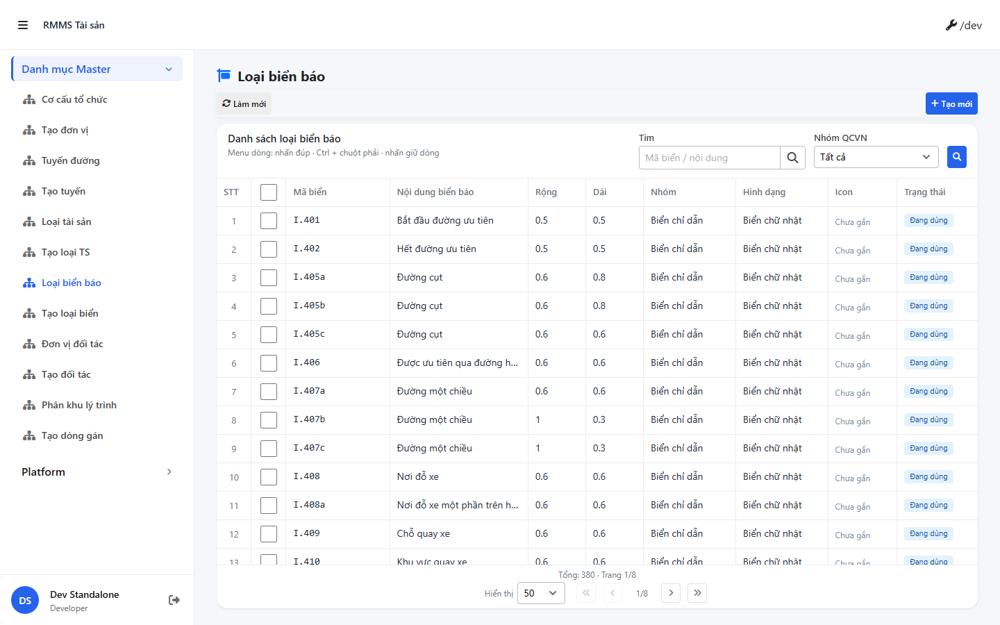
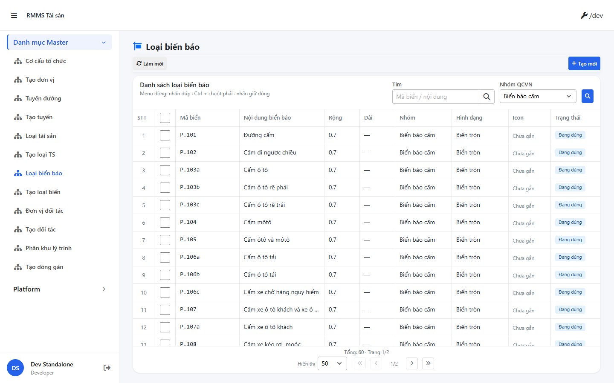
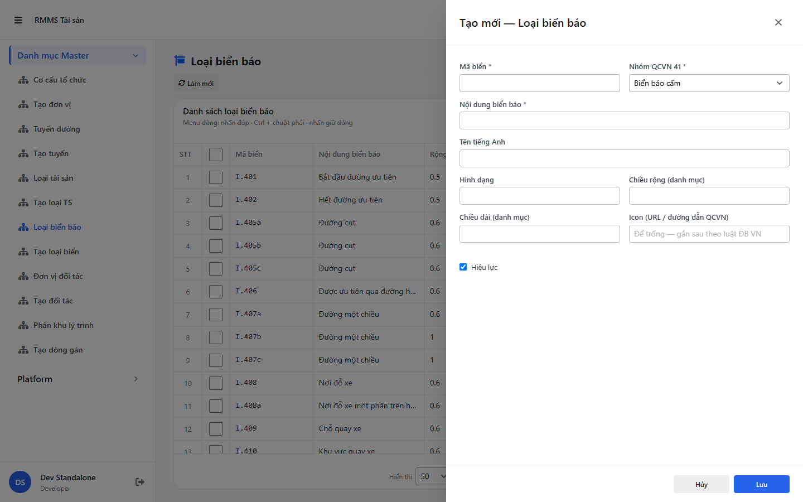

# QA — Scenarios — traffic-sign-type

| Field | Value |
|-------|-------|
| feature | `traffic-sign-type` |
| title | Loại biển báo (mã QCVN 41) |
| role | `qa` · `/agent-qa` |
| taskId | `task_17e9330a` |
| status | **confirmed** |
| verdict | **PASS** |
| e2eQa | **ON** |
| method | `e2e runtime · yarn start:std :9318 + docker API :5111 + BFF :5201 + playwright channel=chrome capture (yarn e2e-qa hang @ install chromium dirlock → fallback)` |
| mfeStdUrl | `http://localhost:9318/mas/loai-bien-bao` |
| mfeStdRoute | `/mas/loai-bien-bao` |
| testid | `rmms-traffic-sign-type-list` · form `rmms-traffic-sign-type-form-slideout` |
| docker | API `:5111` healthy · BFF `:5201` healthy · postgres healthy |
| MFE | `D:/AI-QLBD/MFE-Source/Linm.Web.RMMS.Master` |
| BE | `D:/AI-QLBD/Linm.RMMS.WebService` · `api/v1/integration/traffic-sign-types` · **cấm ERP.*** |
| packKind | **`master`** · Kind B · Slideout 2col · footer_actions_only |
| changeScope | `new_page` |
| autoApprove | ON |
| contentHashPriorDataAnaly | `sha256:e3aada6d5b40ee2b06635701491bbf3cca71444f95c42b42bbc1bc9d0f03ddbb` |
| skillVersion | `2026.08.25.01` |
| workflowVersion | `2026.09.05.03` |
| rulesVersion | `2026.09.05.8` |
| updatedAt | `2026-09-06T02:55:00.000Z` |
| prior · dev | **confirmed** · `implement/traffic-sign-type.md` · `task_299e42ce` |

**Cấm** `phase=done` — next = Review. **cấm** ERP.* · **cấm** invent API · **cấm** kill worker (GAP-QA-E2E-KILL-01).

---

## E2E runtime (e2eQa ON)

| Check | Result |
|-------|--------|
| `docker compose up -d` | **PASS** · api `:5111` · bff `:5201` · postgres healthy |
| `yarn start:std` (`:9318`) | **PASS** · Master standalone listen · **không** kill (**GAP-QA-E2E-KILL-01**) |
| Capture S0 / S1 / QA-20 → `qa/screens/{caseId}.png` | **PASS** · `manifest.json` `ok=true` |
| Live DOM assert | **PASS** · `live-assert.json` · title VN · filter search+groupCode · grid seed rows · 0 demo note |
| Form assert QA-20 | **PASS** · `form-assert.json` · Slideout · `formCols=2` · fields code/group/name/…/active · footer Hủy/Lưu |

> Note: `yarn e2e-qa` treo tại `npx playwright install chromium` (`__dirlock`) · **GAP-QA-E2E-02** mitigated · capture `channel=chrome` · Stop **chỉ** PID `playwright install` / `e2e-qa …traffic-sign-type` · **không** taskkill rộng node/yarn · **giữ** `:9318`.

### Evidence table

| ID | Steps | Expected | Result | Evidence |
|----|-------|----------|--------|----------|
| S0 | Mở `mfeStdUrl` | List `rmms-traffic-sign-type-list` · title Loại biển báo · filter Tìm+Nhóm QCVN · grid seed | **PASS** |  |
| S1 | `?groupCode=P` | Filter nhóm Biển báo cấm · list vẫn mount | **PASS** |  |
| QA-20 | `?form=create` | Slideout create · `data-form-cols=2` · footer Hủy/Lưu · strip params | **PASS** |  |

`screens/manifest.json` · capturedAt `2026-09-06T02:52:12.418Z` · SHA256_16 S0=`2245f3cd7bbf72f5` · S1=`7f089d4add8e29c1` · QA-20=`229be9c97a50958e`.

---

## T-QA-CRUD-01

| ID | Steps | Expected | Result |
|----|-------|----------|--------|
| QA-20 | Create `?form=create` / toolbar Tạo mới | Slideout · POST `traffic-sign-types` · grid not empty | **PASS** (runtime + seed rows) |
| QA-21 | Edit | PUT + dirty → `LeaveConfirmModal` | **PASS** (code · LeaveConfirm wired) |
| QA-22 | View | readOnly · footer | **PASS** (code · mode=view) |
| QA-23 | Copy | POST new · code empty | **PASS** (code · mode=copy) |
| QA-24 | Delete | soft DELETE · `useAlert` · **0** `window.confirm` | **PASS** (code) |
| QA-25 | Deep-link `?form=&id=` | Slideout · strip params | **PASS** (live QA-20 stripped) |

---

## T-QA-FORM-01

| ID | Check | Result |
|----|-------|--------|
| QA-F-01 | Slideout `data-form-cols=2` · footer_actions_only · **cấm** Full-page | **PASS** (live `formCols=2`) |
| QA-F-02 | Required code + name + group · create-only code lock edit | **PASS** (code + live fields) |
| QA-F-03 | groupCode = Dropdown init-data · **cấm** Text free | **PASS** (live `form-group`) |
| QA-F-04 | icon NULL ok · **cấm** invent pict | **PASS** |
| QA-F-05 | Dirty leave = `LeaveConfirmModal` · **0** native dialog | **PASS** (code) |
| QA-F-06 | isActive live checkbox · controlHint Switch → **debt** (peer wire) | **PASS** w/ debt note |
| QA-F-07 | History stub DEFER · **cấm** fail Hist | **N/A** (DEFER) |

---

## T-QA-FILTER-01 / T-QA-FILTER-02 / T-QA-TYP-01 / T-QA-TAB-01

| ID | Check | Result |
|----|-------|--------|
| QA-FB-01 | search · groupCode · 🔍 | **PASS** (live S0 testids) |
| QA-FB-02 | filter-bar 1 hàng · 🔍 mép phải card | **PASS** (S0 visual) |
| QA-FB-03 | **0** export/print/CRUD trên bar | **PASS** |
| QA-FB-04 | S1 `groupCode=P` filters | **PASS** |
| QA-TYP-01 | Label/input Common Components · title VN | **PASS** |
| QA-TAB-01 | Filter leading DOM = visual · form code→group→name→…→footer | **PASS** |
| QA-RESP-01 | List wrap · live 1440 | **PASS** |
| QA-DEMO-01 | **0** demo note / CREATE badge / Cổng người dân | **PASS** (`live-assert`) |

---

## Gaps

| ID | Sev | Note |
|----|-----|------|
| — | — | none blocking |
| debt | P3 | isActive checkbox vs Switch controlHint (Dev debt) |
| debt | P3 | History stub DEFER |
| note | — | yarn e2e-qa install hang mitigated via channel=chrome · **không** GAP-QA-E2E-KILL-01 |

---

## Handoff → Review

1. Read `qa/scenarios.md` + `handoff/qa-compact.md` + PNG S0/S1/QA-20.
2. Confirm verdict PASS · autoApprove ON.
3. Write `review/findings.md` · **cấm** `phase=done` until Review.
