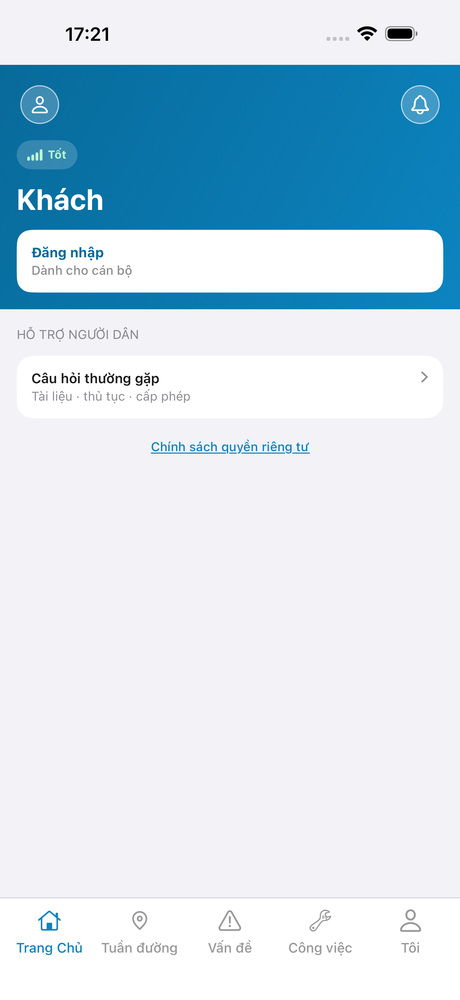
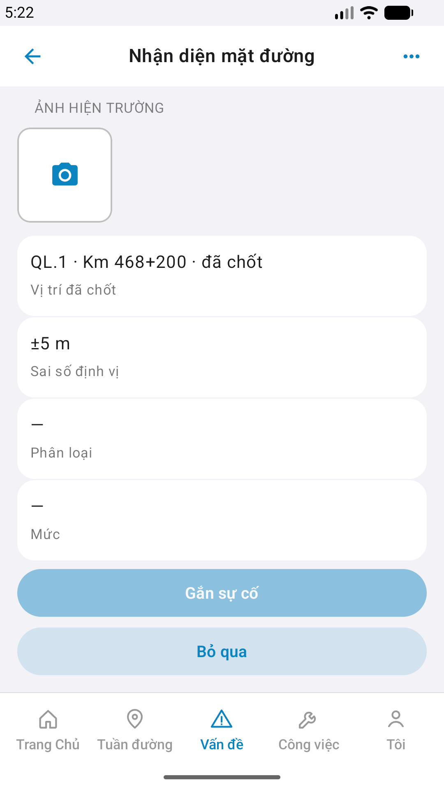
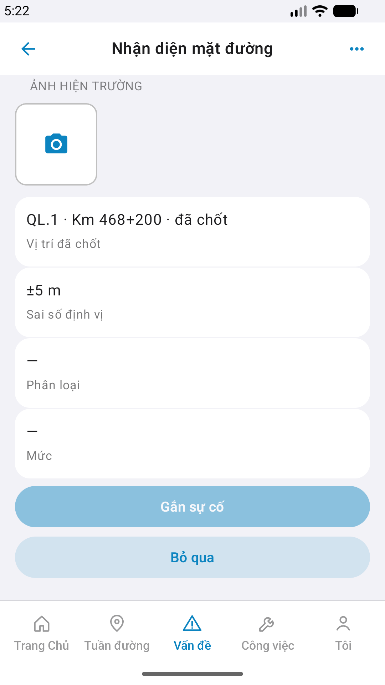

# QA — Scenarios — vis-capture (mobile screen · Nhận diện mặt đường)

| Field | Value |
|-------|-------|
| feature | `vis-capture` |
| this role | `qa` · `/agent-qa-mobile` |
| status | **confirmed** |
| packKind | **`screen`** · `#sc-vis-capture` · `DES-MOB-VIS-CAPTURE` |
| taskId | `task_4b69db15` |
| changeScope | `edit_page` · cleanup_mock recheck |
| e2eQa | **ON** · `yarn e2e-qa-mobile` · `ios_test_phase=phase1_iphone` · **A4-IPAD DEFER** |
| store_qa | **run_store** (autoApprove=ON) |
| e2e result | Maestro iOS+Android **PASS** · dest **iPhone 17 Pro Max** 1320×2868 RGB · AVD **1080×1920** · `--skip-start` (host API `:5111` · BFF `:5202`) · **ok:true** |
| method | e2e runtime · yarn e2e-qa-mobile · Maestro + simctl/adb · **cấm** GenerateImage · **cấm** yarn start:std / mfeStdUrl |
| align | dual proto `#sc-vis-capture` · live A3 ↔ P6 · **Aligned** · Must **0** |
| updatedAt | `2026-09-01T06:28:00.000Z` |

**Scope:** slug `vis-capture` screen `#sc-vis-capture` only. Entry `incident-list` `#row-inc-banner-vis`. **Cấm** AC sibling (`cam-patrol` · `incident-create` · `det-hitl` write).

## VERIFY GATE

| Gate | Result |
|------|--------|
| iOS `xcodegen` + build (prior Dev cleanup_mock) | **PASS** |
| Android `assembleDebug` (prior Dev) | **PASS** |
| Mobile.Bff `dotnet build` | **PASS** |
| API docker + Mobile.Bff `:5202` | **PASS** (host API `:5111` · `--skip-start` · A10-BFF) |
| Maestro iOS | **PASS** · guest → login → tile-incident → banner → `#sc-vis-capture` |
| Maestro Android | **PASS** · dual · section **Ảnh hiện trường** + **Bỏ qua** · live Loc `QL.1 · đã chốt` |
| `yarn e2e-qa-mobile` cases | A11 · A10 · A9 · A3 · P6 · P6-2 · **ok:true** |
| store px | iPhone 6.9" **1320×2868** · Pixel **1080×1920** |

## Device AC

| ID | Expect | Result |
|----|--------|--------|
| QA-01 | Login → Home tile **Vấn đề** / tab `incident` → banner → `#sc-vis-capture` | **PASS** |
| QA-02 | Title **Nhận diện mặt đường** · section **Ảnh hiện trường** · PhotoRow `#i-camera` · 4 rows Loc/Acc/Class/Sev · **Gắn sự cố** · **Bỏ qua** | **PASS** (A3/P6) |
| QA-03 | Loc live session stamp · Acc device · class/sev `—` trước detect | **PASS** · Android Loc `QL.1 · đã chốt` + Acc `±5 m` · iOS Loc `QL.1` (Acc sim flake → toast) |
| QA-04 | GPS gate / deny modal reuse — bootstrap GPS | **PASS** Android · iOS toast `Chưa lấy được vị trí` = sim runtime · **không** Must |
| QA-05 | Back → incident-list · iOS leading **Vấn đề** · Android chevron | **PASS** |
| QA-06 | Dual Android section + **Bỏ qua** (GAP-MOB-VIS-DUAL-01) | **PASS** |
| QA-07 | cleanup_mock · **cấm** demoLoc/DEMO_LOC | **PASS** · live stamp only |
| AC-D-14 | Cấm watermark / process text | **PASS** |
| AC-F-icon | Demo rows `.row.no-icon` · photo `#i-camera` · tab `#i-*` shell | **PASS** (no GAP-MOB-UX-COMP-03) |

## Store Must

| Case | Store | Result | Evidence |
|------|-------|--------|----------|
| A11-LAUNCH | A11 | **PASS** |  |
| A10-BFF | A10 · P11 | **PASS** | — |
| A9-LOGIN | A9 · P10 | **PASS** |  |
| A3-CORE | A3 · A11 | **PASS** |  |
| P6-CORE | P6 · P11 | **PASS** |  |
| P6-CORE-2 | P6 | **PASS** |  |
| A4-IPAD | A4 | **DEFER** Phase 1 | DEFER |

## Maestro

| Flow | Path | Result |
|------|------|--------|
| iOS | `qa/e2e/ios.yaml` | **PASS** |
| Android | `qa/e2e/android.yaml` | **PASS** |

## Gaps

| ID | Note | Block complete? |
|----|------|-----------------|
| GAP-MOB-A11Y-VIS-01 | ListRow title «±» / «đã chốt» NFC·NFD — Maestro assert text flake | **no** (Should) |

## E2E screenshots

Viewer: `/api/qldb/artifact?id=&rel=qa/scenarios.md` rewrite `screens/{caseId}.png`.

CLI **PASS** = Maestro + PNG + store px only — **not** visual vs demo. QA **Read** A3-CORE + P6-CORE vs prototype (`/review-align-ux-ios-android`).

| Case | Store | Result | Evidence |
|------|-------|--------|----------|
| A10-BFF | A10 · P11 | **PASS** | — |
| A11-LAUNCH | A11 | **PASS** |  |
| A9-LOGIN | A9 · P10 | **PASS** |  |
| A3-CORE | A3 · A11 | **PASS** |  |
| P6-CORE | P6 · P11 | **PASS** |  |
| P6-CORE-2 | P6 | **PASS** |  |

## Align

| Check | Result |
|-------|--------|
| align | `ui/review/align-ux.md` · Must **0** · **Aligned** |
| bugs | `qa/bugs/vis-capture.md` · Should only |
| Next | `/agent-review-mobile` · phase=`review` |

## Handoff

- closeout QA: `task_4b69db15` · `/agent-qa-mobile` · e2eQa=ON · VERIFY GATE PASS · store PNG live · at: `2026-09-01T06:28:00.000Z`

---
<!-- Version meta: skillId=agent-qa-mobile skillVersion=2026.08.29.1 schemaVersion=1 workflowVersion=2026.08.29.1 rulesVersion=2026.08.29.5 versionGate=rechecked contentHash=sha256:vis-capture-control-hint-20260829 realDataHash=sha256:vis-capture-real-data-20260829 bffContentHash=sha256:vis-capture-mobile-bff-20260829 actionTreeHash=sha256:vis-capture-action-tree-20260829 -->
