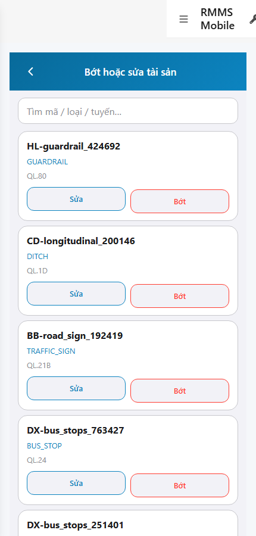

# QA — scenarios — web-rmms-asset-adjust

| Field | Value |
|-------|-------|
| feature | `web-rmms-asset-adjust` |
| this role | `qa` · `/agent-qa` |
| status | `done` |
| changeScope | `new_page` |
| packKind | `list` (phone list · DES-GRID / filter **WAIVE**) |
| mfeStdUrl | `http://localhost:9301/web-rmms-asset-adjust` |
| mfeStdRoute | `/web-rmms-asset-adjust` · alias `/asset/adjust` |
| backend | `D:/AI-QLBD/Linm.RMMS.WebService` · Mobile.Bff `:5202` · API `:5111` · BFF `:5201` |
| taskId | `task_54a0eee2` |
| prior Dev | implement **confirmed** · handoff `handoff/dev-compact.md` |
| autoApprove | ON |
| e2eQa | ON · runtime |
| method | `e2e runtime · yarn start:std :9301 (existing · no kill) + docker compose up -d + capture_aadjust` · cases `S0,S1,QA-20` · MFE `/login` JWT · viewport **430** |
| updatedAt | `2026-09-25T16:45:00.000Z` |
| skillVersion | `2026.09.05.03` |
| contentHash | `sha256:6f74282b807da7f2cc1aa57ac64848cd1d75ff3383c0f432eaad7bea53fff80e` |

## Smoke — Final MFE (REQUIRED · e2e)

| # | Step | Expect | Result | Evidence |
|---|------|--------|--------|----------|
| S0 | Cán bộ mở list Bớt/Sửa tài sản | AA-00…07 · search · Live rows Code/Type/Route · Sửa+Bớt · **0** crash/overlay · no LatLng | **PASS** |  |
| S1 | Peer Hub · entry Cập nhật / bớt | Hub · `#tileAdjust` · wallet Live | **PASS** |  |
| QA-20 | Click tileAdjust → Adjust (JWT kept) | Cùng surface list · `#pageTitle` · **0** login bounce | **PASS** |  |

## Scenario / Expect / Actual (visual dump)

| Case | Expect (design/PO) | Actual (PNG/dump) | Verdict |
|------|--------------------|-------------------|--------|
| S0 | AA-* phone list · GET road-assets · Sửa+Bớt · no LatLng | feature=`web-rmms-asset-adjust` · zones AA-00…04,06,07 · title «Bớt hoặc sửa tài sản» · 50 rows · remove/edit=50 · Code/Type/Route (GUARDRAIL/DITCH/…) · pager | **Aligned** |
| S1 | Peer Hub entry `#tileAdjust` | «Hub tài sản» · `#tileAdjust` «Cập nhật / bớt» · AH-* · wallet KHAC | **Aligned** |
| QA-20 | Hub CTA → Adjust | href `/web-rmms-asset-adjust` · AA-* · JWT kept · S0≠S1≠QA-20 hashes | **Aligned** |

## T-QA-*

| id | Scope | Result |
|----|-------|--------|
| T-QA-LIST-01 | Live GET road-assets · rows Code/Type/Route · no LatLng | **PASS** (S0 · 50 rows · AA-04) |
| T-QA-SEARCH-01 | `#search` present · server search | **PASS** (AA-03 · id present) |
| T-QA-EDIT-01 | Sửa → peer list `?id=` · no PUT P1 | **PASS** (AA-07 count=50 · smoke no click PUT) |
| T-QA-SOFTDEL-01 | Bớt → AA-08 confirm + toast · soft DELETE | **WAIVE** smoke (destructive · dialog not opened S0/S1/QA-20) |
| T-QA-EMPTY-01 | empty/error + retry | **WAIVE** smoke (list populated · AA-05 not shown) |
| T-QA-FILTER-01/02 | LinErpListFilterBar | **WAIVE** (phone list · DES-GRID N/A · Kind B WAIVE) |
| T-QA-VI-ENC-01 | Title/nav UTF-8 | **PASS** («Bớt hoặc sửa tài sản») |
| T-QA-NAV-01 | Hub `#tileAdjust` → Adjust | **PASS** (QA-20) |

## E2E runtime gate

| Check | Result |
|-------|--------|
| docker compose up -d | **PASS** · postgres/api healthy · bff `:5201` · Mobile.Bff `:5202` · api `:5111` |
| yarn start:std | **PASS** · `:9301` HTTP 200 (existing worker · **cấm** kill · GAP-QA-E2E-KILL-01) |
| yarn e2e-qa stock | **FAIL soft** · probe API `:5101` vs compose `:5111` · **worked around** `_capture_aadjust.mjs` + playwright junction |
| PNG evidence | S0/S1/QA-20 present · distinct SHA256 · S1 ≠ S0 · list loaded · **0** blank/crash |
| visual dump | **Aligned** · Must **0** |
| GET road-assets (list) | **200** via page Live (50 rows) |
| **cấm** phase=done | yes · next Review |

## Gaps / debt (không P0)

| ID | Severity | Note |
|----|----------|------|
| GAP-QA-E2E-STOCK-PORT | soft | stock CLI probes `:5101` · compose `:5111` (carry prior wave) |
| GAP-QA-SOFTDEL-SMOKE | soft | AA-08 confirm not exercised in S0/S1/QA-20 (destructive WAIVE) |
| LOOKUP_HINT_KEYS | soft | Hub tile hints show `assetHub.tile.*` until OMS seed (peer Hub debt) |

**P0:** none — handoff Review.

## Handoff → Review

1. `review/findings.md` · roles sau = **pending**.
2. `autoApprove=ON` → Review tự confirm khi tới lượt.
3. STATUS `qa` = **done** · `phase=review` · **cấm** `phase=done`.

## Version meta

| skillId | skillVersion | schemaVersion |
|---------|--------------|---------------|
| agent-qa | 2026.09.05.03 | 1 |
