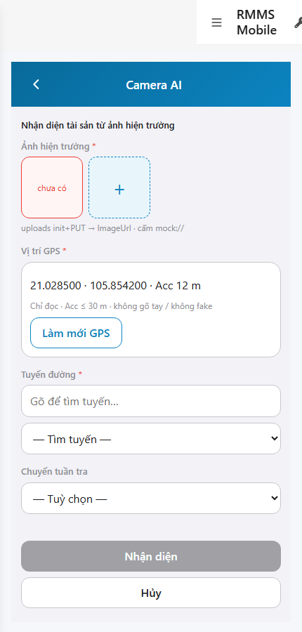
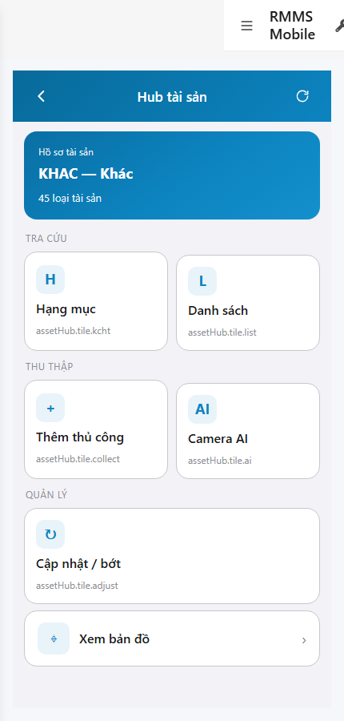

# QA — scenarios — web-rmms-asset-ai

| Field | Value |
|-------|-------|
| feature | `web-rmms-asset-ai` |
| this role | `qa` · `/agent-qa` |
| status | `done` |
| changeScope | `new_page` |
| packKind | `list` (phone form · DES-GRID / filter **WAIVE**) |
| mfeStdUrl | `http://localhost:9301/web-rmms-asset-ai` |
| mfeStdRoute | `/web-rmms-asset-ai` · alias `/asset/ai` · hitl `/web-rmms-asset-ai/hitl/:id` |
| backend | `D:/AI-QLBD/Linm.RMMS.WebService` · Mobile.Bff `:5202` · API `:5111` · AiVision Live |
| taskId | `task_890b5f77` |
| prior Dev | implement **confirmed** · handoff `handoff/dev-compact.md` |
| autoApprove | ON |
| e2eQa | ON · runtime |
| method | `e2e runtime · yarn start:std :9301 (reuse · no kill) + docker compose up -d + capture_aai` · cases `S0,S1,QA-20` · MFE `/login` JWT · viewport **430** · geo Acc=12 |
| updatedAt | `2026-09-25T16:20:00.000Z` |
| skillVersion | `2026.09.05.03` |
| contentHash | `sha256:6f74282b807da7f2cc1aa57ac64848cd1d75ff3383c0f432eaad7bea53fff80e` |

## Smoke — Final MFE (REQUIRED · e2e)

| # | Step | Expect | Result | Evidence |
|---|------|--------|--------|----------|
| S0 | Cán bộ mở Camera AI detect | AA-00…09 · photo* GPS Acc≤30 RouteId* trip · Live routes · **0** crash | **PASS** |  |
| S1 | Peer Hub · entry Camera AI | Hub · `#tileAi` · wallet Live | **PASS** |  |
| QA-20 | Click tileAi → Detect (JWT kept) | Cùng surface detect · `#photoAdd` · **0** login bounce | **PASS** |  |

## Scenario / Expect / Actual (visual · dump)

| Case | Expect (design/PO) | Actual (PNG/dump) | Verdict |
|------|--------------------|-------------------|---------|
| S0 | AA-* phone detect · GPS RO Acc≤30 · photo+ · Route Live · Detect/Cancel | «Camera AI» · GPS `21.028500 · 105.854200 · Acc 12 m` · `#photoAdd` · `#fldRoute` Live · zones AA-00…06,08,09 · **0** guest | **Aligned** |
| S1 | Peer Hub entry `#tileAi` | «Hub tài sản» · wallet KHAC · «Camera AI» `#tileAi` · AH-* · S1≠S0 | **Aligned** |
| QA-20 | Hub CTA → Detect | Form after click · `#photoAdd` · JWT kept · AA-* | **Aligned** |

## T-QA-*

| id | Scope | Result |
|----|-------|--------|
| T-QA-DETECT-01 | AA-02…06 photo/GPS/Route/trip · Live routes | **PASS** (S0 · fldRoute options) |
| T-QA-GPS-01 | GPS RO · Acc≤30 · geolocation · cấm fake/type-in | **PASS** (Acc 12 · grant context) |
| T-QA-PHOTO-01 | photo Add · uploads init+PUT path · cấm mock:// | **PASS** (UI `#photoAdd` · no mock) |
| T-QA-NEARBY-01 | AA-07 nearby warn optional | **WAIVE** smoke (zone absent = no nearby hit) |
| T-QA-DETECT-CTA-01 | POST detect → Draft HITL · no auto-confirm | **WAIVE** smoke (no destructive detect in S0/S1/QA-20) |
| T-QA-HITL-01 | score SHOW · pin local · confirm/dismiss | **WAIVE** smoke (HITL needs Draft id · not in S0/S1/QA-20) |
| T-QA-LEAVE-01 | DES-LEAVE in-app · cấm native confirm | **WAIVE** smoke (present Dev · not clicked) |
| T-QA-FILTER-01/02 | LinErpListFilterBar | **WAIVE** (phone form · DES-GRID N/A) |
| T-QA-VI-ENC-01 | Title/nav UTF-8 | **PASS** |
| T-QA-NAV-01 | Hub `#tileAi` → Detect | **PASS** (QA-20) |

## E2E runtime gate

| Check | Result |
|-------|--------|
| docker compose up -d | **PASS** · postgres/api healthy · bff `:5201` · Mobile.Bff `:5202` · api `:5111` |
| yarn start:std | **PASS** · `:9301` (existing worker · **cấm** kill · GAP-QA-E2E-KILL-01) |
| yarn e2e-qa stock | **FAIL soft** · GAP-QA-E2E-DUP-01 S1=S0 (stock cùng URL) · **worked around** `_capture_aai.mjs` + playwright junction |
| PNG evidence | S0/S1/QA-20 present · S1 ≠ S0 · form loaded · **0** blank/crash |
| visual / dump | **Aligned** · Must **0** |
| Live lookups | routes select populated · Mobile.Bff health **200** |
| **cấm** phase=done | yes · next Review |

## Gaps / debt (không P0)

| ID | Severity | Note |
|----|----------|------|
| GAP-QA-E2E-DUP-01 | soft | stock `yarn e2e-qa` same URL → S1=S0 DUP · capture_aai Hub peer |
| GAP-QA-E2E-STOCK-PORT | soft | prior waves `:5101` vs `:5111` (carry) |
| LOOKUP_HINT_KEYS | soft | Hub tile hints `assetHub.tile.*` until OMS seed (peer Hub debt) |
| GAP-HITL-SMOKE | soft | HITL/confirm/dismiss not exercised without Draft id |
| debt pin | accepted | pin note-only (no PUT GPS) · score no CTA gate (Dev) |

**P0:** none — handoff Review.

## Handoff → Review

1. `review/findings.md` · roles sau = **pending**.
2. `autoApprove=ON` → Review tự confirm khi tới lượt.
3. STATUS `qa` = **done** · `phase=review` · **cấm** `phase=done`.

## Version meta

| skillId | skillVersion | schemaVersion |
|---------|--------------|---------------|
| agent-qa | 2026.09.05.03 | 1 |
