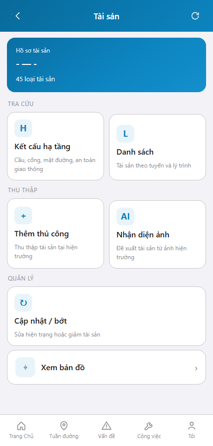
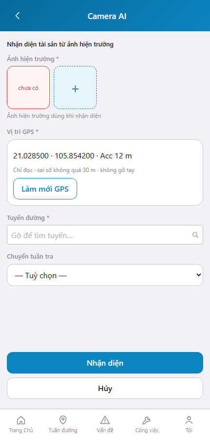

# QA — scenarios — web-rmms-asset-ai

| Field | Value |
|-------|-------|
| feature | `web-rmms-asset-ai` |
| this role | `qa` · `/agent-qa` |
| status | `done` |
| changeScope | `edit_page` |
| packKind | `list` (phone form · DES-GRID / filter **WAIVE**) |
| mfeStdUrl | `http://localhost:9301/m/tai-san/ai` (standalone `/m` · memory `/tai-san/ai`) |
| mfeStdRoute | `/tai-san/ai` · alias `/asset/ai` · hitl `/tai-san/ai/hitl/:id` |
| backend | `D:/AI-QLBD/Linm.RMMS.WebService` · Mobile.Bff `:5202` · API `:5111` · AiVision Live |
| taskId | `task_5a497c25` |
| prior Dev | implement **confirmed** · handoff `handoff/dev-compact.md` · contentHash `sha256:e223304b…c9594c` |
| autoApprove | ON |
| e2eQa | ON · runtime |
| method | `e2e runtime · yarn start:std :9301 (reuse · no kill) + docker compose up -d + capture_aai` · cases `S0,S1,QA-20` · MFE `/m/login` JWT · viewport **430** · geo Acc=12 · Pattern B SearchInput |
| updatedAt | `2026-09-27T10:22:00.000Z` |
| skillVersion | `2026.09.05.03` |
| contentHash | `sha256:e223304b3658e8067766aed729e36988d54f1df8ad38ca953b2e176e63c9594c` |

## Smoke — Final MFE (REQUIRED · e2e)

| # | Step | Expect | Result | Evidence |
|---|------|--------|--------|----------|
| S0 | Cán bộ mở Camera AI detect | AA-00…09 · Pattern B · SearchInput route · GPS Acc≤30 · photo* · Detect always-on · **0** crash | **PASS** |  · 41 471 B · `searchInput=true` |
| S1 | Peer Hub · entry Camera AI | Hub `/m/tai-san` · `#tileAi` · S1≠S0 | **PASS** |  · 64 802 B |
| QA-20 | Click tileAi → Detect (JWT kept) | Cùng surface detect · `#photoAdd` · **0** login bounce | **PASS** |  · 41 471 B |

## Scenario / Expect / Actual (visual · dump)

| Case | Expect (design/PO/Dev) | Actual (PNG/dump) | Verdict |
|------|------------------------|-------------------|---------|
| S0 | Pattern B detect · SearchInput AA-05 · GPS RO Acc≤30 · photo+ · Detect/Cancel · banner id after attempt | «Camera AI» · GPS `21.028500 · 105.854200 · Acc 12 m` · `#photoAdd` · `searchInput=true` · zones AA-00…06,08,09 · Detect CTA present | **Aligned** |
| S1 | Peer Hub entry `#tileAi` | «Tài sản / Hồ sơ» · `#tileAi` · AH-* · S1≠S0 | **Aligned** |
| QA-20 | Hub CTA → Detect JWT kept | Form after click · `#photoAdd` · `searchInput=true` · AA-* | **Aligned** |

## T-QA-*

| id | Scope | Result |
|----|-------|--------|
| T-QA-DETECT-01 | AA-02…06 photo/GPS/Route/trip · SearchInput live | **PASS** (S0 · searchInput) |
| T-QA-PATTERN-B-01 | Detect always-on · validationAttempted banner on submit | **PASS** UI (CTA visible · `#aaValidateBanner` id exists after attempt only — smoke no click) |
| T-QA-GPS-01 | GPS RO · Acc≤30 · geolocation · cấm fake/type-in | **PASS** (Acc 12 · grant context) |
| T-QA-PHOTO-01 | photo Add · uploads init+PUT · cấm mock:// | **PASS** (UI `#photoAdd` · no mock) |
| T-QA-NEARBY-01 | AA-07 nearby warn optional | **WAIVE** smoke (zone absent = no nearby hit) |
| T-QA-DETECT-CTA-01 | POST detect → Draft HITL · no auto-confirm | **WAIVE** smoke (no destructive detect in S0/S1/QA-20) |
| T-QA-HITL-01 | score SHOW · pin local · confirm/dismiss | **WAIVE** smoke (HITL needs Draft id) |
| T-QA-LEAVE-01 | DES-LEAVE in-app · cấm native confirm | **WAIVE** smoke (present Dev · not clicked) |
| T-QA-FILTER-01/02 | LinErpListFilterBar | **WAIVE** (phone form · DES-GRID N/A) |
| T-QA-VI-ENC-01 | Title/nav UTF-8 | **PASS** |
| T-QA-NAV-01 | Hub `#tileAi` → Detect | **PASS** (QA-20) |

## E2E runtime gate

| Check | Result |
|-------|--------|
| docker compose up -d | **PASS** · api/bff/mobile-bff healthy · API `:5111` · Mobile.Bff `:5202` |
| yarn start:std | **PASS** · `:9301` (existing worker · **cấm** kill · GAP-QA-E2E-KILL-01) |
| yarn e2e-qa stock | **FAIL soft** · expects API `:5101` (actual `:5111`) · **GAP-QA-E2E-STOCK-PORT** · worked around `_capture_aai.mjs` |
| capture_aai S0/S1/QA-20 | **PASS** · manifest `ok=true` · S1≠S0 · form + SearchInput · **0** blank/crash |
| PNG evidence | S0/S1/QA-20 present under `qa/screens/` |
| Live lookups | SearchInput route control present · Mobile.Bff health **200** |
| **cấm** phase=done | yes · next Review |

## Gaps / debt (không P0)

| ID | Severity | Note |
|----|----------|------|
| GAP-QA-E2E-STOCK-PORT | soft | stock `yarn e2e-qa` Docker gate `:5101` vs Live `:5111` |
| GAP-QA-E2E-DUP-01 | soft | stock same-URL S1=S0 (carry) · capture Hub peer |
| GAP-HITL-SMOKE | soft | HITL/confirm/dismiss not exercised without Draft id |
| debt pin | accepted | pin note-only · score no CTA gate (Dev) |

**P0:** none — handoff Review.

## Handoff → Review

1. `review/findings.md` · roles sau = **pending**.
2. `autoApprove=ON` → Review tự confirm khi tới lượt.
3. STATUS `qa` = **done** · `phase=review` · **cấm** `phase=done`.

## Version meta

| skillId | skillVersion | schemaVersion |
|---------|--------------|---------------|
| agent-qa | 2026.09.05.03 | 1 |
