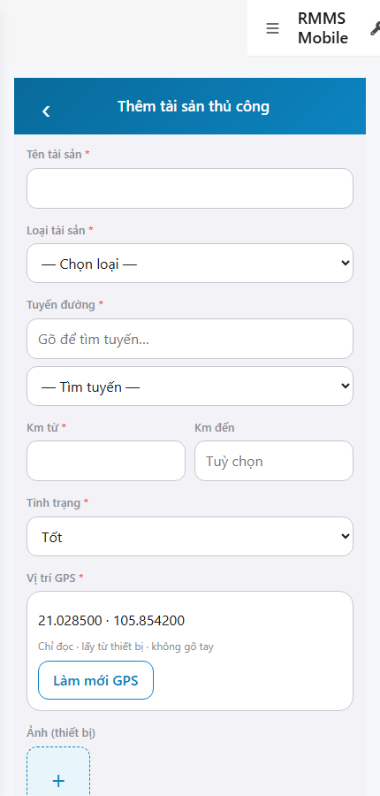
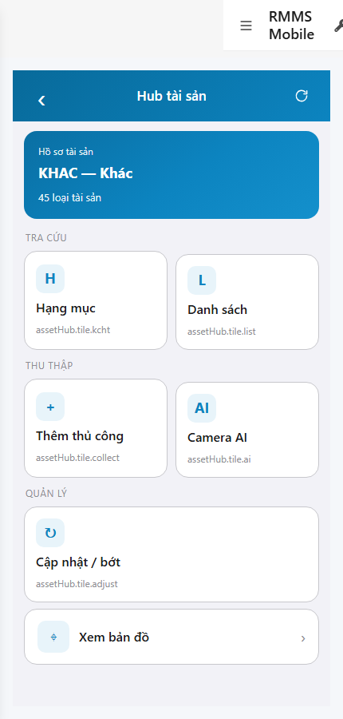

# QA — scenarios — web-rmms-asset-collect

| Field | Value |
|-------|-------|
| feature | `web-rmms-asset-collect` |
| this role | `qa` · `/agent-qa` |
| status | `done` |
| changeScope | `new_page` |
| packKind | `list` (phone form · DES-GRID / filter **WAIVE**) |
| mfeStdUrl | `http://localhost:9301/web-rmms-asset-collect` |
| mfeStdRoute | `/web-rmms-asset-collect` · alias `/asset/collect` |
| backend | `D:/AI-QLBD/Linm.RMMS.WebService` · Mobile.Bff `:5202` · API `:5111` |
| taskId | `task_1e2c84e5` |
| prior Dev | implement **confirmed** · handoff `handoff/dev-compact.md` |
| autoApprove | ON |
| e2eQa | ON · runtime |
| method | `e2e runtime · yarn start:std :9301 (existing · no kill) + docker compose up -d + capture_acollect` · cases `S0,S1,QA-20` · MFE `/login` JWT · viewport **430** · geo grant |
| updatedAt | `2026-09-25T15:05:00.000Z` |
| skillVersion | `2026.09.05.03` |
| contentHash | `sha256:6f74282b807da7f2cc1aa57ac64848cd1d75ff3383c0f432eaad7bea53fff80e` |

## Smoke — Final MFE (REQUIRED · e2e)

| # | Step | Expect | Result | Evidence |
|---|------|--------|--------|----------|
| S0 | Cán bộ mở form Thu thập thủ công | AC-00…10 · Name/Type/Route/Km/Status/GPS/photos · Live types · **0** crash/overlay | **PASS** |  |
| S1 | Peer Hub · entry Thêm thủ công | Hub · `#tileCollect` · wallet Live | **PASS** |  |
| QA-20 | Click tileCollect → Collect (JWT kept) | Cùng surface form · fldName · **0** login bounce | **PASS** |  |

## Scenario / Expect / Actual (visual Read · dump)

| Case | Expect (design/PO) | Actual (PNG/dump) | Verdict |
|------|--------------------|-------------------|---------|
| S0 | AC-* phone form · GPS RO · photos local · POST CTAs | «Thêm tài sản thủ công» · Tên/Loại/Tuyến/Km/Tình trạng · GPS `21.028500 · 105.854200` · «Làm mới GPS» · ảnh `+` · zones AC-00…10 · Live types (PAVEMENT…) | **Aligned** |
| S1 | Peer Hub entry `#tileCollect` | «Hub tài sản» · wallet KHAC · «Thêm thủ công» `#tileCollect` · AH-* | **Aligned** |
| QA-20 | Hub CTA → Collect | Form after click · fldName · JWT kept · AC-* | **Aligned** |

## T-QA-*

| id | Scope | Result |
|----|-------|--------|
| T-QA-FORM-01 | AC-02…06 required fields · Live lookups | **PASS** (S0 · types/routes 200) |
| T-QA-GPS-01 | GPS RO · geolocation · deny blocks submit | **PASS** (coords shown · grant context) |
| T-QA-PHOTO-01 | local PhotoRow GAP · no invent media | **PASS** (local `+` only) |
| T-QA-LEAVE-01 | LeaveConfirmModal · cấm native confirm | **WAIVE** smoke (DES-LEAVE present Dev · not clicked S0) |
| T-QA-POST-01 | POST road-assets Source=manual | **WAIVE** smoke (no destructive create in S0/S1/QA-20) |
| T-QA-FILTER-01/02 | LinErpListFilterBar | **WAIVE** (phone form · DES-GRID N/A) |
| T-QA-VI-ENC-01 | Title/nav UTF-8 | **PASS** |
| T-QA-NAV-01 | Hub `#tileCollect` → Collect | **PASS** (QA-20) |

## E2E runtime gate

| Check | Result |
|-------|--------|
| docker compose up -d | **PASS** · postgres/api healthy · bff `:5201` · Mobile.Bff `:5202` · api `:5111` |
| yarn start:std | **PASS** · `:9301` (existing worker · **cấm** kill · GAP-QA-E2E-KILL-01) |
| yarn e2e-qa stock | **FAIL soft** · probe API `:5101` vs compose `:5111` · **worked around** `_capture_acollect.mjs` + playwright junction |
| PNG evidence | S0/S1/QA-20 present · S1 ≠ S0 · form loaded · **0** blank/crash |
| visual Read | **Aligned** · Must **0** |
| GET asset-types · road-routes/search · road-assets/init-data · patrol/sessions | **200** via mobile-bff |
| QA hotfix | restore `.topbar .title` selector in `WebRmmsShell/styles.module.css` (orphan `}` broke CSS module) |
| **cấm** phase=done | yes · next Review |

## Gaps / debt (không P0)

| ID | Severity | Note |
|----|----------|------|
| GAP-QA-E2E-STOCK-PORT | soft | stock CLI probes `:5101` · compose `:5111` (carry prior wave) |
| GAP-MOB-ASSET-COLLECT-MEDIA-01 | accepted | photos local only · no invent media path |
| LOOKUP_HINT_KEYS | soft | Hub tile hints show `assetHub.tile.*` until OMS seed (peer Hub debt) |
| GAP-QA-INIT-SLOW | soft | `road-assets/init-data` ~6–7s · capture must wait `#fldName` not `#acTitle` |

**P0:** none — handoff Review.

## Handoff → Review

1. `review/findings.md` · roles sau = **pending**.
2. `autoApprove=ON` → Review tự confirm khi tới lượt.
3. STATUS `qa` = **done** · `phase=review` · **cấm** `phase=done`.

## Version meta

| skillId | skillVersion | schemaVersion |
|---------|--------------|---------------|
| agent-qa | 2026.09.05.03 | 1 |
