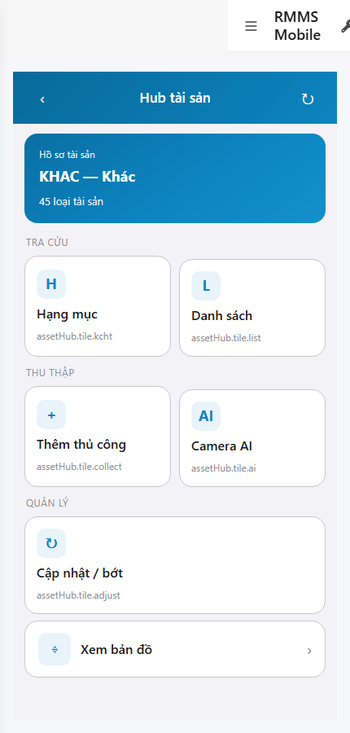
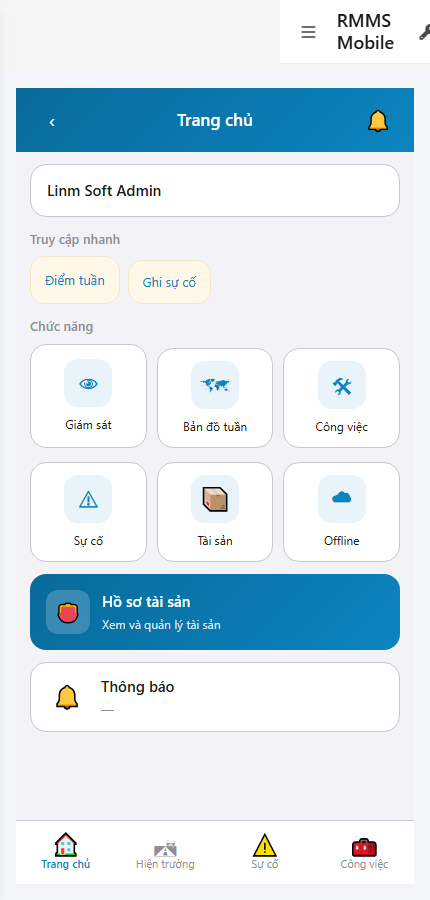

# QA — scenarios — web-rmms-asset-hub

| Field | Value |
|-------|-------|
| feature | `web-rmms-asset-hub` |
| this role | `qa` · `/agent-qa` |
| status | `done` |
| changeScope | `new_page` |
| packKind | `list` (phone Hub · DES-GRID / filter **WAIVE**) |
| mfeStdUrl | `http://localhost:9301/web-rmms-asset-hub` |
| mfeStdRoute | `/web-rmms-asset-hub` · alias `/asset` |
| backend | `D:/AI-QLBD/Linm.RMMS.WebService` · Mobile.Bff `:5202` · API `:5111` |
| taskId | `task_a46a2b1b` |
| prior Dev | implement **confirmed** · handoff `handoff/dev-compact.md` |
| autoApprove | ON |
| e2eQa | ON · runtime |
| method | `e2e runtime · yarn start:std :9301 (existing · no kill) + docker compose up -d + capture_ahub` · cases `S0,S1,QA-20` · MFE `/login` JWT · viewport **430** |
| updatedAt | `2026-09-25T13:30:00.000Z` |
| skillVersion | `2026.09.05.03` |
| contentHash | `sha256:6f74282b807da7f2cc1aa57ac64848cd1d75ff3383c0f432eaad7bea53fff80e` |

## Smoke — Final MFE (REQUIRED · e2e)

| # | Step | Expect | Result | Evidence |
|---|------|--------|--------|----------|
| S0 | Cán bộ mở Hub tài sản | AH-01…06 · wallet RO Live · tile×5 · rowGis · **0** crash/overlay · AH-07 hide empty | **PASS** |  |
| S1 | Peer Home · entry Hồ sơ tài sản | Home · `#walletAsset` · CTA vào Hub | **PASS** |  |
| QA-20 | Click walletAsset → Hub (JWT kept) | Cùng surface Hub · wallet+tiles · **0** login bounce | **PASS** |  |

## Scenario / Expect / Actual (visual Read · dump)

| Case | Expect (design/PO) | Actual (PNG/dump) | Verdict |
|------|--------------------|-------------------|---------|
| S0 | AH-* phone Hub · wallet Live · tiles nav | «Hub tài sản» · «Hồ sơ tài sản» · **KHAC — Khác** · **45 loại tài sản** · Tra cứu/Thu thập/Quản lý · tile×5 · «Xem bản đồ» · zones AH-00…06 · AH-07 absent | **Aligned** |
| S1 | Peer Home entry | «Trang chủ» · `#walletAsset` «Hồ sơ tài sản» · HM-* zones | **Aligned** |
| QA-20 | Home CTA → Hub | Hub after click · 0 overlay · JWT kept | **Aligned** |

## T-QA-*

| id | Scope | Result |
|----|-------|--------|
| T-QA-HUB-01 | Wallet 2×GET Integration · title first road-route · count asset-types | **PASS** (S0 Live · BFF 200) |
| T-QA-TILE-01 | tile×5 + rowGis nav-only · no Hub CRUD | **PASS** |
| T-QA-AI-EMPTY-01 | AH-07 hide when 0 Draft candidates | **PASS** (AH-07 absent runtime) |
| T-QA-FILTER-01/02 | LinErpListFilterBar | **WAIVE** (phone Hub · DES-GRID N/A) |
| T-QA-VI-ENC-01 | Title/nav UTF-8 | **PASS** |
| T-QA-HIST / Leave | LeaveConfirmModal | **WAIVE** (Hub RO · Leave N/A) |

## E2E runtime gate

| Check | Result |
|-------|--------|
| docker compose up -d | **PASS** · postgres/api healthy · bff `:5202` · api `:5111` |
| yarn start:std | **PASS** · `:9301` (existing worker · **cấm** kill · GAP-QA-E2E-KILL-01) |
| yarn e2e-qa stock | **FAIL soft** · S1=S0 DUP (stock cùng URL) · **worked around** `_capture_ahub.mjs` + playwright junction |
| PNG evidence | S0/S1/QA-20 present · S1 ≠ S0 · **0** blank/crash |
| visual Read | **Aligned** · Must **0** |
| GET road-routes/search · asset-types | **200** via mobile-bff |
| **cấm** phase=done | yes · next Review |

## Gaps / debt (không P0)

| ID | Severity | Note |
|----|----------|------|
| GAP-QA-E2E-STOCK-DUP | soft | stock CLI S0/S1 same URL → DUP-01 · used `_capture_ahub.mjs` (S1=Home peer) |
| GAP-QA-E2E-STOCK-PORT | soft | stock default API probe `:5101` · compose `:5111` (carry prior wave) |
| LOOKUP_HINT_KEYS | soft | tile hints show `assetHub.tile.*` LOOKUP_STATIC until OMS seed (Dev debt) |
| GAP-F-AHUB-01 | accepted | wallet title = first road-route · no invent org API |

**P0:** none — handoff Review.

## Handoff → Review

1. `review/findings.md` · roles sau = **pending**.
2. `autoApprove=ON` → Review tự confirm khi tới lượt.
3. STATUS `qa` = **done** · `phase=review` · **cấm** `phase=done`.

## Version meta

| skillId | skillVersion | schemaVersion |
|---------|--------------|---------------|
| agent-qa | 2026.09.05.03 | 1 |
