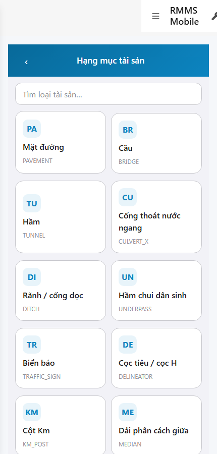

# QA — scenarios — web-rmms-asset-kcht

| Field | Value |
|-------|-------|
| feature | `web-rmms-asset-kcht` |
| this role | `qa` · `/agent-qa` |
| status | `done` |
| changeScope | `new_page` |
| packKind | `list` (phone type-grid · DES-GRID / filter **WAIVE**) |
| mfeStdUrl | `http://localhost:9301/web-rmms-asset-kcht` |
| mfeStdRoute | `/web-rmms-asset-kcht` · alias `/asset/kcht` |
| backend | `D:/AI-QLBD/Linm.RMMS.WebService` · Mobile.Bff `:5202` · API `:5111` · web BFF `:5201` |
| taskId | `task_16d57156` |
| prior Dev | implement **confirmed** · handoff `handoff/dev-compact.md` |
| autoApprove | ON |
| e2eQa | ON · runtime |
| method | `e2e runtime · yarn start:std :9301 (targeted webpack restart · no broad kill) + docker compose up -d (+ BFF rebuild) + capture_kcht` · cases `S0,S1,QA-20` · MFE `/login` JWT · viewport **430** |
| updatedAt | `2026-09-25T13:55:00.000Z` |
| skillVersion | `2026.09.05.03` |
| contentHash | `sha256:6f74282b807da7f2cc1aa57ac64848cd1d75ff3383c0f432eaad7bea53fff80e` |

## Smoke — Final MFE (REQUIRED · e2e)

| # | Step | Expect | Result | Evidence |
|---|------|--------|--------|----------|
| S0 | Cán bộ mở KCHT | AK-00…06 · search · type-grid Live · tiles · **0** crash/overlay | **PASS** |  |
| S1 | Peer Hub · entry Hạng mục | Hub · `#tileKcht` · AH-* | **PASS** |  |
| QA-20 | Click tileKcht → KCHT (JWT kept) | Cùng surface KCHT · grid · **0** login bounce | **PASS** |  |

## Scenario / Expect / Actual (visual · dump)

| Case | Expect (design/PO) | Actual (PNG/dump) | Verdict |
|------|--------------------|-------------------|---------|
| S0 | AK-* phone type-grid · Live asset-types · search | «Hạng mục tài sản» · `#pageTitle` · `#search` · **45** tiles AK-06 · zones AK-00…04+06 · AK-05 absent (has data) | **Aligned** |
| S1 | Peer Hub entry | «Hub tài sản» · `#tileKcht` «Hạng mục» · AH-00…06 · «45 loại tài sản» | **Aligned** |
| QA-20 | Hub CTA → KCHT | KCHT after click · 45 tiles · JWT kept · 0 overlay | **Aligned** |

## T-QA-*

| id | Scope | Result |
|----|-------|--------|
| T-QA-KCHT-01 | Live GET integration/asset-types → tiles code/name/icon | **PASS** (S0 · 45 tiles · BFF 200) |
| T-QA-SEARCH-01 | Client filter P1 `#search` present | **PASS** (AK-03 · id=search) |
| T-QA-TAP-01 | Tile nav peer list `?type={code}` wired | **PASS** (data-route on AK-06) |
| T-QA-BACK-01 | navBack → Hub | **PASS** (#navBack) |
| T-QA-FILTER-01/02 | LinErpListFilterBar | **WAIVE** (phone type-grid · DES-GRID N/A) |
| T-QA-VI-ENC-01 | Title/nav UTF-8 | **PASS** |
| T-QA-HIST / Leave | LeaveConfirmModal | **WAIVE** (RO type-grid · Leave N/A) |

## E2E runtime gate

| Check | Result |
|-------|--------|
| docker compose up -d | **PASS** · postgres/api healthy · web BFF `:5201` (rebuilt · was crashloop runtimeconfig) · Mobile BFF `:5202` healthy · asset-types **200** |
| yarn start:std | **PASS** · `:9301` · chunk `web-rmms-asset-kcht` emitted · **cấm** broad kill · targeted webpack-only restart (stale 404 route) · GAP-QA-E2E-KILL-01 respected |
| yarn e2e-qa stock | **FAIL soft** · probe API `:5101` (compose `:5111`) · **worked around** `_capture_kcht.mjs` + playwright junction |
| PNG evidence | S0/S1/QA-20 present · S1 ≠ S0 · **0** blank/crash · 430×900 |
| visual / dump | **Aligned** · Must **0** |
| GET asset-types | **200** via mobile-bff `:5202` |
| **cấm** phase=done | yes · next Review |

## Gaps / debt (không P0)

| ID | Severity | Note |
|----|----------|------|
| GAP-QA-E2E-STOCK-PORT | soft | stock CLI probe API `:5101` · compose `:5111` (carry prior wave) |
| GAP-QA-E2E-STOCK-DUP | soft | stock S1=S0 same URL risk · capture_kcht S1=Hub `#tileKcht` |
| LOOKUP_HINT_KEYS | soft | Hub tile hints `assetHub.tile.*` LOOKUP_STATIC until OMS seed (carry Hub) |

**P0:** none — handoff Review.

## Handoff → Review

1. `review/findings.md` · roles sau = **pending**.
2. `autoApprove=ON` → Review tự confirm khi tới lượt.
3. STATUS `qa` = **done** · `phase=review` · **cấm** `phase=done`.

## Version meta

| skillId | skillVersion | schemaVersion |
|---------|--------------|---------------|
| agent-qa | 2026.09.05.03 | 1 |
