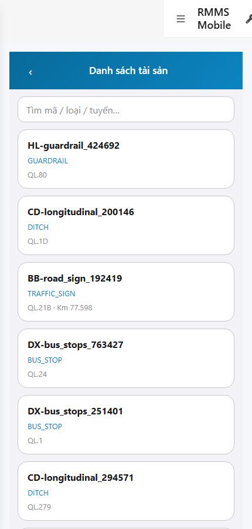
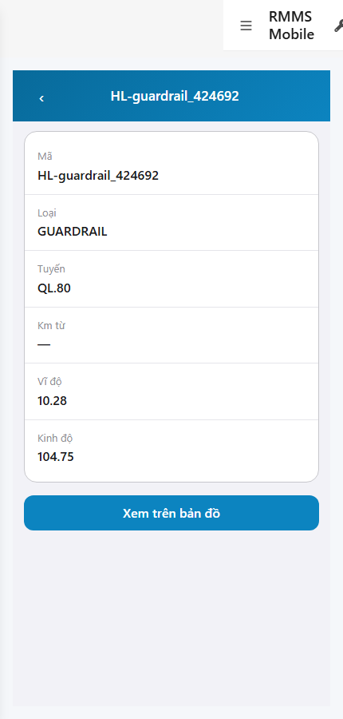

# QA — scenarios — web-rmms-asset-list

| Field | Value |
|-------|-------|
| feature | `web-rmms-asset-list` |
| this role | `qa` · `/agent-qa` |
| status | `done` |
| changeScope | `new_page` |
| packKind | `list` (phone List+Detail · Kind B / filter-bar **WAIVE**) |
| mfeStdUrl | `http://localhost:9301/web-rmms-asset-list` |
| mfeStdRoute | `/web-rmms-asset-list` · alias `/asset/list` · detail same-slug `?id=` |
| backend | `D:/AI-QLBD/Linm.RMMS.WebService` · Mobile.Bff `:5202` · API `:5111` · web BFF `:5201` |
| taskId | `task_8a1c9f9f` |
| prior Dev | implement **confirmed** · handoff `handoff/dev-compact.md` |
| autoApprove | ON |
| e2eQa | ON · runtime |
| method | `e2e runtime · yarn start:std :9301 (reuse · no kill) + docker compose up -d + capture_alist` · cases `S0,S1,QA-20` · MFE `/login` JWT · viewport **430** |
| updatedAt | `2026-09-25T14:30:00.000Z` |
| skillVersion | `2026.09.05.03` |
| contentHash | `sha256:6f74282b807da7f2cc1aa57ac64848cd1d75ff3383c0f432eaad7bea53fff80e` |

## Smoke — Final MFE (REQUIRED · e2e)

| # | Step | Expect | Result | Evidence |
|---|------|--------|--------|----------|
| S0 | Cán bộ mở danh sách tài sản | AL-00…04/06 · «Danh sách tài sản» · `#search` · Live rows · **0** crash/overlay | **PASS** |  |
| S1 | Peer Hub · entry Danh sách | Hub · `#tileList` · AH-* | **PASS** |  |
| QA-20 | Hub tileList → list → row detail | Detail `?id=` · AL-10…12 · pin · JWT kept · **0** crash | **PASS** |  |

## Scenario / Expect / Actual (visual · dump)

| Case | Expect (design/PO) | Actual (PNG/dump) | Verdict |
|------|--------------------|-------------------|---------|
| S0 | AL-* phone list · Live road-assets · search | «Danh sách tài sản» · `#pageTitle` · `#search` · **50** rows AL-06 · zones AL-00…04+06 · AL-05 absent (has data) | **Aligned** |
| S1 | Peer Hub entry `#tileList` | «Hub tài sản» · `#tileList` · AH-00…06 · wallet + tiles | **Aligned** |
| QA-20 | Row → detail same-slug · pin map | `?id=ffffe198-…` · AL-11 fields (Mã/Loại/Tuyến/Km/lat/lng) · AL-12 «Xem trên bản đồ» · JWT kept | **Aligned** |

## T-QA-*

| id | Scope | Result |
|----|-------|--------|
| T-QA-LIST-01 | Live GET asset/road-assets → rows code/type/route | **PASS** (S0 · 50 rows · dump) |
| T-QA-SEARCH-01 | `#search` present · debounce wired | **PASS** (AL-03 · id=search) |
| T-QA-DETAIL-01 | Tap row → `?id=` · GET /{id} · AL-11 | **PASS** (QA-20) |
| T-QA-PIN-01 | AL-12 pin → `/gis?focus` · disable no coords | **PASS** (AL-12 visible · enabled w/ coords) |
| T-QA-BACK-01 | navBack → Hub | **PASS** (#navBack) |
| T-QA-FILTER-01/02 | LinErpListFilterBar | **WAIVE** (phone list · Kind B) |
| T-QA-VI-ENC-01 | Title/nav UTF-8 | **PASS** |
| T-QA-HIST / Leave | LeaveConfirmModal | **WAIVE** (RO list+detail · no PUT · Leave N/A) |
| T-QA-CRUD-WRITE | PUT/POST asset | **N/A** (read-only · cấm invent write) |

## E2E runtime gate

| Check | Result |
|-------|--------|
| docker compose up -d | **PASS** · postgres/api healthy `:5111` · web BFF `:5201` · Mobile.Bff `:5202` healthy |
| yarn start:std | **PASS** · `:9301` reuse (webpack already up · **cấm** broad kill · GAP-QA-E2E-KILL-01) |
| yarn e2e-qa stock | **FAIL soft** · probe API `:5101` (compose `:5111`) · **worked around** `_capture_alist.mjs` + playwright junction |
| PNG evidence | S0/S1/QA-20 present · hashes **distinct** · **0** blank/crash · 430×900 |
| visual / dump | **Aligned** · Must **0** |
| Live list+detail | S0 50 rows · QA-20 detail id=ffffe198-… |
| **cấm** phase=done | yes · next Review |

## Gaps / debt (không P0)

| ID | Severity | Note |
|----|----------|------|
| GAP-QA-E2E-STOCK-PORT | soft | stock CLI probe API `:5101` · compose `:5111` (carry prior wave) |
| GAP-QA-E2E-STOCK-DUP | soft | stock S1=S0 same-URL risk · capture_alist S1=Hub `#tileList` · QA-20=detail |
| LOOKUP_HINT_KEYS | soft | Hub tile labels `assetHub.tile.*` LOOKUP_STATIC until OMS seed (carry Hub) |
| DEV_STANDALONE_CHROME | soft | Dev Standalone nav chrome visible in shots · production shell separate |

**P0:** none — handoff Review.

## Handoff → Review

1. `review/findings.md` · roles sau = **pending**.
2. `autoApprove=ON` → Review tự confirm khi tới lượt.
3. STATUS `qa` = **done** · `phase=review` · **cấm** `phase=done`.

## Version meta

| skillId | skillVersion | schemaVersion |
|---------|--------------|---------------|
| agent-qa | 2026.09.05.03 | 1 |
