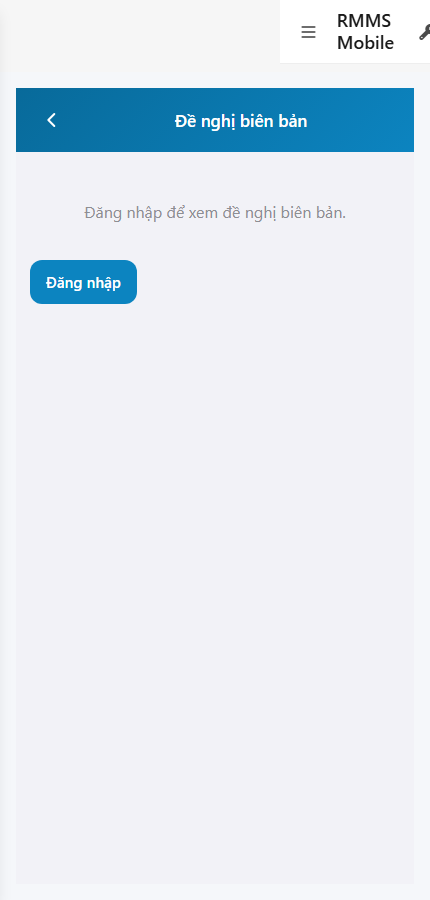
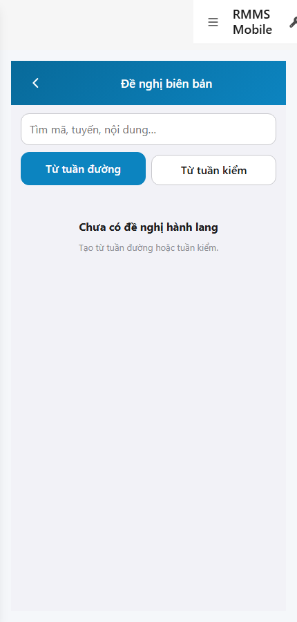

# QA — scenarios — web-rmms-bien-ban

| Field | Value |
|-------|-------|
| feature | `web-rmms-bien-ban` |
| this role | `qa` · `/agent-qa` |
| status | `done` |
| changeScope | `new_page` |
| packKind | `list` (phone ≤430 · Kind B / DES-GRID **WAIVE**) |
| mfeStdUrl | `http://localhost:9301/web-rmms-bien-ban` |
| mfeStdRoute | `/web-rmms-bien-ban` |
| backend | `D:/AI-QLBD/Linm.RMMS.WebService` · Mobile.Bff `:5202` · API `:5111` · **cấm ERP.*** |
| taskId | `task_a1b4753a` |
| prior Dev | implement **confirmed** · handoff `handoff/dev-compact.md` |
| autoApprove | ON |
| e2eQa | ON · runtime |
| method | `e2e runtime · yarn start:std :9301 (reuse · no kill) + docker + playwright` · cases `S0,S1,QA-20` · LoginSheet · viewport **430** · SPA deep-link fulfill |
| updatedAt | `2026-09-26T01:00:57.087Z` |
| skillVersion | `2026.09.05.03` |
| contentHash | `sha256:bc9070c4ab20da1960355a727eae18029943c2d95865aebd7d9bcb443ea60cd2` |

## Smoke — Final MFE (REQUIRED · e2e)

| # | Step | Expect | Result | Evidence |
|---|------|--------|--------|----------|
| S0 | Guest mở `/web-rmms-bien-ban` | guestGate «Đăng nhập để xem đề nghị biên bản.» · CTA Đăng nhập · `#BB-ROOT` · BB-00 · DES-MOB-BIEN-BAN · **0** crash | **PASS** |  |
| S1 | Staff list sau LoginSheet | BB-00/01/07 · `list.search` · `btnCreateTd`/`btnCreateTk` · Live empty «Chưa có đề nghị hành lang» · **0** crash | **PASS** |  |
| QA-20 | Login overlay từ Home guest | SH-02 · `#loginUser`/`#loginPass`/`#loginSubmit` · Hủy/Đăng nhập · **0** crash | **PASS** |  |

## Scenario / Expect / Actual (visual + DOM dump)

| Case | Expect (design/PO) | Actual (PNG + DOM dump) | Verdict |
|------|--------------------|-------------------------|---------|
| S0 | Guest gate trước list Live | zones BB-00 · guestGate=true · «Đăng nhập để xem đề nghị biên bản.» · `#BB-ROOT` · DES-MOB-BIEN-BAN · **0** search/create | **Aligned** |
| S1 | Staff list Live · chips TD/TK | BB-00/01/07 · fields list.search/btnCreateTd/btnCreateTk/list.empty · title «Đề nghị biên bản» · empty Live OK | **Aligned** |
| QA-20 | Shell login sheet | SH-02 · «Tài khoản / Mật khẩu / Hủy / Đăng nhập» · `#loginUser`/`#loginPass`/`#loginSubmit` | **Aligned** |

## T-QA-*

| id | Scope | Result |
|----|-------|--------|
| T-QA-CRUD-01 | Live GET petitions kind=hanh-lang · guest no Live list | **PASS** (S1 empty Live · S0 guest gate) |
| T-QA-FORM-01 | Surface AC e2e · guest→login→list · TITLE · DES-MOB-BIEN-BAN · BB-01 | **PASS** (S0→QA-20→S1) |
| T-QA-FILTER-01/02 | LinErpListFilterBar | **WAIVE** (phone list · DES-GRID N/A) |
| T-QA-VI-ENC-01 | Title/nav UTF-8 «Đề nghị biên bản» | **PASS** |
| T-QA-HIST / Leave | toast SSOT · LeaveConfirmModal dirty create | **PASS** (code Dev) · leave headed not forced this smoke |

## E2E runtime gate

| Check | Result |
|-------|--------|
| docker compose up -d | **PASS** · api healthy `:5111` · Mobile.Bff `:5202` · compose up |
| yarn start:std | **PASS** · port **9301** (already up · reuse · **cấm** kill worker) |
| yarn e2e-qa stock | **FAIL soft** — gate `API:5101 / BFF:5201` (repo uses `:5111` / Mobile.Bff `:5202`) |
| capture `_capture_bien_ban.mjs` | **PASS** · S0/S1/QA-20 · LoginSheet · deep-link fulfill |
| PNG distinct (core) | S0 / S1 / QA-20 hashes distinct · **0** blank/crash |
| visual / DOM | **Aligned** · Must **0** |
| **cấm** phase=done | yes · next Review |
| **cấm** GAP-QA-E2E-KILL-01 | yes · no taskkill / Stop-Process node\|yarn |

## Gaps / debt (không P0)

| ID | Severity | Note |
|----|----------|------|
| GAP-QA-E2E-STOCK-PORT | soft | stock `yarn e2e-qa` expects `:5101/:5201` — workaround `_capture_bien_ban.mjs` |
| GAP-QA-E2E-HISTORY-FALLBACK | soft | WDS deep-link HTTP 404 · capture fulfills document with `/` index |
| GAP-QA-E2E-PLAYWRIGHT-RESOLVE | soft | junction playwright from AI-AutoCode |
| Dev nav chrome | soft | standalone `showDevNav` in shots · BB zones still present |
| S1 empty Live | soft | `list.empty` — API kind=hanh-lang 0 rows · surface OK |
| SO07 debt | soft | Mobile không host · disable+copy (Dev) |
| Create parent id | soft | TD/TK create requires journalLineId/findingId query (Dev) |

**P0:** none — handoff Review.

## Handoff → Review

1. `review/findings.md` · roles sau = **pending**.
2. `autoApprove=ON` → Review tự confirm khi tới lượt.
3. STATUS `qa` = **done** · `phase=review` · **cấm** `phase=done`.

## Version meta

| skillId | skillVersion | schemaVersion |
|---------|--------------|---------------|
| agent-qa | 2026.09.05.03 | 1 |
