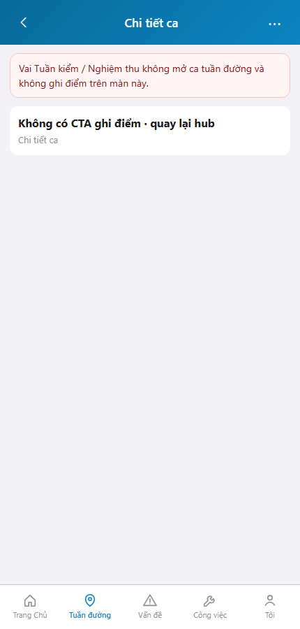
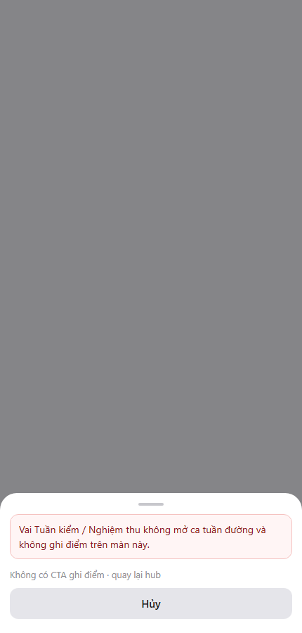
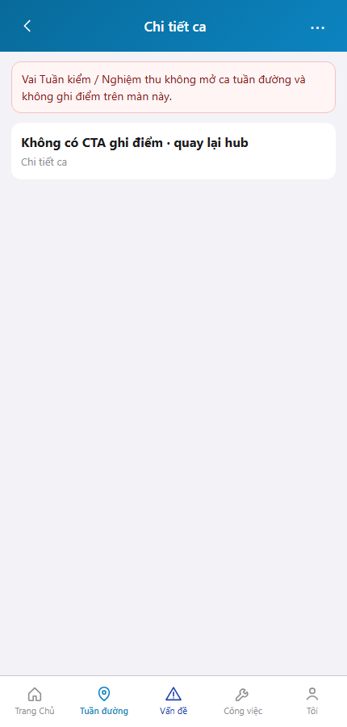

# QA — Scenarios — web-rmms-cam-checkin

> Status: **PASS** · e2eQa=ON · task `task_fb54db09` · 2026-10-01T01:00:00.000Z  
> Role: `qa` · packKind=`list` · changeScope=`edit_page`  
> runtimeUrl product=`/tuan-duong/:id` · `/diem-tuan` · mfeStdUrl alias `/web-rmms-cam-checkin` **404** (queue-only)  
> Screens: `specs/web-rmms-cam-checkin/qa/screens/{S0,S1,QA-20}.png` · `manifest.json` ok=true · method=`_capture_ci.mjs`

| | |
|--|--|
| Feature | `web-rmms-cam-checkin` |
| Title | Camera check-in tuần đường |
| Role | `qa` |
| Runtime | docker compose (WebService) + Mobile `yarn start:std` :9301 · Playwright phone 430 |

## Environment

| Item | Value |
|------|-------|
| Docker | `D:/AI-QLBD/Linm.RMMS.WebService` · api `:5111` · Mobile.Bff `:5202` healthy · **cấm** kill worker |
| MFE | `D:/AI-QLBD/MFE-Source/Linm.Web.RMMS.Mobile` · existing `start:std` · `--skip-start` · **cấm** GAP-QA-E2E-KILL-01 |
| Session | live hub `cf7cea17-1b5f-4c12-8d8f-d01d0c5b1fb7` (TD-20260930-001) |
| Stock CLI | `yarn e2e-qa --url=…/web-rmms-cam-checkin` → **FAIL soft** (alias 404 + mapLike DUP) |
| Custom | `_capture_ci.mjs` · SPA fulfill index · login `/dang-nhap`→`/m/trang-chu` · PNG distinct |
| Principal | E2E admin · jobTitle ≠ TUAN-DUONG/HAT → `camCheckInAccess=block` (AC TK/NT/manager block) |

## Cases (T-QA-CI-01)

| Id | Zone | Steps | Expect | Result | Shot |
|----|------|-------|--------|--------|------|
| S0 | CI-02 | Login · hub resolve session · goto `/tuan-duong/:id` · wait `sc-patrol-detail` | Detail · `roleGateBanner` danger · **không** CTA ghi điểm/kết ca | **PASS** |  |
| S1 | CI-01 | Goto `/tuan-duong/:id/diem-tuan` · wait `sheet-checkin` | Sheet block · banner + Hủy · **không** `ci-btn-save` write | **PASS** |  |
| QA-20 | CI-02 · DES-LEAVE | Cancel sheet → detail | Detail block lại · PNG ≠ S1 · không crash | **PASS** |  |

## Observations

- Role matrix runtime: principal không có `tuanDuong`/`qlHat` → **block** path (đúng `RoleCapsResolver` · MANAGER-RMMS không suy tuần đường).
- CTA `btn-pat-detail-checkin` / `btn-pat-detail-end` / `ci-btn-save` **ẩn** khi block — AC PASS.
- Soft debt: write (tuần đường) / view (QL_HAT) cần account `jobTitleCode=TUAN-DUONG|HAT-*` hoặc package `QL_HAT` — không mutate self từ UI seed.
- Stock `mfeStdUrl` alias 404 · deep-link product + `_capture_ci.mjs` PASS.
- SHA PNG distinct · không GAP-QA-E2E-DUP-01 / BLANK / CRASH.
- DES-GRID / filter Kind B: **WAIVE** phone.

## T-QA-* checklist

| Task | Status |
|------|--------|
| T-QA-CI-01 | **PASS** · S0/S1/QA-20 + PNG · role-block AC |
| T-QA-CI-WRITE | **SOFT** · cần user TUAN-DUONG (ngoài E2E principal hiện tại) |
| T-QA-CI-VIEW | **SOFT** · cần user QL_HAT / HAT-* |
| T-QA-FILTER-01/02 | **WAIVE** phone · Kind B N/A |
| T-QA-VI-ENC-01 | **PASS** · banner/title UTF-8 trên runtime |

## Gate

| Gate | Status |
|------|--------|
| e2eQa runtime (not static-only) | **PASS** · `_capture_ci.mjs` |
| Screens per case | **PASS** |
| stock yarn e2e-qa alias | **FAIL soft** · documented |
| phase≠done | kept · **cấm** phase=done |
| next | review pending (roleOnly HARD — không start review) |

## Notes

- Soft: write/view path chưa cover bởi E2E principal; block path cover đủ AC gate cho TK/NT/manager.
- HARD: **cấm** taskkill node/yarn · worker giữ sống.

## E2E screenshots

Viewer: `/api/qldb/artifact?id=&rel=qa/scenarios.md` rewrite `screens/{caseId}.png`.

CLI **PASS** = Playwright + PNG không đen + không overlay đỏ + ảnh không trùng case.

| Case | Scenario | Expect | Actual | Result | Evidence |
|------|----------|--------|--------|--------|----------|
| S0 | Cán bộ mở chi tiết ca (CI-02) | roleGateBanner · không CTA ghi điểm | Banner block · sc-patrol-detail | **PASS** |  |
| S1 | Cán bộ mở sheet ghi điểm (CI-01) | Block sheet · không Lưu | sheet-checkin · Hủy · không save | **PASS** |  |
| QA-20 | Rời sheet về detail | Detail ổn · không crash | sc-patrol-detail · banner | **PASS** |  |

## Version meta

| skillId | skillVersion | schemaVersion |
|---------|--------------|---------------|
| agent-qa | 2026.09.05.03 | 1 |
