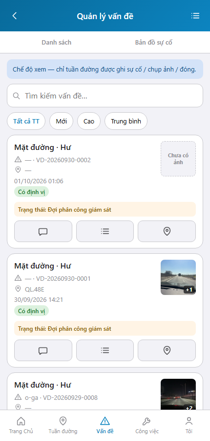
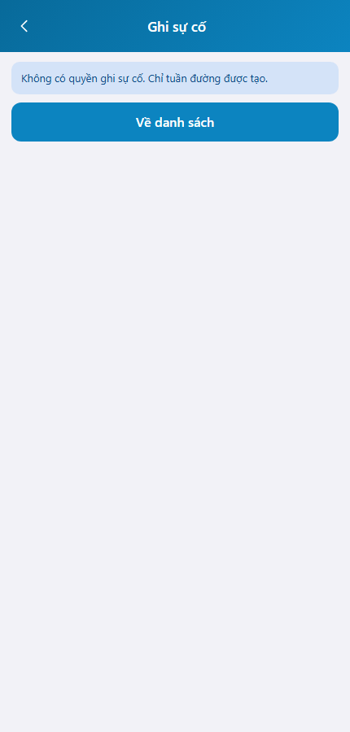
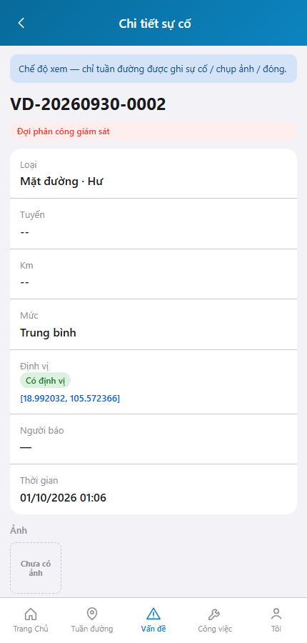

# QA — Scenarios — web-rmms-cam-incident

> Status: **PASS** · e2eQa=ON · task `task_bf0fd012` · 2026-10-01T05:10:00.000Z  
> Role: `qa` · packKind=`list` · changeScope=`edit_page`  
> runtimeUrl product=`/van-de` · `/van-de/moi` · `/van-de/:id` · mfeStdUrl alias `/web-rmms-cam-incident` **404** (queue-only)  
> Screens: `specs/web-rmms-cam-incident/qa/screens/{S0,S1,QA-20}.png` · `manifest.json` ok=true · method=`_capture_cam_incident.mjs`

| | |
|--|--|
| Feature | `web-rmms-cam-incident` |
| Title | Camera sự cố theo vai |
| Role | `qa` |
| Runtime | docker compose (WebService) + Mobile `yarn start:std` :9301 · Playwright phone 430 |

## Environment

| Item | Value |
|------|-------|
| Docker | `D:/AI-QLBD/Linm.RMMS.WebService` · api `:5111` · Mobile.Bff `:5202` healthy · **cấm** kill worker |
| MFE | `D:/AI-QLBD/MFE-Source/Linm.Web.RMMS.Mobile` · existing `start:std` · `--skip-start` · **cấm** GAP-QA-E2E-KILL-01 |
| Stock CLI | `yarn e2e-qa --url=…/web-rmms-cam-incident` → **FAIL soft** (alias 404 + S1=DUP-01 vs S0) |
| Custom | `_capture_cam_incident.mjs` · SPA fulfill index · login `/dang-nhap`→`/m/trang-chu` · PNG distinct |
| Principal | E2E admin · jobTitle ≠ TUAN-DUONG/HAT → `camIncidentAccess=view` (AC TK/NT/manager RO) |

## Cases (T-QA-INC-01)

| Id | Zone | Steps | Expect | Result | Shot |
|----|------|-------|--------|--------|------|
| S0 | INC-L | Login · goto `/van-de` · wait feature INC-L | List Live · `roleGateBanner` view · **không** `fabCreate` · **không** `assignCta` | **PASS** |  |
| S1 | INC-N | Goto `/van-de/moi` · wait INC-N | Create deny · banner «Không có quyền ghi sự cố» · **không** form create | **PASS** |  |
| QA-20 | INC-D · DEC-CLOSE | Click `entry.detailIcon` → detail | INC-D · banner RO · **không** `detail.close` · **không** `assignCta` · PNG ≠ S0/S1 | **PASS** |  |

## Observations

- Role matrix runtime: principal không có `tuanDuong`/`qlHat` → **view** path (đúng `camIncidentAccess` · MANAGER không suy write/assign).
- FAB `fabCreate` / create form / close / assign **ẩn** khi view — AC PASS (DEC-LIST unscoped list vẫn Live; DEC-CLOSE ẩn close).
- Soft debt: write (tuần đường) / assign (QL_HAT) cần account `jobTitleCode=TUAN-DUONG|HAT-*` hoặc package `QL_HAT` — không mutate self từ UI seed.
- Stock `mfeStdUrl` alias 404 · deep-link product + `_capture_cam_incident.mjs` PASS.
- SHA PNG distinct · S0=`4dcf3eb37473` · S1=`459c94c56d68` · QA-20=`3dc16575c351` · không GAP-QA-E2E-DUP-01 / BLANK / CRASH.
- DES-GRID / filter Kind B: **WAIVE** phone.

## T-QA-* checklist

| Task | Status |
|------|--------|
| T-QA-INC-01 | **PASS** · S0/S1/QA-20 + PNG · role-view AC |
| T-QA-INC-WRITE | **SOFT** · cần user TUAN-DUONG (ngoài E2E principal hiện tại) |
| T-QA-INC-ASSIGN | **SOFT** · cần user QL_HAT / HAT-* · workFor CTA |
| T-QA-FILTER-01/02 | **WAIVE** phone · Kind B N/A |
| T-QA-VI-ENC-01 | **PASS** · banner/title UTF-8 trên runtime |

## Gate

| Gate | Status |
|------|--------|
| e2eQa runtime (not static-only) | **PASS** · `_capture_cam_incident.mjs` |
| Screens per case | **PASS** |
| stock yarn e2e-qa alias | **FAIL soft** · documented |
| docker + start:std reuse | **PASS** · **cấm** kill |
| phase≠done | kept · **cấm** phase=done |
| next | review pending (roleOnly HARD — không start review) |

## Notes

- Soft: write/assign path chưa cover bởi E2E principal; view/deny path cover đủ AC gate cho TK/NT/manager.
- HARD: **cấm** taskkill node/yarn · worker giữ sống.

## E2E screenshots

Viewer: `/api/qldb/artifact?id=&rel=qa/scenarios.md` rewrite `screens/{caseId}.png`.

CLI **PASS** = Playwright + PNG không đen + không overlay đỏ + ảnh không trùng case.

| Case | Scenario | Expect | Actual | Result | Evidence |
|------|----------|--------|--------|--------|----------|
| S0 | Cán bộ mở danh sách sự cố (INC-L) | roleGateBanner · không FAB · Live cards | Banner view · fab=false · list.card | **PASS** |  |
| S1 | Cán bộ mở tạo sự cố (INC-N) | Deny banner · không form | «Không có quyền ghi sự cố» · Về danh sách | **PASS** |  |
| QA-20 | Cán bộ mở chi tiết (INC-D) | RO banner · ẩn close/assign | INC-D · hasClose=false · hasAssign=false | **PASS** |  |

## Version meta

| skillId | skillVersion | schemaVersion |
|---------|--------------|---------------|
| agent-qa | 2026.09.05.03 | 1 |
